# 리스트 (List)
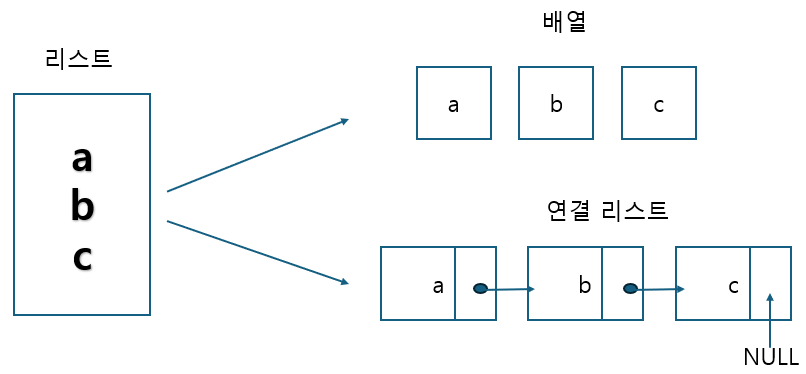
>위 그림은 배열과 연결리스트의 데이터 구조를 보여줌

- 데이터를 순차적으로 저장하는 선형 데이터 구조임

## 배열 (Array)

### 고정 크기 배열 (Fixed-size Array)

- **정의**: 
  - 고정된 크기의 메모리를 미리 할당받아 크기를 변경할 수 없는 배열임

- **특징**:  
  - 인덱스를 이용한 데이터 접근이 빠름 (O(1))
  - 크기가 고정되어 동적 메모리 할당이 불필요함

- **동작방식**:  
  - 배열 생성 시 메모리 공간을 한 번에 할당함
  - 데이터는 인덱스를 통해 접근함

- **장단점**:  
  - 장점: 빠른 인덱싱, 메모리 낭비가 적음  
  - 단점: 크기 변경 불가능, 데이터 추가/삭제 비효율적 (O(n))

- **활용**:  
  - 데이터 크기가 고정적인 경우 (ex. 2D 좌표 배열, 행렬 계산)
  
<details><summary>C 고정크기 배열</summary>

```c
#include <stdio.h>
void fixedSizeArrayExample() {
    int arr[5] = {1, 2, 3, 4, 5};
    for (int i = 0; i < 5; i++) {
        printf("%d ", arr[i]);
    }
}
```

</details>

<details><summary>Java 고정크기 배열</summary>

```java
public class FixedSizeArrayExample {
    public static void main(String[] args) {
        int[] arr = {1, 2, 3, 4, 5};
        for (int num : arr) {
            System.out.print(num + " ");
        }
    }
}
```

</details>

### 동적 배열 (Dynamic Array)

- **정의**: 
  - 필요에 따라 크기를 동적으로 조정할 수 있는 배열임

- **특징**:  
  - 크기 제한이 없으며 데이터를 추가할 때 자동으로 크기를 확장함

- **동작방식**:  
  - 배열이 가득 찰 경우 두 배 크기의 새 배열을 생성하고 기존 데이터를 복사함

- **장단점**:  
  - 장점: 크기 유연성, 데이터 추가/삭제 용이  
  - 단점: 크기 확장 시 복사 비용 발생, 메모리 사용 증가 가능

- **활용**:  
  - 동적 리스트 (ex. Python의 리스트, Java의 ArrayList)

<details><summary>C 동적 배열</summary>

```c
#include <stdio.h>
#include <stdlib.h>
void dynamicArrayExample() {
    int *arr = malloc(3 * sizeof(int));
    arr[0] = 1; arr[1] = 2; arr[2] = 3;
    for (int i = 0; i < 3; i++) {
        printf("%d ", arr[i]);
    }
    free(arr);
}
```
</details>
<details><summary>Java 동적 배열</summary>

```java
import java.util.ArrayList;
public class DynamicArrayExample {
    public static void main(String[] args) {
        ArrayList<Integer> list = new ArrayList<>();
        list.add(1);
        list.add(2);
        list.add(3);
        for (int num : list) {
            System.out.print(num + " ");
        }
    }
}
```
</details>

## 연결 리스트 (Linked List)

- 각 노드가 데이터를 저장하며 포인터를 통해 연결됨

### 단일 연결 리스트 (Singly-Linked List)


>위 그림은 단일 연결 리스트의 구조를 보여줌 

- **정의**: 
  - 각 노드가 데이터를 저장하며 다음 노드의 주소를 가리키는 포인터를 가진 구조임

- **특징**:  
  - 노드가 순차적으로 연결되어 있음
  - 크기가 유동적이고 메모리 효율적임

- **동작방식**:  
  - 삽입/삭제 시 포인터를 수정하여 연결을 유지함

- **장단점**:  
  - 장점: 동적 크기, 삽입/삭제가 빠름 (O(1) 또는 O(n))  
  - 단점: 인덱스 접근 비효율적 (O(n)), 추가 포인터로 인한 메모리 오버헤드 발생

- **활용**:  
  - 메모리가 제한적이고 데이터 크기가 가변적인 상황

<details><summary>C 단일 연결 리스트</summary>

```c
#include <stdio.h>
#include <stdlib.h>
struct Node {
    int data;
    struct Node* next;
};
void printList(struct Node* n) {
    while (n != NULL) {
        printf("%d ", n->data);
        n = n->next;
    }
}
```
</details>

<details><summary>Java 단일 연결 리스트</summary>

```java
class SinglyLinkedList {
    class Node {
        int data;
        Node next;

        Node(int data) {
            this.data = data;
        }
    }

    Node head;

    void insert(int data) {
        Node newNode = new Node(data);
        if (head == null) {
            head = newNode;
        } else {
            Node temp = head;
            while (temp.next != null) {
                temp = temp.next;
            }
            temp.next = newNode;
        }
    }

    void display() {
        Node temp = head;
        while (temp != null) {
            System.out.print(temp.data + " ");
            temp = temp.next;
        }
    }
}

public class TestSinglyLinkedList {
    public static void main(String[] args) {
        SinglyLinkedList list = new SinglyLinkedList();
        list.insert(10);
        list.insert(20);
        list.insert(30);
        list.display();
    }
}
```
</details>

### 이중 연결 리스트 (Doubly-Linked List)


>위 그림은 이중 연결 리스트의 구조를 보여줌 

- **정의**: 
  - 각 노드가 이전 및 다음 노드의 포인터를 가진 구조임

- **특징**:  
  - 양방향 순회 가능

- **동작방식**:  
  - 삽입/삭제 시 두 포인터를 수정함

- **장단점**:  
  - 장점: 양방향 탐색 가능, 특정 위치 데이터 삽입/삭제 효율적  
  - 단점: 포인터 관리 복잡, 추가 메모리 사용

- **활용**:  
  - 양방향 탐색이 필요한 경우 (ex. 브라우저 뒤로/앞으로 이동)

<details><summary>C 이중 연결 리스트</summary>  

```c
#include <stdio.h>
#include <stdlib.h>
struct DNode {
    int data;
    struct DNode *prev, *next;
};
void printDList(struct DNode* n) {
    while (n != NULL) {
        printf("%d ", n->data);
        n = n->next;
    }
}
```
</details>
<details><summary>Java 이중 연결 리스트</summary>

```java
class DoublyLinkedList {
    class Node {
        int data;
        Node prev, next;

        Node(int data) {
            this.data = data;
        }
    }

    Node head;

    void insert(int data) {
        Node newNode = new Node(data);
        if (head == null) {
            head = newNode;
        } else {
            Node temp = head;
            while (temp.next != null) {
                temp = temp.next;
            }
            temp.next = newNode;
            newNode.prev = temp;
        }
    }

    void display() {
        Node temp = head;
        while (temp != null) {
            System.out.print(temp.data + " ");
            temp = temp.next;
        }
    }
}

public class TestDoublyLinkedList {
    public static void main(String[] args) {
        DoublyLinkedList list = new DoublyLinkedList();
        list.insert(10);
        list.insert(20);
        list.insert(30);
        list.display();
    }
}
```
</details>

### 원형 연결 리스트 (Circular-Linked List)


>위 그림은 원형 연결 리스트의 구조를 보여줌 

- **정의**: 
  - 마지막 노드가 첫 번째 노드를 가리키는 구조임

- **특징**:  
  - 순환 구조로 연속적 데이터 처리가 가능

- **동작방식**:  
  - 삽입/삭제 시 포인터를 순환 구조로 유지함

- **장단점**:  
  - 장점: 순환 데이터 처리에 적합  
  - 단점: 구현 복잡성 증가

- **활용**:  
  - 자원 스케줄링 (ex. 운영체제의 CPU 스케줄링)

<details><summary>C 원형 연결 리스트</summary>

```c
#include <stdio.h>
#define SIZE 5
int queue[SIZE];
int front = -1, rear = -1;

void enqueue(int element) {
    if ((rear + 1) % SIZE == front) {
        printf("Queue is full\n");
    } else {
        if (front == -1) front = 0;
        rear = (rear + 1) % SIZE;
        queue[rear] = element;
    }
}

void display() {
    if (front == -1) {
        printf("Queue is empty\n");
        return;
    }
    int i = front;
    while (1) {
        printf("%d ", queue[i]);
        if (i == rear) break;
        i = (i + 1) % SIZE;
    }
}
```
</details>
<details><summary>Java 원형 연결 리스트</summary> 

```java
class CircularQueue {
    int[] queue;
    int front, rear, size;

    CircularQueue(int size) {
        this.size = size;
        queue = new int[size];
        front = rear = -1;
    }

    void enqueue(int element) {
        if ((rear + 1) % size == front) {
            System.out.println("Queue is full");
        } else {
            if (front == -1) front = 0;
            rear = (rear + 1) % size;
            queue[rear] = element;
        }
    }

    void display() {
        if (front == -1) {
            System.out.println("Queue is empty");
            return;
        }
        int i = front;
        while (true) {
            System.out.print(queue[i] + " ");
            if (i == rear) break;
            i = (i + 1) % size;
        }
    }
}

public class TestCircularQueue {
    public static void main(String[] args) {
        CircularQueue cq = new CircularQueue(5);
        cq.enqueue(10);
        cq.enqueue(20);
        cq.enqueue(30);
        cq.display();
    }
}
```
</details>

### 다중 연결 리스트 (Multi-Linked List)

- **정의**: 
  - 각 노드가 여러 개의 포인터를 가지고 다양한 방향으로 연결되는 구조임

- **특징**:  
  - 복잡한 관계 데이터를 표현 가능

- **동작방식**:  
  - 각 포인터를 이용해 여러 방향으로 데이터 연결

- **장단점**:  
  - 장점: 다양한 연결 관계 표현 가능  
  - 단점: 구현 복잡, 높은 메모리 사용량 발생

- **활용**:  
  - 그래프, 관계형 데이터베이스

---

# 스택 (Stack)

- LIFO (Last In, First Out) 방식의 데이터 구조임

## 배열 기반 스택 (Array-based Stack)
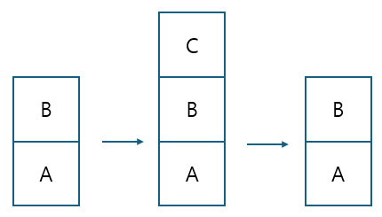
>위 그림은 LIFO (Last In, First Out) 방식의 데이터 구조를 보여줌 

- **정의**
  - 배열을 사용하여 스택을 구현함

- **특징**
  - 데이터 삽입(Push)과 삭제(Pop)는 한쪽에서만 이루어짐

- **동작방식**
  - Push: 데이터 추가 후 Top 증가
  - Pop: 데이터 제거 후 Top 감소

- **장단점**
  - 장점: 간단한 구현, 빠른 데이터 접근
  - 단점: 크기 제한, 배열 크기 확장 비용 발생

- **활용**
  - 함수 호출 스택, undo/redo 기능

<details><summary>C 스택</summary> 

```c
#include <stdio.h>
#include <stdlib.h>

#define MAX 100

typedef struct {
    int data[MAX];
    int top;
} Stack;

void init(Stack *s) {
    s->top = -1;
}

int isFull(Stack *s) {
    return s->top == MAX - 1;
}

int isEmpty(Stack *s) {
    return s->top == -1;
}

void push(Stack *s, int value) {
    if (isFull(s)) {
        printf("Stack Overflow\n");
        return;
    }
    s->data[++(s->top)] = value;
}

int pop(Stack *s) {
    if (isEmpty(s)) {
        printf("Stack Underflow\n");
        return -1;
    }
    return s->data[(s->top)--];
}

int main() {
    Stack s;
    init(&s);
    push(&s, 10);
    push(&s, 20);
    printf("Popped: %d\n", pop(&s));
    return 0;
}
```
</details>
<details><summary>Java 스택</summary>    

```java
class ArrayStack {
    private int[] stack;
    private int top;
    private int max;

    public ArrayStack(int size) {
        max = size;
        stack = new int[max];
        top = -1;
    }

    public boolean isFull() {
        return top == max - 1;
    }

    public boolean isEmpty() {
        return top == -1;
    }

    public void push(int value) {
        if (isFull()) {
            System.out.println("Stack Overflow");
            return;
        }
        stack[++top] = value;
    }

    public int pop() {
        if (isEmpty()) {
            System.out.println("Stack Underflow");
            return -1;
        }
        return stack[top--];
    }

    public static void main(String[] args) {
        ArrayStack stack = new ArrayStack(5);
        stack.push(10);
        stack.push(20);
        System.out.println("Popped: " + stack.pop());
    }
}
```
</details>

## 연결 리스트 기반 스택 (Linked List-based Stack)
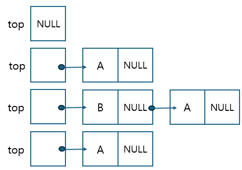
>위 그림은 연결 리스트 기반으로로 스택의 구조를 보여줌
- **정의**
  - 연결 리스트로 구현된 스택임

- **특징**
  - 데이터 크기에 제한이 없음

- **동작방식**
  - Push: 새로운 노드를 Top으로 설정
  - Pop: Top 노드 제거 후 다음 노드를 Top으로 설정

- **장단점**
  - 장점: 크기 제한 없음, 동적 메모리 사용 가능
  - 단점: 추가 포인터로 인한 메모리 오버헤드 발생

- **활용**
  - 동적 데이터 처리
<details><summary>C 연결리스트 기반 스택</summary>    

```c
#include <stdio.h>
#include <stdlib.h>

typedef struct Node {
    int data;
    struct Node *next;
} Node;

typedef struct {
    Node *top;
} Stack;

void init(Stack *s) {
    s->top = NULL;
}

int isEmpty(Stack *s) {
    return s->top == NULL;
}

void push(Stack *s, int value) {
    Node *newNode = (Node *)malloc(sizeof(Node));
    newNode->data = value;
    newNode->next = s->top;
    s->top = newNode;
}

int pop(Stack *s) {
    if (isEmpty(s)) {
        printf("Stack Underflow\n");
        return -1;
    }
    Node *temp = s->top;
    int value = temp->data;
    s->top = s->top->next;
    free(temp);
    return value;
}

int main() {
    Stack s;
    init(&s);
    push(&s, 10);
    push(&s, 20);
    printf("Popped: %d\n", pop(&s));
    return 0;
}
```
</details>
<details><summary>Java 연결 리스트 기반 스택</summary>

```java
class Node {
    int data;
    Node next;

    Node(int data) {
        this.data = data;
        this.next = null;
    }
}

class LinkedListStack {
    private Node top;

    public LinkedListStack() {
        this.top = null;
    }

    public boolean isEmpty() {
        return top == null;
    }

    public void push(int value) {
        Node newNode = new Node(value);
        newNode.next = top;
        top = newNode;
    }

    public int pop() {
        if (isEmpty()) {
            System.out.println("Stack Underflow");
            return -1;
        }
        int value = top.data;
        top = top.next;
        return value;
    }

    public static void main(String[] args) {
        LinkedListStack stack = new LinkedListStack();
        stack.push(10);
        stack.push(20);
        System.out.println("Popped: " + stack.pop());
    }
}
```
</details>

## 최소값/최대값 추적 스택 (Min/Max Stack)

- **정의**
  - 현재 스택에서 최소값/최대값을 추적하는 구조임

- **특징**
  - 추가 데이터 구조(보조 스택)를 사용해 최소/최대값 관리

- **동작방식**
  - Push/Pop 시 보조 스택 업데이트

- **장단점**
  - 장점: 최소/최대값 조회가 O(1)로 빠름
  - 단점: 보조 스택으로 인한 메모리 사용 증가

- **활용**
  - 최적화된 데이터 처리
<details><summary>C 최소값/최대값 추적 스택</summary>

```c
#include <stdio.h>
#include <stdlib.h>

#define MAX 100

typedef struct {
    int data[MAX];
    int min[MAX];
    int top;
} MinStack;

void init(MinStack *s) {
    s->top = -1;
}

int isFull(MinStack *s) {
    return s->top == MAX - 1;
}

int isEmpty(MinStack *s) {
    return s->top == -1;
}

void push(MinStack *s, int value) {
    if (isFull(s)) {
        printf("Stack Overflow\n");
        return;
    }
    s->data[++(s->top)] = value;
    if (s->top == 0 || value < s->min[s->top - 1]) {
        s->min[s->top] = value;
    } else {
        s->min[s->top] = s->min[s->top - 1];
    }
}

int pop(MinStack *s) {
    if (isEmpty(s)) {
        printf("Stack Underflow\n");
        return -1;
    }
   
```
</details>   
<details><summary>Java 최소값/최대값 추적 스택</summary>

```java
import java.util.Stack;

class MinStack {
    private Stack<Integer> stack;
    private Stack<Integer> minStack;

    public MinStack() {
        stack = new Stack<>();
        minStack = new Stack<>();
    }

    public void push(int value) {
        stack.push(value);
        if (minStack.isEmpty() || value <= minStack.peek()) {
            minStack.push(value);
        }
    }

    public int pop() {
        if (stack.isEmpty()) {
            System.out.println("Stack Underflow");
            return -1;
        }
        int value = stack.pop();
        if (value == minStack.peek()) {
            minStack.pop();
        }
        return value;
    }

    public int getMin() {
        if (minStack.isEmpty()) {
            System.out.println("Stack is empty");
            return -1;
        }
        return minStack.peek();
    }

    public static void main(String[] args) {
        MinStack stack = new MinStack();
        stack.push(10);
        stack.push(20);
        stack.push(5);
        System.out.println("Minimum: " + stack.getMin());
        stack.pop();
        System.out.println("Minimum: " + stack.getMin());
    }
}
```
</details>

---

# 큐 (Queue)

## 배열 기반 큐 (Array-based Queue)

>위 그림은 FIFO (First In, First Out) 방식의 데이터 구조를 보여줌

- **정의**
  - 배열을 사용하여 구현된 큐임

- **특징**
  - 인덱스가 순차적으로 이동함

- **동작방식**
  - Enqueue: Rear에 데이터 추가
  - Dequeue: Front에서 데이터 제거

- **장단점**
  - 장점: 간단한 구현
  - 단점: 배열 크기 제한

- **활용**
  - 간단한 데이터 버퍼
<details><summary>C 배열 기반 큐</summary>

```c
#include <stdio.h>
#include <stdlib.h>

#define MAX 100

typedef struct {
    int data[MAX];
    int front;
    int rear;
} Queue;

void init(Queue *q) {
    q->front = 0;
    q->rear = -1;
}

int isFull(Queue *q) {
    return q->rear == MAX - 1;
}

int isEmpty(Queue *q) {
    return q->front > q->rear;
}

void enqueue(Queue *q, int value) {
    if (isFull(q)) {
        printf("Queue Overflow\n");
        return;
    }
    q->data[++(q->rear)] = value;
}

int dequeue(Queue *q) {
    if (isEmpty(q)) {
        printf("Queue Underflow\n");
        return -1;
    }
    return q->data[(q->front)++];
}

int main() {
    Queue q;
    init(&q);
    enqueue(&q, 10);
    enqueue(&q, 20);
    printf("Dequeued: %d\n", dequeue(&q));
    return 0;
}
```
</details>
<details><summary>배열 기반 큐</summary>

```java
class ArrayQueue {
    private int[] queue;
    private int front, rear, max;

    public ArrayQueue(int size) {
        max = size;
        queue = new int[max];
        front = 0;
        rear = -1;
    }

    public boolean isFull() {
        return rear == max - 1;
    }

    public boolean isEmpty() {
        return front > rear;
    }

    public void enqueue(int value) {
        if (isFull()) {
            System.out.println("Queue Overflow");
            return;
        }
        queue[++rear] = value;
    }

    public int dequeue() {
        if (isEmpty()) {
            System.out.println("Queue Underflow");
            return -1;
        }
        return queue[front++];
    }

    public static void main(String[] args) {
        ArrayQueue queue = new ArrayQueue(5);
        queue.enqueue(10);
        queue.enqueue(20);
        System.out.println("Dequeued: " + queue.dequeue());
    }
}
```
</details>

## 순환 큐 (Circular Queue)
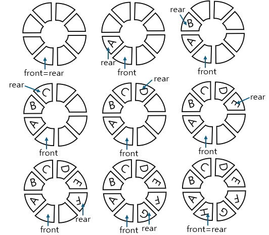
>위 그림은 순환 큐 방식의 과정을 보여줌 

- **정의**
  - 큐가 배열 끝에 도달하면 다시 처음으로 돌아가는 방식임

- **특징**
  - 배열 공간을 효율적으로 사용함

- **동작방식**
  - Rear와 Front가 순환 구조로 이동함

- **장단점**
  - 장점: 공간 효율성 증가
  - 단점: 구현 복잡성 증가

- **활용**
  - 자원 스케줄링
<details><summary>C 순환 큐</summary>

```c
#include <stdio.h>
#include <stdlib.h>

#define MAX 5

typedef struct {
    int data[MAX];
    int front, rear;
} CircularQueue;

void init(CircularQueue *q) {
    q->front = -1;
    q->rear = -1;
}

int isFull(CircularQueue *q) {
    return (q->rear + 1) % MAX == q->front;
}

int isEmpty(CircularQueue *q) {
    return q->front == -1;
}

void enqueue(CircularQueue *q, int value) {
    if (isFull(q)) {
        printf("Queue Overflow\n");
        return;
    }
    if (isEmpty(q)) {
        q->front = q->rear = 0;
    } else {
        q->rear = (q->rear + 1) % MAX;
    }
    q->data[q->rear] = value;
}

int dequeue(CircularQueue *q) {
    if (isEmpty(q)) {
        printf("Queue Underflow\n");
        return -1;
    }
    int value = q->data[q->front];
    if (q->front == q->rear) {
        q->front = q->rear = -1;
    } else {
        q->front = (q->front + 1) % MAX;
    }
    return value;
}

int main() {
    CircularQueue q;
    init(&q);
    enqueue(&q, 10);
    enqueue(&q, 20);
    printf("Dequeued: %d\n", dequeue(&q));
    return 0;
}
```
</details>
<details><summary>Java 순환환 큐</summary>

```java
class CircularQueue {
    private int[] queue;
    private int front, rear, max;

    public CircularQueue(int size) {
        max = size;
        queue = new int[max];
        front = -1;
        rear = -1;
    }

    public boolean isFull() {
        return (rear + 1) % max == front;
    }

    public boolean isEmpty() {
        return front == -1;
    }

    public void enqueue(int value) {
        if (isFull()) {
            System.out.println("Queue Overflow");
            return;
        }
        if (isEmpty()) {
            front = rear = 0;
        } else {
            rear = (rear + 1) % max;
        }
        queue[rear] = value;
    }

    public int dequeue() {
        if (isEmpty()) {
            System.out.println("Queue Underflow");
            return -1;
        }
        int value = queue[front];
        if (front == rear) {
            front = rear = -1;
        } else {
            front = (front + 1) % max;
        }
        return value;
    }

    public static void main(String[] args) {
        CircularQueue queue = new CircularQueue(5);
        queue.enqueue(10);
        queue.enqueue(20);
        System.out.println("Dequeued: " + queue.dequeue());
    }
}
```
</details>

## 연결 리스트 기반 큐 (Linked List-based Queue)
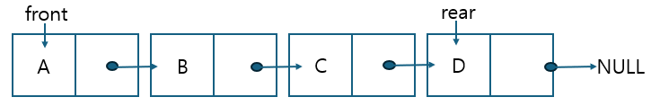
> 위 그림은 연결리스트를 기반의 큐의 구조를 보여줌 

- **정의**
  - 연결 리스트로 구현된 큐임

- **특징**
  - 크기 제한이 없음

- **동작방식**
  - Enqueue: 새로운 노드를 Rear에 연결
  - Dequeue: Front 노드를 제거

- **장단점**
  - 장점: 동적 크기 지원 가능
  - 단점: 포인터 관리 필요

- **활용**
  - 대규모 데이터 처리
<details><summary>C 연결 리스트 기반 큐</summary>

```c
#include <stdio.h>
#include <stdlib.h>

typedef struct Node {
    int data;
    struct Node *next;
} Node;

typedef struct {
    Node *front;
    Node *rear;
} Queue;

void init(Queue *q) {
    q->front = q->rear = NULL;
}

int isEmpty(Queue *q) {
    return q->front == NULL;
}

void enqueue(Queue *q, int value) {
    Node *newNode = (Node *)malloc(sizeof(Node));
    newNode->data = value;
    newNode->next = NULL;
    if (isEmpty(q)) {
        q->front = q->rear = newNode;
    } else {
        q->rear->next = newNode;
        q->rear = newNode;
    }
}

int dequeue(Queue *q) {
    if (isEmpty(q)) {
        printf("Queue Underflow\n");
        return -1;
    }
    Node *temp = q->front;
    int value = temp->data;
    q->front = q->front->next;
    free(temp);
    return value;
}

int main() {
    Queue q;
    init(&q);
    enqueue(&q, 10);
    enqueue(&q, 20);
    printf("Dequeued: %d\n", dequeue(&q));
    return 0;
}
```
</details>
<details><summary>Java 연결 리스트 기반 큐</summary>

```java
class Node {
    int data;
    Node next;

    Node(int data) {
        this.data = data;
        this.next = null;
    }
}

class LinkedListQueue {
    private Node front, rear;

    public LinkedListQueue() {
        front = rear = null;
    }

    public boolean isEmpty() {
        return front == null;
    }

    public void enqueue(int value) {
        Node newNode = new Node(value);
        if (isEmpty()) {
            front = rear = newNode;
        } else {
            rear.next = newNode;
            rear = newNode;
        }
    }

    public int dequeue() {
        if (isEmpty()) {
            System.out.println("Queue Underflow");
            return -1;
        }
        int value = front.data;
        front = front.next;
        if (front == null) {
            rear = null;
        }
        return value;
    }

    public static void main(String[] args) {
        LinkedListQueue queue = new LinkedListQueue();
        queue.enqueue(10);
        queue.enqueue(20);
        System.out.println("Dequeued: " + queue.dequeue());
    }
}
```
</details>

## 우선순위 큐 (Priority Queue)

- **정의**
  -  우선순위를 기준으로 데이터를 처리하는 큐임

### 배열 기반 우선순위 큐
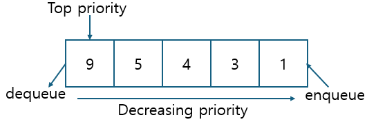
>위 그림은 우선순위로 데이터가 정렬된 큐를 보여줌 

- **특징**
  - 우선순위를 위해 정렬 필요

- **장단점**
  - 장점: 간단한 구현 가능
  - 단점: 정렬 비용 발생 (O(n))

<details><summary>C 배열 기반 우선순위 큐</summary>

```c
#include <stdio.h>
#include <stdlib.h>

#define MAX 100

typedef struct {
    int data[MAX];
    int size;
} PriorityQueue;

void init(PriorityQueue *pq) {
    pq->size = 0;
}

int isEmpty(PriorityQueue *pq) {
    return pq->size == 0;
}

int isFull(PriorityQueue *pq) {
    return pq->size == MAX;
}

void enqueue(PriorityQueue *pq, int value) {
    if (isFull(pq)) {
        printf("Queue Overflow\n");
        return;
    }
    int i = pq->size - 1;
    while (i >= 0 && pq->data[i] < value) {
        pq->data[i + 1] = pq->data[i];
        i--;
    }
    pq->data[i + 1] = value;
    pq->size++;
}

int dequeue(PriorityQueue *pq) {
    if (isEmpty(pq)) {
        printf("Queue Underflow\n");
        return -1;
    }
    return pq->data[--(pq->size)];
}

int main() {
    PriorityQueue pq;
    init(&pq);

    enqueue(&pq, 10);
    enqueue(&pq, 20);
    enqueue(&pq, 5);

    printf("Dequeued: %d\n", dequeue(&pq)); // Outputs: 20
    printf("Dequeued: %d\n", dequeue(&pq)); // Outputs: 10

    return 0;
}
```
</details>
<details><summary>Java 배열 기반 우선순위 큐</summary>

```java
class PriorityQueue {
    private int[] queue;
    private int size;

    public PriorityQueue(int capacity) {
        queue = new int[capacity];
        size = 0;
    }

    public void enqueue(int value) {
        if (size == queue.length) {
            System.out.println("Queue Overflow");
            return;
        }
        queue[size++] = value;
        for (int i = size - 1; i > 0 && queue[i] > queue[i - 1]; i--) {
            int temp = queue[i];
            queue[i] = queue[i - 1];
            queue[i - 1] = temp;
        }
    }

    public int dequeue() {
        if (size == 0) {
            System.out.println("Queue Underflow");
            return -1;
        }
        return queue[--size];
    }

    public static void main(String[] args) {
        PriorityQueue pq = new PriorityQueue(5);
        pq.enqueue(10);
        pq.enqueue(20);
        pq.enqueue(5);
        System.out.println("Dequeued: " + pq.dequeue());
    }
}
```
</details>

### 힙 기반 우선순위 큐
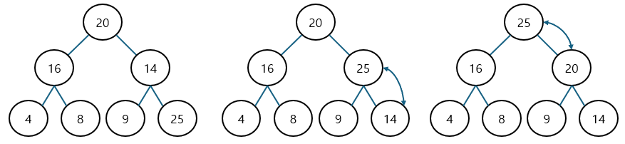
>위 그림은 우선순위를 기준으로 힙을 정리하는 과정을 보여줌 

- **특징**
  - 힙 자료구조를 사용하여 효율적인 우선순위 관리

- **장단점**
  - 장점: 삽입/삭제가 O(log n)으로 빠름
  - 단점: 구현 복잡성 높음

- **활용**
  - 작업 스케줄링, 네트워크 라우팅
<details><summary>C 힙 기반 우선순위 큐</summary>

```c
#include <stdio.h>
#include <stdlib.h>

#define MAX 100

typedef struct {
    int data[MAX];
    int size;
} PriorityQueue;

void init(PriorityQueue *pq) {
    pq->size = 0;
}

int isEmpty(PriorityQueue *pq) {
    return pq->size == 0;
}

int isFull(PriorityQueue *pq) {
    return pq->size == MAX;
}

void heapifyUp(PriorityQueue *pq, int index) {
    while (index > 0) {
        int parent = (index - 1) / 2;
        if (pq->data[index] > pq->data[parent]) {
            int temp = pq->data[index];
            pq->data[index] = pq->data[parent];
            pq->data[parent] = temp;
            index = parent;
        } else {
            break;
        }
    }
}

void heapifyDown(PriorityQueue *pq, int index) {
    int left, right, largest;
    while (1) {
        left = 2 * index + 1;
        right = 2 * index + 2;
        largest = index;

        if (left < pq->size && pq->data[left] > pq->data[largest]) {
            largest = left;
        }
        if (right < pq->size && pq->data[right] > pq->data[largest]) {
            largest = right;
        }
        if (largest != index) {
            int temp = pq->data[index];
            pq->data[index] = pq->data[largest];
            pq->data[largest] = temp;
            index = largest;
        } else {
            break;
        }
    }
}

void enqueue(PriorityQueue *pq, int value) {
    if (isFull(pq)) {
        printf("Queue Overflow\n");
        return;
    }
    pq->data[pq->size] = value;
    heapifyUp(pq, pq->size);
    pq->size++;
}

int dequeue(PriorityQueue *pq) {
    if (isEmpty(pq)) {
        printf("Queue Underflow\n");
        return -1;
    }
    int root = pq->data[0];
    pq->data[0] = pq->data[--(pq->size)];
    heapifyDown(pq, 0);
    return root;
}

int main() {
    PriorityQueue pq;
    init(&pq);

    enqueue(&pq, 10);
    enqueue(&pq, 20);
    enqueue(&pq, 5);

    printf("Dequeued: %d\n", dequeue(&pq)); // Outputs: 20
    printf("Dequeued: %d\n", dequeue(&pq)); // Outputs: 10

    return 0;
}
```
</details>
<details><summary>Java 힙 기반 우선순위 큐</summary>

```java
import java.util.PriorityQueue;

public class HeapPriorityQueue {
    public static void main(String[] args) {
        PriorityQueue<Integer> pq = new PriorityQueue<>(); // Min-heap
        pq.add(10);
        pq.add(20);
        pq.add(5);

        System.out.println("Dequeued: " + pq.poll()); // Outputs smallest element
    }
}
```
</details>

---

# 덱 (Deque)
- **정의**: 양쪽 끝에서 요소를 추가하거나 제거할 수 있는 자료구조
- **특징**:
  - 앞과(Front) 뒤(Rear) 양쪽 끝에서 삽입과 삭제가 가능
  - 큐의 FIFO 특성과 스택의 LIFO 특성을 모두 지원

- **주요 연산**  
  - **앞쪽 인큐(enqueue front)**: 덱의 front에 요소 추가
  - **뒤쪽 인큐(enqueue rear)**: 덱의 rear에 요소 추가
  - **앞쪽 디큐(dequeue front)**: 덱의 front에서 요소 제거 및 반환
  - **뒤쪽 디큐(dequeue rear)**: 덱의 rear에서 요소 제거 및 반환
---
## 배열 기반 덱 (Array-based Deque)

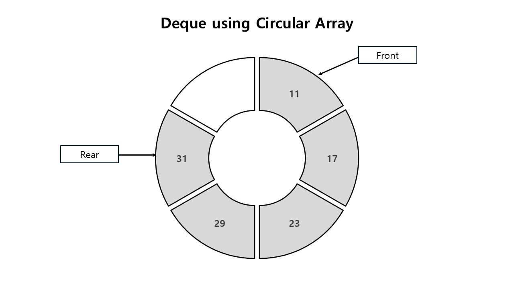
> circular array를 이용하여 만든 덱 구조

- **정의**:  배열을 사용해서 덱의 요소를 저장하는 방식  

- **특징**:  
  - 고정 크기 또는 동적 배열 사용 가능
  - 양쪽 끝에서의 삽입과 삭제가 가능
  - 인덱스를 통해 데이터에 접근 가능


- **장점**:  
    - 인덱스 기반으로 요소에 접근할 수 있어 $O(1)$의 시간 복잡도로 접근이 가능
    - 배열을 기반으로 구현하여 메모리 접근이 빠르고 캐시 친화적
- **단점**:  
    - 고정 크기의 경우 공간 낭비 또는 오버플로우 발생 가능
    - 동적 배열일 경우 크기 조정 시 비용 발생
    - 배열의 앞쪽에 요소를 추가할 때 요소를 이동시켜야 할 수 있음

- **활용**:  
  - 슬라이딩 윈도우 알고리즘
  - 캐시 구현
  - 브라우저의 앞으로/뒤로 가기 기능

<details><summary>C 배열 기반 덱 구현</summary>

```c
//c에서의 Array-based Deque
#include <stdio.h>
#include <stdlib.h>

#define MAX_SIZE 5

typedef struct {
    int arr[MAX_SIZE];
    int front;
    int rear;
} Deque;

void initDeque(Deque* deque) {
    deque->front = -1;
    deque->rear = -1;
}

// 덱이 꽉 찼는지 확인
int isFull(Deque* deque) {
    return (deque->front == (deque->rear + 1) % MAX_SIZE);
}

// 덱이 비었는지 확인
int isEmpty(Deque* deque) {
    return (deque->front == -1);
}

// front에 삽입
void insertFront(Deque* deque, int value) {
    if (isFull(deque)) {
        printf("Deque is full\n");
        return;
    }

    if (isEmpty(deque)) {
        deque->front = 0;
        deque->rear = 0;
    } else {
        deque->front = (deque->front - 1 + MAX_SIZE) % MAX_SIZE;
    }
    deque->arr[deque->front] = value;
}

// rear에 삽입
void insertRear(Deque* deque, int value) {
    if (isFull(deque)) {
        printf("Deque is full\n");
        return;
    }

    if (isEmpty(deque)) {
        deque->front = 0;
        deque->rear = 0;
    } else {
        deque->rear = (deque->rear + 1) % MAX_SIZE;
    }
    deque->arr[deque->rear] = value;
}

// front에서 제거
void deleteFront(Deque* deque) {
    if (isEmpty(deque)) {
        printf("Deque is empty\n");
        return;
    }

    if (deque->front == deque->rear) {
        deque->front = -1;
        deque->rear = -1;
    } else {
        deque->front = (deque->front + 1) % MAX_SIZE;
    }
}

// rear에서 제거
void deleteRear(Deque* deque) {
    if (isEmpty(deque)) {
        printf("Deque is empty\n");
        return;
    }

    if (deque->front == deque->rear) {
        deque->front = -1;
        deque->rear = -1;
    } else {
        deque->rear = (deque->rear - 1 + MAX_SIZE) % MAX_SIZE;
    }
}

```

</details>

<details><summary>Java 배열 기반 덱 구현</summary>

```java

//Java에서의 Array-based Deque
public class ArrayDeque {
    private static final int MAX_SIZE = 5;
    private int[] arr;
    private int front, rear;

    public ArrayDeque() {
        arr = new int[MAX_SIZE];
        front = -1;
        rear = -1;
    }

    // 덱이 꽉 찼는지 확인
    private boolean isFull() {
        return (front == (rear + 1) % MAX_SIZE);
    }

    // 덱이 비었는지 확인
    private boolean isEmpty() {
        return (front == -1);
    }

    // front에 삽입
    public void insertFront(int value) {
        if (isFull()) {
            System.out.println("Deque is full");
            return;
        }

        if (isEmpty()) {
            front = 0;
            rear = 0;
        } else {
            front = (front - 1 + MAX_SIZE) % MAX_SIZE;
        }
        arr[front] = value;
    }

    // rear에 삽입
    public void insertRear(int value) {
        if (isFull()) {
            System.out.println("Deque is full");
            return;
        }

        if (isEmpty()) {
            front = 0;
            rear = 0;
        } else {
            rear = (rear + 1) % MAX_SIZE;
        }
        arr[rear] = value;
    }

    // front에서 제거
    public void deleteFront() {
        if (isEmpty()) {
            System.out.println("Deque is empty");
            return;
        }

        if (front == rear) {
            front = -1;
            rear = -1;
        } else {
            front = (front + 1) % MAX_SIZE;
        }
    }

    // rear에서 제거
    public void deleteRear() {
        if (isEmpty()) {
            System.out.println("Deque is empty");
            return;
        }

        if (front == rear) {
            front = -1;
            rear = -1;
        } else {
            rear = (rear - 1 + MAX_SIZE) % MAX_SIZE;
        }
    }
}

```

</details>

---
## 연결 리스트 기반 덱 (Linked List-based Deque)
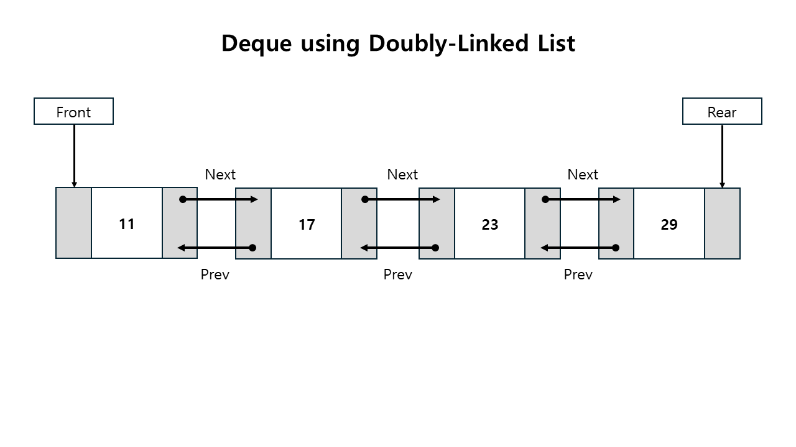
> doubly-linked list를 이용하여 만든 덱 구조
- **정의**: 이중 연결 리스트를 사용하여 덱를 구현한 형태

- **특징**:  
  - 이중 연결 리스트 기반이기 때문에 크기를 미리 설정하지 않아도 동적으로 크기 조절 가능
  - 배열 기반 덱보다 구조적으로 유연하고 크기 제한이 없음
  - 각 노드가 이전 노드와 다음 노드를 가리키는 포인터를 포함
 
- **장점**:  
  - 덱의 크기가 동적으로 변경되어 메모리 낭비가 없고, 수동 크기 조정이 필요하지 않음
  - 양쪽 끝에서의 삽입과 삭제가 $O(1)$ 시간에 가능
  - 덱의 앞쪽에 요소를 추가할 때 요소 이동이 필요 없음

- **단점**:  
  - 각 노드가 데이터와 포인터를 저장해야하므로 배열 기반 덱에 비해 메모리 공간이 많이 필요
  - 특정 인덱스의 데이터에 접근하려면 순차 탐색이 필요하여 $O(n)$의 시간 복잡도가 필요

- **활용**  
  - 양방향 큐
  - 브라우저의 앞으로/뒤로 가기 기능
  - 이중 연결 리스트를 이용한 다양한 알고리즘
<details><summary>C 연결 리스트 기반 덱 구현</summary>

```c
// C에서의 Linked List-based Deque
typedef char element;

typedef struct DQNode {
    element data;
    struct DQNode* llink;
    struct DQNode* rlink;
} DQNode;

typedef struct {
    DQNode* front, * rear;
} DQueType;

DQueType* createDQue() {
    DQueType* DQ = (DQueType*)malloc(sizeof(DQueType));
    DQ->front = NULL;
    DQ->rear = NULL;
    return DQ;
}

// 덱이 비었는지 확인
int isEmpty(DQueType* DQ) {
    return (DQ->front == NULL);
}

// front에 삽입
void insertFront(DQueType* DQ, element item) {
    DQNode* newNode = (DQNode*)malloc(sizeof(DQNode));
    newNode->data = item;
    newNode->llink = NULL;
    newNode->rlink = DQ->front;

    if (isEmpty(DQ)) {
        DQ->front = DQ->rear = newNode;
    }
    else {
        DQ->front->llink = newNode;
        DQ->front = newNode;
    }
}

// rear에 삽입
void insertRear(DQueType* DQ, element item) {
    DQNode* newNode = (DQNode*)malloc(sizeof(DQNode));
    newNode->data = item;
    newNode->rlink = NULL;
    newNode->llink = DQ->rear;

    if (isEmpty(DQ)) {
        DQ->front = DQ->rear = newNode;
    }
    else {
        DQ->rear->rlink = newNode;
        DQ->rear = newNode;
    }
}

// front에서 제거
element deleteFront(DQueType* DQ) {
    if (isEmpty(DQ)) {
        printf("Linked Deque is empty!\n");
        return '\0';
    }

    DQNode* temp = DQ->front;
    element item = temp->data;
    DQ->front = DQ->front->rlink;

    if (DQ->front == NULL) {
        DQ->rear = NULL;  
    }
    else {
        DQ->front->llink = NULL;
    }

    free(temp);
    return item;
}

// rear에서 제거
element deleteRear(DQueType* DQ) {
    if (isEmpty(DQ)) {
        printf("Linked Deque is empty!\n");
        return '\0';
    }

    DQNode* temp = DQ->rear;
    element item = temp->data;
    DQ->rear = DQ->rear->llink;

    if (DQ->rear == NULL) {
        DQ->front = NULL;  
    }
    else {
        DQ->rear->rlink = NULL;
    }

    free(temp);
    return item;
}

```

</details>
<details><summary>Java 연결 리스트 기반 덱 구현</summary>

```java
// Java에서의 Linked List-based Deque
import java.util.*;

class GFG {

	static class Node {
		int data;
		Node prev, next;

		static Node getnode(int data)
		{
			Node newNode = new Node();
			newNode.data = data;
			newNode.prev = newNode.next = null;
			return newNode;
		}
	};

	static class Deque {
		Node front;
		Node rear;
		int Size;

		Deque()
		{
			front = rear = null;
			Size = 0;
		}

		
		// 덱이 비었는지 확인
		boolean isEmpty() { return (front == null); }

		// 덱이 꽉 찼는지 확인
		int size() { return Size; }

		// front에서 삽입
		void insertFront(int data)
		{
			Node newNode = Node.getnode(data);
			if (newNode == null)
				System.out.print("OverFlow\n");
			else {
				if (front == null)
					rear = front = newNode;

				else {
					newNode.next = front;
					front.prev = newNode;
					front = newNode;
				}

				Size++;
			}
		}

		// rear에서 삽입
		void insertRear(int data)
		{
			Node newNode = Node.getnode(data);
			if (newNode == null)
				System.out.print("OverFlow\n");
			else {
				if (rear == null)
					front = rear = newNode;

				else {
					newNode.prev = rear;
					rear.next = newNode;
					rear = newNode;
				}

				Size++;
			}
		}

		// front에서 제거
		void deleteFront()
		{
			if (isEmpty())
				System.out.print("UnderFlow\n");
			else {
				Node temp = front;
				front = front.next;

				if (front == null)
					rear = null;
				else
					front.prev = null;

				Size--;
			}
		}

		// rear에서 제거
		void deleteRear()
		{
			if (isEmpty())
				System.out.print("UnderFlow\n");

			else {
				Node temp = rear;
				rear = rear.prev;

				if (rear == null)
					front = null;
				else
					rear.next = null;

				Size--;
			}
		}
	}
}

```

</details>

---
# 트리 (Tree)
---
## 트리 (Tree)
- **정의**: 노드와 간선으로 구성된 계층적(hierarchical) 구조를 표현하기 위한 비선형 자료구조
- **특징**:
  - 노드(Node)와 간선(Edge)로 구성되어 노드들 간의 계층적인 관계(부모-자식 관계)를 나타냄

- **주요 용어**:
    -  **루트 노드(Root Node)**: 트리의 최상위 노드, 부모 노드가 존재하지 않는 유일한 노드
    -  **부모 노드(Parent Node)**: 자식 노드와 연결된 상위 노드
    -  **자식 노드(Child Node)**: 부모 노드와 연결된 하위 노드
    -  **형제 노드(Sibling Node)**: 동일한 부모 노드를 가지는 노드
    -  **리프 노드(Leaf Node)**: 자식 노드가 없는 노드
    -  **깊이(Depth)**: 루트 노드에서 특정 노드까지의 경로 길이
    -  **높이(Height)**: 특정 노드에서 리프 노드까지의 최대 경로 길이
    -  **서브트리(Subtree)**: 트리의 특정 노드를 루트 노드로 하는 부분 트리
    -  **차수(Degree)**: 노드가 가지는 자식 노드의 개수
---
### 일반 트리 (General Tree)
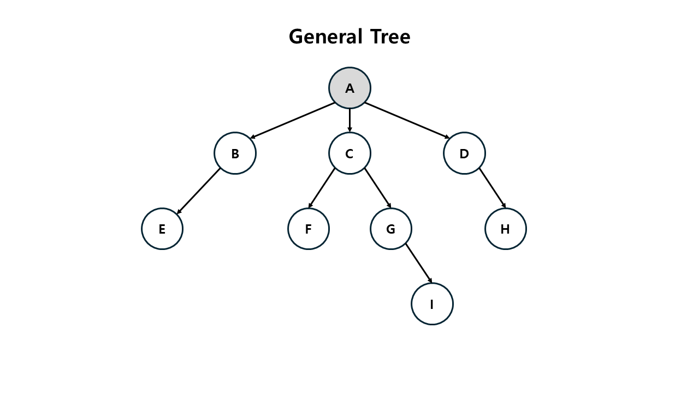
> 일반 트리 구조
- **정의**: 노드와 간선으로 구성된 계층적 데이터 구조

- **특징**:  
  - 하나의 루트 노드에서 시작하며, 모든 노드는 루트 노드와 연결되어 있어야 함
  - 다양한 형태로 확장 가능 (예: 이진 트리, 다진 트리)
  
- **장점**:  
  - 계층적 데이터 표현에 유용
  - 각 노드가 자식 노드의 수에 제한을 받지 않아 다양한 데이터 표현 가능
  - 서브트리도 트리의 성질을 가져 재귀적 알고리즘을 쉽게 적용할 수 있음

- **단점**:  
  - 특정 노드를 찾으려면 순회가 필요해 **O(n)** 의 시간 복잡도를 가짐
  - 자식 노드의 수가 동적이라 이진 트리 등에 비해 알고리즘이 제한적
  - 각 노드가 여러 자식 노드를 가질 수 있어 구현이 복잡해질 수 있음

- **활용**:  
  - 파일 시스템 구조  
  - 조직도  
  - 계층적 데이터 저장
  
<details><summary>C 일반 트리 구현</summary>

```c
// 일반 트리 노드 정의 및 삽입
typedef struct TreeNode {
    int data;
    struct TreeNode* firstChild;
    struct TreeNode* nextSibling;
} TreeNode;
    
// 새 노드 생성
TreeNode* createNode(int data) {
    TreeNode* newNode = (TreeNode*)malloc(sizeof(TreeNode));
    newNode->data = data;
    newNode->firstChild = NULL;
    newNode->nextSibling = NULL;
    return newNode;
}
    
// 자식 노드 추가
void addChild(TreeNode* parent, TreeNode* child) {
    if (parent->firstChild == NULL) {
        parent->firstChild = child;
    } else {
        TreeNode* sibling = parent->firstChild;
        while (sibling->nextSibling != NULL) {
            sibling = sibling->nextSibling;
        }
        sibling->nextSibling = child;
    }
}
```

</details>

<details><summary>java 일반 트리 구현</summary>

```java
import java.util.ArrayList;
import java.util.List;

class Node {
    String data;
    List<Node> children;

    // 노드 생성자
    public Node(String data) {
        this.data = data;
        this.children = new ArrayList<>();
    }

    // 자식 노드 추가
    public void addChild(Node child) {
        this.children.add(child);
    }
}

class Tree {
    Node root;

    // 트리 생성자 (루트 노드를 설정)
    public Tree(String rootData) {
        root = new Node(rootData);
    }
}

```
</details>


---   

### Left-child-right-sibling 트리 (LCRS Tree)
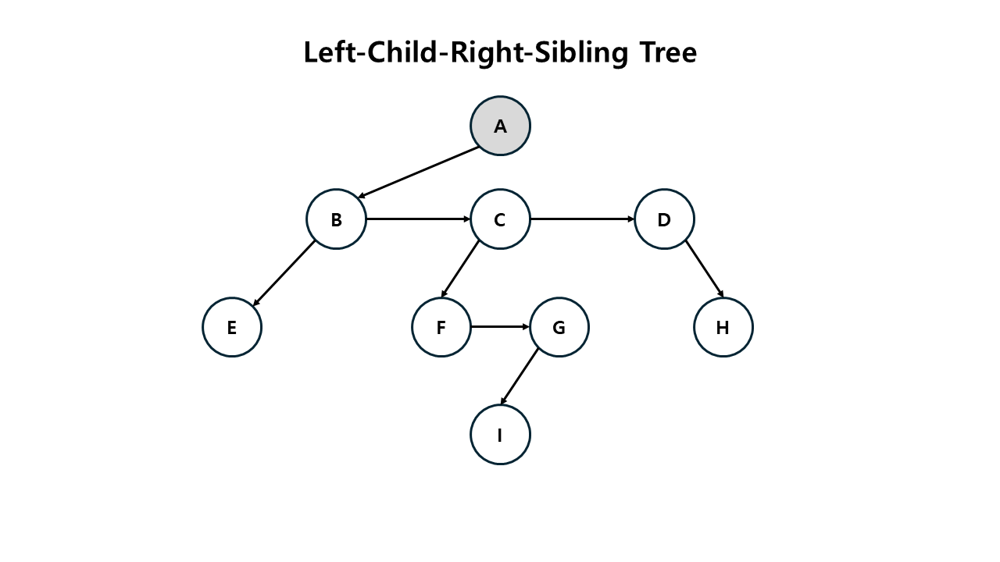
> 일반 트리를 이진 트리 형태로 변형한 형태의 LCRS 트리
- **정의**: 일반 트리를 이진 트리로 변환한 형태의 트리  

- **특징**  
  - 각 노드의 첫번째 자식 노드를 왼쪽 포인터로 가리키고, 형제 노드를 오른쪽 포인터로 가리킴
  - 일반 트리를 이진 트리의 형태로 변환했기 때문에 이진 트리의 알고리즘을 사용할 수 있음
 
- **장점**:  
  - 일반 트리를 이진 트리의 구조로 표현하여 구현 용이  
  - 공간 효율적  

- **단점**:  
  - 형제 노드 간의 탐색이 오른쪽 포인터를 따라가야 해 형제 노드가 많을 경우 비효율적
  - 계층을 표현하기 위해 자식 노드와 형제 노드간의 관계를 재귀적으로 순회해야 해 비효율적

- **활용**  
  - 다양한 트리 구조의 표현  
  - 문서의 계층적 구조 표현

<details><summary>C 일반 트리 LCRS변환 구현</summary>

```c
// Left-child-right-sibling 변환 예시
TreeNode* convertToLCRS(TreeNode* root) {
    if (!root) return NULL;
    TreeNode* leftChild = root->firstChild;
    TreeNode* sibling = leftChild ? leftChild->nextSibling : NULL;
    
    root->firstChild = leftChild ? convertToLCRS(leftChild) : NULL;
    if (root->firstChild) root->firstChild->nextSibling = sibling ? convertToLCRS(sibling) : NULL;
    
    return root;
    }
```

</details>
<details><summary>Java 일반 트리 LCRS변환 구현</summary>

```java
public class TreeConversion {

    static class LCRSTreeNode {
        int val;
        LCRSTreeNode left;  // 첫 번째 자식
        LCRSTreeNode right; // 오른쪽 형제

        public LCRSTreeNode(int val) {
            this.val = val;
            this.left = null;
            this.right = null;
        }
    }

    public static LCRSTreeNode convertToLCRS(GeneralTreeNode node) {
        if (node == null) {
            return null;
        }

        // 현재 노드를 LCRS 트리 노드로 생성
        LCRSTreeNode lcrsNode = new LCRSTreeNode(node.val);

        // 일반 트리의 첫 번째 자식 노드를 left 포인터로 변환
        if (!node.children.isEmpty()) {
            lcrsNode.left = convertToLCRS(node.children.get(0));

            // 나머지 자식들은 오른쪽 형제 체인으로 연결
            LCRSTreeNode current = lcrsNode.left;
            for (int i = 1; i < node.children.size(); i++) {
                current.right = convertToLCRS(node.children.get(i));
                current = current.right;
            }
        }
        return lcrsNode;
    }
}
```

</details>

---

## 트리 순회 (Tree Traversal)
- **정의**: 트리 구조의 모든 노드를 일정한 규칙에 따라 탐색하는 방법
- **특징**:
    -  트리의 모든 노드를 순회하여 데이터를 처리
    -  트리 구조의 재귀적 특성 때문에 대부분의 순회 알고리즘이 재귀적으로 구현
    -  깊이 우선 탐색(DFS)와 너비 우선 탐색(BFS)의 방법으로 나뉨

---

### 전위 순회 (Pre-order Traversal)
- **정의**: 루트 노드를 먼저 방문한 후 왼쪽 서브트리와 오른쪽 서브트리를 순서대로 탐색하는 방법

- **특징**:  
  - 루트 노드가 서브트리보다 우선적으로 처리됨
  - 재귀적 또는 비재귀적으로 구현 가능
  - 깊이 우선 탐색 방식으로 노드의 깊이를 따라 탐색

- **동작방식**  
  1. 현재 노드 방문  
  2. 왼쪽 서브트리 전위 순회  
  3. 오른쪽 서브트리 전위 순회
  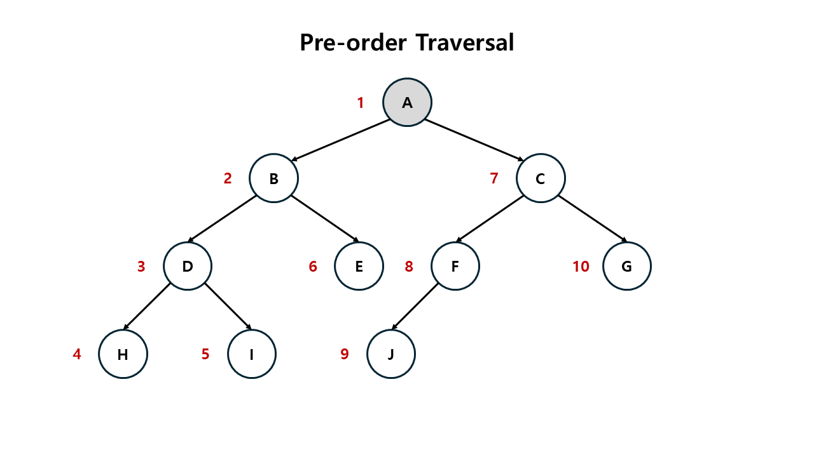
        > pre-order 규칙을 따라 A -> B -> D -> H -> I -> E -> C -> F -> J -> G 순서대로 탐색

- **장점**:  
    - 노드를 루트에서부터 순차적으로 처리하기 때문에 트리의 구조를 복사하거나 재구성하는데 유용
    - 루트가 항성 먼저 탐색되므로 계층적 데이터 구조의 루트 우선 순서를 유지

- **단점**:  
    - 계층 구조는 드러나지만 데이터의 정렬된 순서를 보장하지 않음

- **활용**  
  - 트리의 구조 복원  
  - 표현식 트리에서 연산 순서 결정

<details><summary>C 이진 트리 전위 순회 구현</summary>

```c
void preOrderTraversal(Node* root) {
    if (root == NULL) return;
    printf("%d ", root->data);
    preOrderTraversal(root->left);
    preOrderTraversal(root->right);
}
```

</details>
<details><summary>Java 이진 트리 전위 순회 구현</summary>

```java
public void preOrderTraversal(Node node) {
    if (node == null) {
        return;
    }
    System.out.print(node.data + " ");
    preOrderTraversal(node.left);
    preOrderTraversal(node.right);
}
```

</details>

---

### 중위 순회 (In-order Traversal)
- **정의**: 왼쪽 서브트리 -> 루트 -> 오른쪽 서브트리 순서대로 탐색하는 방법

- **특징**:  
  - 이진 탐색 트리에서 데이터가 오름차순으로 정렬된 결과를 보임

- **동작방식**  
  1. 왼쪽 서브트리 중위 순회  
  2. 현재 노드 방문  
  3. 오른쪽 서브트리 중위 순회
 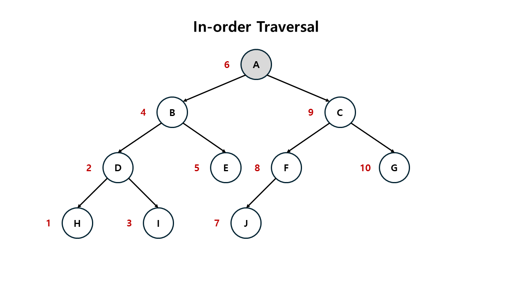
        > 중위 순회 규칙을 따라 H -> D -> I -> B -> E -> A -> J -> F -> C -> G 순서로 탐색
- **장점**:  
    - 이진 탐색 트리에서 정렬된 순서로 요소 접근 가능  

- **단점**:  
    - 이진 트리를 기반으로 하므로 일반 트리에서는 적용하기 어려움 

- **활용**  
  - 이진 탐색 트리의 데이터 정렬  
  - 표현식 트리에서 중위 표현식 생성

<details><summary>C 중위 순회 구현</summary>

```c
void inOrderTraversal(Node* root) {
    if (root == NULL) return;
    inOrderTraversal(root->left);
    printf("%d ", root->data);
    inOrderTraversal(root->right);
}
```

</details>

<details><summary>Java 중위 순회 구현</summary>

```java
public void inOrderTraversal(Node node) {
    if (node == null) {
        return;
    }
    inOrderTraversal(node.left);
    System.out.print(node.data + " ");
    inOrderTraversal(node.right);
}
```

</details>

---

### 후위 순회 (Post-order Traversal)
- **정의**: 왼쪽 서브트리 -> 오른쪽 서브트리 -> 루트 순서대로 탐색하는 방법
- **특징**  
  - 모든 자식 노드를 방문한 후에 루트 노드를 처리

- **동작방식**  
  1. 왼쪽 서브트리 후위 순회  
  2. 오른쪽 서브트리 후위 순회  
  3. 현재 노드 방문
 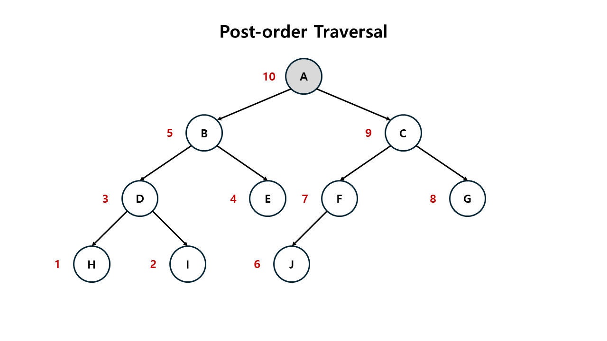
        > 후위 순회 규칙을 따라 H -> I -> D -> E -> B -> J -> F -> G -> C -> A 순서로 탐색
- **장점**:  
    - 자식 노드를 모두 처리한 후 부모 노드를 처리하기 때문에 종속 관계의 데이터 처리에 적합
- **단점**:  
    - 루트 노드를 마지막에 처리하므로 루트 노드에 대한 즉각적인 작업이 불가능
    - 루트 노드 중심의 탐색이 아니기 때문에 계층적 구조 파악이 어려울 수 있음

- **활용**  
  - 트리의 삭제 작업  
  - 표현식 트리에서 후위 표현식 생성

<details><summary>C 후위 순회 구현</summary>

```c
void postOrderTraversal(Node* root) {
    if (root == NULL) return;
    postOrderTraversal(root->left);
    postOrderTraversal(root->right);
    printf("%d ", root->data); 
}
```

</details>
<details><summary>Java 후위 순회 구현</summary>

```java
public void postOrderTraversal(Node node) {
    if (node == null) {
        return;
    }
    postOrderTraversal(node.left);
    postOrderTraversal(node.right);
    System.out.print(node.data + " ");
}
```

</details>

---

### 레벨 순회 (Level-order Traversal)
- **정의**:  
  - 루트 노드에서 시작하여 같은 레벨의 노드들을 왼쪽에서 오른쪽 순서대로 탐색하는 방법
- **특징**:  
  - 큐를 사용하여 구현
  - 한 레벨씩 내려가며 같은 레벨의 노드를 왼쪽에서 오른쪽 순서로 탐색
  - 너비 우선 탐색(BFS, Breadth-First Search)임

- **동작방식**:  
  1. 루트 노드 큐에 추가  
  2. 큐가 빌 때까지 반복: 큐에서 노드 제거, 방문, 자식 노드 큐에 추가
    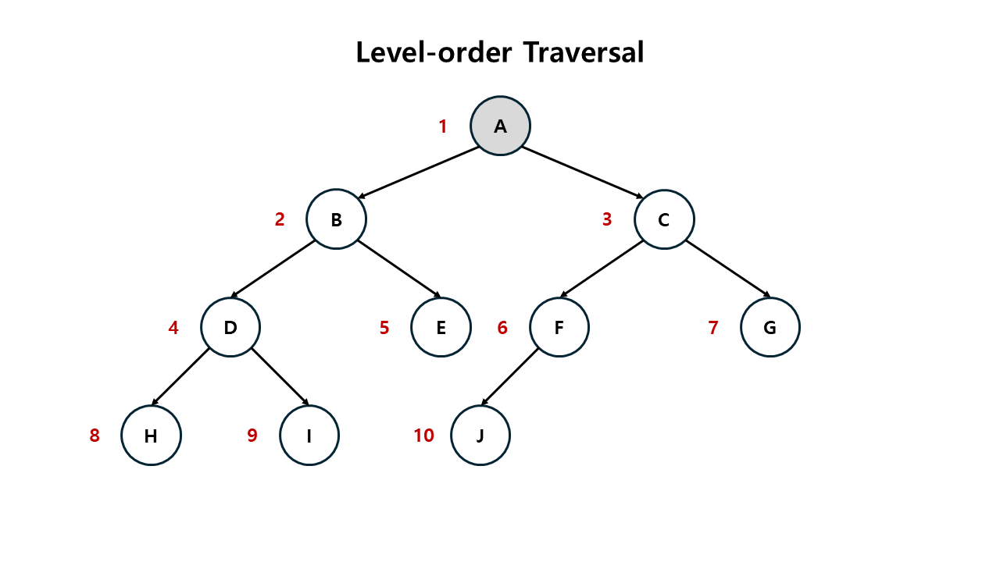
        > 레벨 순회 규칙을 따라 A -> B -> C -> D -> E -> F -> G -> H -> I -> J 순서로 탐색
- **장점**:  
    - 트리의 계층 구조를 그대로 탐색하여 직관적으로 이해하거나 시각화하는데 유용
    - BFS방식이므로 최단 경로 탐색에 적합
- **단점**:  
    - 큐를 사용해야해 트리의 최대 너비만큼 추가적인 메모리 공간이 필요
    - 깊은 노드의 탐색 시간이 오래 걸리고 비효율적

- **활용**  
  - 너비 우선 탐색 (BFS) 알고리즘  
  - 레벨별 데이터 처리

<details><summary>C 레벨 순회 구현</summary>

```c
void levelOrderTraversal(Node* root) {
    if (root == NULL) return;
    Queue* queue = createQueue(); // 큐 생성
    enqueue(queue, root);
    while (!isEmpty(queue)) {
        Node* current = dequeue(queue);
        printf("%d ", current->data);
        if (current->left != NULL) enqueue(queue, current->left);
        if (current->right != NULL) enqueue(queue, current->right);
    }
}
```

</details>
<details><summary>Java 레벨 순회 구현</summary>

```java
public void levelOrderTraversal(Node node) {
    if (node == null) {
        return;
    }
    Queue<Node> queue = new LinkedList<>();
    queue.add(node);
    while (!queue.isEmpty()) {
        Node current = queue.poll();
        System.out.print(current.data + " ");
        if (current.left != null) {
            queue.add(current.left);
        }
        if (current.right != null) {
            queue.add(current.right);
        }
    }
}
```

</details>

---

## 이진 트리 (Binary Tree)
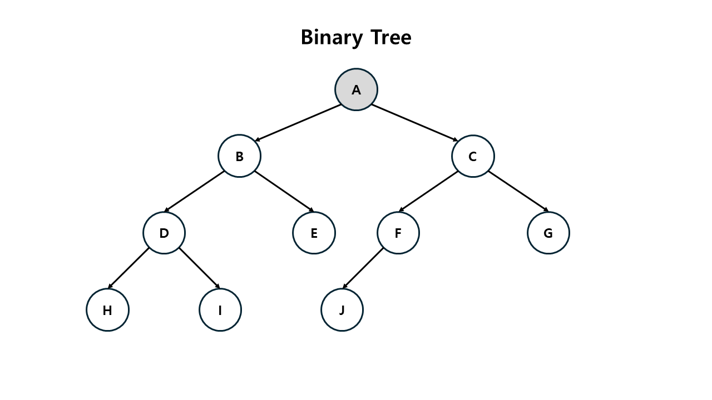
> 기본적인 이진 트리의 형태
- **정의**: 각 노드가 최대 두 개의 자식 노드를 가질 수 있는 트리 구조
- **특징**: 
  - 각 노드가 최대 두 개의 자식 노드(왼쪽, 오른쪽)을 가질 수 있음
  - 왼쪽과 오른쪽 서브트리가 각각 또 다른 이진 트리로 구성되는 재귀적 성질을 가짐
### 포화 이진 트리 (Perfect Binary Tree)
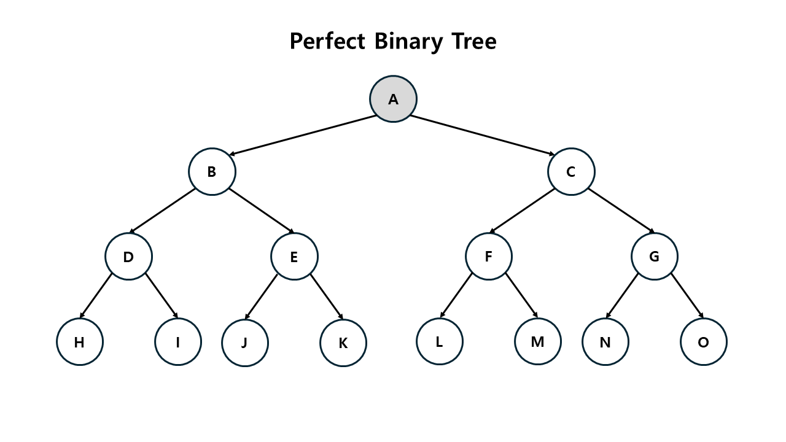
> 모든 레벨이 완전히 채워진 형태
- **정의**: 모든 레벨이 완전히 채워져 있는 이진 트리

- **특징**:  
  - 리프 노드를 제외한 모든 노드가 2개의 자식 노드를 가짐
  - 모든 리프 노드가 동일한 레벨을 가짐
  - 높이가 $h$ 인 트리의 전체 노드 개수는 $2^h-1$개 이고, 리프 노드의 개수는 $2^{h-1}$개
  - 균형이 잘 맞아 효율적인 검색 가능

- **장점**: 
  - 주어진 높이에서 노드가 최대로 채워져 있어 공간 사용이 효율적
  - 트리의 높이가 최소화되어 탐색, 삽입, 삭제 연산의 시간 복잡도가 **O($log\,n$)** 으로 효율적

- **단점**:  
  - 구조를 유지하기 위해 삽입, 삭제 연산시 재구성이 필요하고 제한적
  - 데이터의 개수가 $2^h-1$개가 아닌 경우 포화 이진 트리 구조를 적용하기 어려움

- **활용**  
  - 이진 탐색 트리 구현  
  - 효율적인 데이터 검색

<details><summary>C 포화 이진 트리 구현</summary>

```c
// 포화 이진 트리 예시 코드
#include <stdio.h>
#include <stdlib.h>

struct Node {
    int data;
    struct Node* left;
    struct Node* right;
};

struct Node* newNode(int data) {
    struct Node* node = (struct Node*)malloc(sizeof(struct Node));
    node->data = data;
    node->left = node->right = NULL;
    return node;
}

int isFullBinaryTree(struct Node* root) {
    if (root == NULL) return 1;  // 공백 노드는 트리로 간주
    
    // 리프 노드이면 1
    if (root->left == NULL && root->right == NULL) return 1;

    // 자식이 둘 다 있으면 재귀적으로 체크
    if (root->left != NULL && root->right != NULL)
        return isFullBinaryTree(root->left) && isFullBinaryTree(root->right);

    // 자식이 하나만 있으면 트리가 아님
    return 0;
}
```

</details>

<details><summary>Java 포화 이진 트리 구현</summary>

```java
public class PBinaryTree {

    static class Node {
        int value;
        Node left;
        Node right;

        public Node(int value) {
            this.value = value;
            this.left = null;
            this.right = null;
        }
    }

    // 노드에 부여할 순차적 값을 위한 변수
    private static int counter = 1;

    public static Node generatePBinaryTree(int maxDepth) {
        counter = 1;
        return generatePBinaryTreeHelper(0, maxDepth);
    }

    private static Node generatePBinaryTreeHelper(int currentDepth, int maxDepth) {
        if (currentDepth > maxDepth) {
            return null;
        }

        // 현재 노드 생성 (순차적으로 값을 할당)
        Node root = new Node(counter++);

        // 최대 깊이에 도달하지 않았다면 좌우 자식을 재귀적으로 생성
        if (currentDepth < maxDepth) {
            root.left = generatePBinaryTreeHelper(currentDepth + 1, maxDepth);
            root.right = generatePBinaryTreeHelper(currentDepth + 1, maxDepth);
        }
        return root;
    }
}
```

</details>

---

### 완전 이진 트리 (Complete Binary Tree)
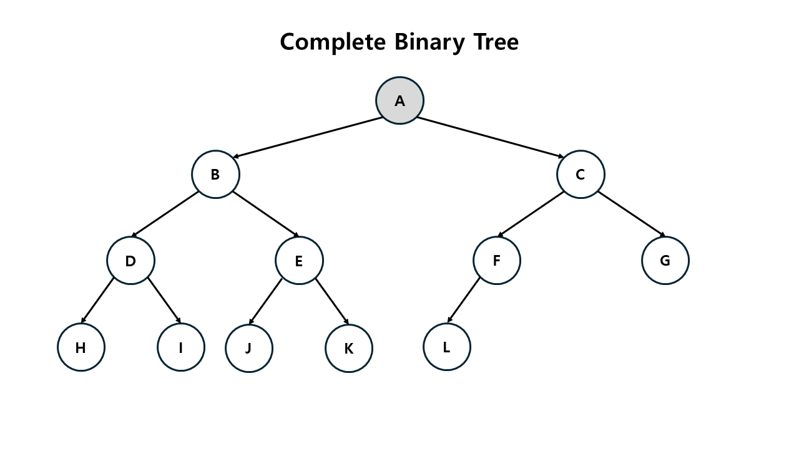
> 차례대로 채워져서 마지막 레벨은 왼쪽 노드부터 채워지는 형태
- **정의**: 마지막 레벨을 제외한 모든 레벨이 완전히 채워져있으며, 마지막 레벨은 왼쪽 노드부터 순차적으로 채워진 이진 트리

- **특징**  
  - 리프 노드를 제외한 모든 노드가 2개의 자식 노드를 가짐
  - 배열로 쉽게 구현이 가능하며, 부모 노드와 자식 노드 간의 인덱스 관계가 명확하여 포인터를 사용하지 않아도 됨
- **장점**:  
  - 트리의 높이가 최소화되어 탐색, 삽입, 삭제 연산의 시간 복잡도가 O($log\,n$) 으로 효율적
  - 포인터를 사용하지 않고 배열 인덱스를 통해 부모-자식 관계를 관리할 수 있어 메모리 사용이 효율적
  - 노드를 추가하거나 삭제할 때 트리의 균형을 유지하기 쉽고, 연산이 효율적
- **단점**:  
  - 트리의 구조가 특정 패턴을 따라 임의의 위치에 노드를 삽입하거나 삭제하는것이 제한적

- **활용**  
  - 힙 구현  
  - 효율적인 데이터 저장 및 검색

<details><summary>C 완전 이진 트리 구현</summary>

```c
#include <stdio.h>
#include <stdlib.h>

// 노드 구조체 정의
struct Node {
    int data;
    struct Node* left;
    struct Node* right;
};

// 새 노드를 생성하는 함수
struct Node* newNode(int data) {
    struct Node* node = (struct Node*)malloc(sizeof(struct Node));
    node->data = data;
    node->left = node->right = NULL;
    return node;
}

// 완전 이진 트리에서 삽입 함수
struct Node* insertCompleteBinaryTree(struct Node* root, int data) {
    if (root == NULL) return newNode(data);
    
    // 큐를 사용하여 완전 이진 트리의 삽입 구현
    struct Node* queue[100];
    int front = -1, rear = -1;

    queue[++rear] = root;
    while (front < rear) {
        struct Node* current = queue[++front];
        
        // 왼쪽 자식이 없으면 삽입
        if (current->left == NULL) {
            current->left = newNode(data);
            return root;
        } else {
            queue[++rear] = current->left;
        }

        // 오른쪽 자식이 없으면 삽입
        if (current->right == NULL) {
            current->right = newNode(data);
            return root;
        } else {
            queue[++rear] = current->right;
        }
    }
    return root;
}
```
</details>

<details><summary>Java 완전 이진 트리 구현</summary>

```java
import java.util.LinkedList;
import java.util.Queue;

class Node {
    int value;
    Node left;
    Node right;

    public Node(int value) {
        this.value = value;
        this.left = null;
        this.right = null;
    }
}

public class CompleteBinaryTree {
    private Node root;

    public CompleteBinaryTree() {
        root = null;
    }

    public void insert(int value) {
        Node newNode = new Node(value);
        
        // 트리가 비어 있다면 새로운 노드를 루트로 지정
        if (root == null) {
            root = newNode;
            return;
        }
        
        Queue<Node> queue = new LinkedList<>();
        queue.add(root);
        
        while (!queue.isEmpty()) {
            Node current = queue.poll();

            // 왼쪽 자식이 없으면 새로운 노드를 왼쪽 자식으로 지정
            if (current.left == null) {
                current.left = newNode;
                return;
            } else {
                queue.add(current.left);
            }
            
            // 오른쪽 자식이 없으면 새로운 노드를 오른쪽 자식으로 지정
            if (current.right == null) {
                current.right = newNode;
                return;
            } else {
                queue.add(current.right);
            }
        }
    }
}
```

</details>

---

### 경사 트리 (Skewed Tree)
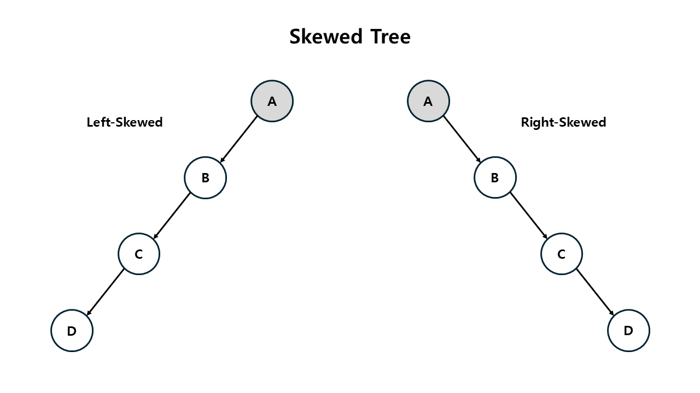
> 왼쪽 혹은 오른쪽 한 쪽 방향으로만 자식 노드를 가지는 형태
- **정의**: 트리의 모든 노드가 같은 방향의 자식 노드만을 가지는 편향된 구조의 트리

- **특징**:  
  - 모든 노드가 하나의 자식 노드만을 가지며 같은 방향의 자식 노드임
  - 트리의 높이($h$)와 트리의 노드 개수($n$)가 동일함($h = n$) 

- **장점**:  
  - 트리의 구조가 단순하여 구현이 용이
  - 노드가 한쪽 자식만을 가지므로 메모리 할당 및 관리가 단순
- **단점**:  
    - 트리가 편향되어 있고, 트리의 높이가 $n$이므로, 탐색, 삽입, 삭제 연산의 시간 복잡도가 $O(n)$으로 비효율적
    - 균형 잡힌 트리 구조가 아니기 때문에, 알고리즘 등이 제한적

- **활용**  
  - 특정 조건에서의 트리 구조  
  - 간단한 데이터 구조가 필요한 경우

<details><summary>C 왼쪽 경사 트리 구현</summary>

```c
#include <stdio.h>
#include <stdlib.h>

struct Node {
    int data;
    struct Node* left;
    struct Node* right;
};

// 새 노드를 생성하는 함수
struct Node* newNode(int data) {
    struct Node* node = (struct Node*)malloc(sizeof(struct Node));
    node->data = data;
    node->left = node->right = NULL;
    return node;
}

// 경사 트리 생성 (왼쪽 경사 트리)
struct Node* createSkewedTreeLeft(int n) {
    struct Node* root = newNode(1);
    struct Node* current = root;

    for (int i = 2; i <= n; i++) {
        current->left = newNode(i);
        current = current->left;
    }

    return root;
}
```

</details>
<details><summary>Java 왼쪽 경사 트리 구현</summary>

```java
import java.util.*;

class LST
{
     
    static class Node 
    {
        int key;
        Node left, right;
    };
    
    // 새 노드를 생성하는 함수
    static Node newNode(int key)
    {
        Node temp = new Node();
        temp.key = key;
        temp.left = temp.right = null;
    
        return (temp);
    }
}
```

</details>

---

### 수식 트리 (Expression Tree)

> 수식을 표현하는 형태
- **정의**:  
    - 수식의 연산자와 피연산자를 표현하기 위해 사용되는 이진 트리

- **특징**:  
  - 리프 노드는 피연산자(숫자, 변수 등)를 나타내고, 내부 노드는 연산자를 나타냄  
  - 수식의 구조를 트리 형태로 표현
  - 대부분의 수식 트리는 이진 트리로 구현되어 각 연산자가 두 개의 피연산자를 가지나, 단항 연산자의 경우 하나의 자식 노드만을 가질 수도 있음
  - 순회 방법에 따라 수식 표기법이 다른 결과가 나옴
    - 전위 순회
      - 수식을 전위 표기법으로 변환
      - 위 그림에서 $+*+112+35$
    - 중위 순회
      - 수식을 일반적인 수식 형태로 변환
      - 위 그림에서 $(1+1)*2+(3+5)$
    - 후위 순회
      - 수식을 후위 표기법으로 변환
      - 위 그림에서 $11+2*35++$

- **장점**:  
  - 수식의 구조적 표현 가능
  - 후위 순회를 이용한 수식 평가가 가능하여 스택을 이용하여 효율적 계산 가능
  - 수식 평가 및 변환이 용이  
- **단점**:  
  - 복잡한 수식일 경우 트리의 크기 증가  
  - 특정 수식 구조에서 트리가 편향되어 높이가 증가하여 순회 및 평가 성능에 영향을 미칠 수 있음 

- **활용**:  
  - 컴파일러의 구문 분석  
  - 수식 계산기  
  - 표현식 평가 및 최적화

<details><summary>C 수식 트리 구현</summary>

```c
#include <stdio.h>
#include <stdlib.h>
#include <string.h>
#include <ctype.h>

struct Node {
    char data;
    struct Node* left;
    struct Node* right;
};

struct Node* newNode(char data) {
    struct Node* node = (struct Node*)malloc(sizeof(struct Node));
    node->data = data;
    node->left = node->right = NULL;
    return node;
}

// 수식 트리 출력 (후위 순회)
void postOrderTraversal(struct Node* root) {
    if (root == NULL) return;
    postOrderTraversal(root->left);
    postOrderTraversal(root->right);
    printf("%c ", root->data);
}

// 수식 계산
int evaluate(struct Node* root) {
    if (root == NULL) return 0;
    
    // 리프 노드(숫자)라면 그 값을 반환
    if (!root->left && !root->right)
        return root->data - '0';
    
    // 연산자라면 왼쪽과 오른쪽 자식에 대해 연산 수행
    int leftVal = evaluate(root->left);
    int rightVal = evaluate(root->right);
    
    switch (root->data) {
        case '+': return leftVal + rightVal;
        case '-': return leftVal - rightVal;
        case '*': return leftVal * rightVal;
        case '/': return leftVal / rightVal;
        default: return 0;
    }
}
```

</details>
<details><summary>Java 수식 트리 구현</summary>

```java
import java.util.Stack;
 
class Node{
    char data;
    Node left,right;
    public Node(char data){
        this.data = data;
        left = right = null;
    }
}
 
public class Main {
    // 피연산자인지 확인하는 함수
    public static boolean isOperator(char ch){
        if(ch=='+' || ch=='-'|| ch=='*' || ch=='/' || ch=='^'){
            return true;
        }
        return false;
    }
    // 수식 트리 생성
    public static Node expressionTree(String postfix){
        Stack<Node> st = new Stack<Node>();
        Node t1,t2,temp;
 
        for(int i=0;i<postfix.length();i++){
            if(!isOperator(postfix.charAt(i))){
                temp = new Node(postfix.charAt(i));
                st.push(temp);
            }
            else{
                temp = new Node(postfix.charAt(i));
 
                t1 = st.pop();
                t2 = st.pop();
 
                temp.left = t2;
                temp.right = t1;
 
                st.push(temp);
            }
 
        }
        temp = st.pop();
        return temp;
    }
}
```

</details>

---

## 이진 탐색 트리 (Binary Search Tree)
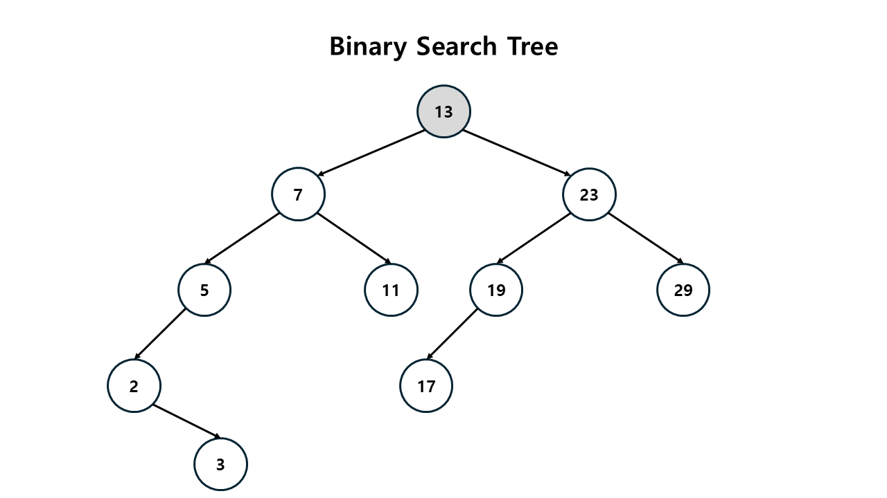
> 빠른 탐색을 위해 왼쪽 자식은 자신보다 작은 데이터, 오른쪽 자식은 자신보다 큰 데이터를 넣은 형태
- **정의**: 각 노드가 최대 두 개의 자식 노드를 가지고, 왼쪽 서브트리의 모든 노드 값은 현재 노드의 값보다 작고, 오른쪽 서브트리의 모든 노드 값은 현재 노드의 값보다 큰 이진 트리
- **특징**: 
    -  트리의 왼쪽 서브트리는 현재 노드보다 작은 값을 가지고, 오른쪽 서브트리는 큰 값을 가져 중위순회를 수행하면 오름차순으로 정렬된 값을 얻을 수 있음
    -  일반적으로 중복된 값을 허용하지 않아 각 노드의 값은 고유해야 함
- **장점**:
  - 효율적인 탐색, 삽입, 삭제
  - 중위 순회를 통해 정렬된 데이터 획득 가능
- **단점**:
  - 균형 유지의 어려움
  - 중복 값 처리 제한

<details><summary>C 이진 탐색 트리 구현</summary>

```c
#include <stdio.h>
#include <stdlib.h>

// 노드 구조체 정의
struct Node {
    int data;
    struct Node* left;
    struct Node* right;
};

// 노드 생성 함수
struct Node* newNode(int data) {
    struct Node* node = (struct Node*)malloc(sizeof(struct Node));
    node->data = data;
    node->left = node->right = NULL;
    return node;
}

// 이진 탐색 트리에서 값을 찾는 함수
struct Node* insert(struct Node* node, int data) {
    if (node == NULL) return newNode(data);

    if (data < node->data)
        node->left = insert(node->left, data);
    else if (data > node->data)
        node->right = insert(node->right, data);

    return node;
}

// 트리에서 값을 검색하는 함수
struct Node* search(struct Node* root, int key) {
    if (root == NULL || root->data == key) return root;

    if (key < root->data)
        return search(root->left, key);
    else
        return search(root->right, key);
}
```
</details>

<details><summary>Java 이진 탐색 트리 구현</summary>

```java
class Node {
    int data;
    Node left, right;

    public Node(int item) {
        data = item;
        left = right = null; 
    }
}

class BinarySearchTree {
    Node root;

    BinarySearchTree() {
        root = null; 
    }

    // 탐색 연산
    public Node search(Node root, int key) {
        if (root == null || root.data == key)
            return root; // key를 찾으면 해당 노드를 반환, 아니면 null

        if (key < root.data)
            return search(root.left, key);
        return search(root.right, key);
    }

    // 삽입 연산
    public Node insert(Node root, int key) {
        if (root == null) {
            root = new Node(key); // 비어있는 자리에 노드 삽입
            return root;
        }

        if (key < root.data)
            root.left = insert(root.left, key);
        else if (key > root.data)
            root.right = insert(root.right, key);

        return root;
    }

    // 삭제 연산
    public Node delete(Node root, int key) {
        if (root == null) return root; // 노드를 찾지 못하면 그대로 반환

        if (key < root.data)
            root.left = delete(root.left, key);
        else if (key > root.data)
            root.right = delete(root.right, key);
        else {
            // 자식이 하나도 없는 경우
            if (root.left == null) return root.right;
            if (root.right == null) return root.left;

            // 자식이 두 명인 경우: 후계자(successor)를 찾음 (오른쪽 서브트리에서 최소값)
            root.data = minValue(root.right);

            // 후계자 삭제
            root.right = delete(root.right, root.data);
        }

        return root;
    }

    // 오른쪽 서브트리에서 가장 작은 값을 찾는 함수 (후계자 찾기)
    int minValue(Node root) {
        int minv = root.data;
        while (root.left != null) {
            minv = root.left.data; // 왼쪽으로 계속 이동해 가장 작은 값을 찾음
            root = root.left;
        }
        return minv;
    }
}
```

</details>

 
---

### 균형 이진 탐색 트리 (Balanced BST)
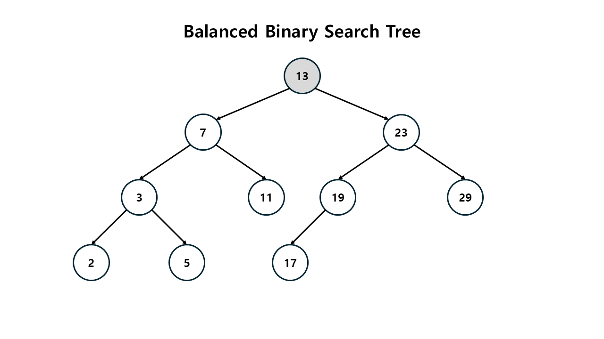
> 균형 이진 트리의 기본적인 형태
- **정의**: 트리의 높이를 최소화하여 균형을 유지하는 이진 탐색 트리
- **특징**:
    -  트리의 각 노드에서 왼쪽 서브트리와 오른쪽 서브트리의 높이 차이가 특정 기준 이하로 유지됨
    -  각 서브트리도 균형 이진 탐색 트리의 특성을 만족하는 재귀적 특성을 만족함
    -  균형이 유지되어 트리의 높이가 $O(log\,n)$으로 제한됨
- **장점**:
    -  트리의 높이가 제한되어 있어 검색, 삽입, 삭제 연산을 효율적으로 수행 가능
    -  균형을 유지함으로써 $O(log\,n)$의 성능을 보장
    -  중위 순회를 통해 데이터를 오름차순으로 쉽게 접근할 수 있음
- **단점**:
    -  노드 삽입이나 삭제 시 균형을 유지하기 위해 회전 연산을 수행해야 함
  
---

#### AVL 트리 (AVL Tree)
- **정의**: 모든 노드에서 왼쪽 서브트리와 오른쪽 서브트리의 높이 차이가 최대 1 이하로 유지되도록 설계된 이진 탐색 트리

- **특징**  
  - $(왼쪽 서브트리의 높이) - (오른쪽 서브트리의 높이)$를 균형 인수라고 하며 $-1\leq n \leq 1\,(n은\, 정수)$를 만족해야함
  - 균형 인수가 범위를 벗어난 경우, 트리가 불균형 상태이므로 회전 연산을 통해 균형을 회복해야함


- **장점**:  
  - 검색, 삽입, 삭제가 모두 $O(log n)$ 시간  
  - 트리의 균형이 항상 유지되므로, 모든 연산에서 일관된 성능 보장
- **단점**:  
  - 회전 연산을 구현해야해 구현이 복잡
  - 각 노드가 자신의 높이 정보를 저장해야해 메모리 사용량이 많음
  - 특정 삽입, 삭제 패턴에서 트리의 균형을 유지하기 위한 연산이 빈번하게 발생할 수 있어 성능 최적화가 어려울 수 있음

- **활용**:  
  - 데이터베이스 인덱스  
  - 고속 검색이 필요한 애플리케이션

<details><summary>AVL tree rotate 예시</summary>

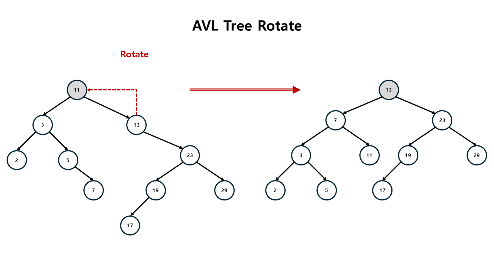
> 높이 차이를 1 이하로 유지하기 위해 rotate를 실행하는 예

</details>

<details><summary>C AVL 트리 구현</summary>

```c
#include <stdio.h>
#include <stdlib.h>
#include <algorithm>

// 노드 구조체 정의
struct Node {
    int data;
    Node* left;
    Node* right;
    int height;
};

// 새 노드를 생성하는 함수
Node* newNode(int data) {
    Node* node = (Node*)malloc(sizeof(Node));
    node->data = data;
    node->left = node->right = NULL;
    node->height = 1;  // 새로운 노드는 높이가 1
    return node;
}

// 높이 계산 함수
int height(Node* node) {
    if (node == NULL) return 0;
    return node->height;
}

// 균형 인수 계산 함수
int getBalance(Node* node) {
    if (node == NULL) return 0;
    return height(node->left) - height(node->right);
}

// 우측 회전 함수
Node* rightRotate(Node* y) {
    Node* x = y->left;
    Node* T2 = x->right;
    
    // 회전
    x->right = y;
    y->left = T2;

    // 높이 갱신
    y->height = std::max(height(y->left), height(y->right)) + 1;
    x->height = std::max(height(x->left), height(x->right)) + 1;

    return x;
}

// 좌측 회전 함수
Node* leftRotate(Node* x) {
    Node* y = x->right;
    Node* T2 = y->left;
    
    // 회전
    y->left = x;
    x->right = T2;

    // 높이 갱신
    x->height = std::max(height(x->left), height(x->right)) + 1;
    y->height = std::max(height(y->left), height(y->right)) + 1;

    return y;
}

// 삽입 함수
Node* insert(Node* node, int data) {
    // 1. 일반적인 BST 삽입
    if (node == NULL) return newNode(data);

    if (data < node->data)
        node->left = insert(node->left, data);
    else if (data > node->data)
        node->right = insert(node->right, data);
    else
        return node;  // 중복 값은 삽입하지 않음

    // 2. 높이 갱신
    node->height = 1 + std::max(height(node->left), height(node->right));

    // 3. 균형 검사
    int balance = getBalance(node);

    // 좌측-좌측 (LL)
    if (balance > 1 && data < node->left->data)
        return rightRotate(node);

    // 우측-우측 (RR)
    if (balance < -1 && data > node->right->data)
        return leftRotate(node);

    // 좌측-우측 (LR)
    if (balance > 1 && data > node->left->data) {
        node->left = leftRotate(node->left);
        return rightRotate(node);
    }

    // 우측-좌측 (RL)
    if (balance < -1 && data < node->right->data) {
        node->right = rightRotate(node->right);
        return leftRotate(node);
    }

    return node;
}
```

</details>

<details><summary>Java AVL 트리 구현</summary>

```java
class Node {
    int key, height;
    Node left, right;

    Node(int d) {
        key = d;
        height = 1;
    }
}

class AVLTree {
    Node root;

    // 높이 반환
    int height(Node N) {
        if (N == null)
            return 0;
        return N.height;
    }

    // 균형 인수 계산
    int getBalance(Node N) {
        if (N == null)
            return 0;
        return height(N.left) - height(N.right);
    }

    // 오른쪽 회전
    Node rightRotate(Node y) {
        Node x = y.left;
        Node T2 = x.right;

        // 회전 수행
        x.right = y;
        y.left = T2;

        // 높이 업데이트
        y.height = Math.max(height(y.left), height(y.right)) + 1;
        x.height = Math.max(height(x.left), height(x.right)) + 1;

        return x;
    }

    // 왼쪽 회전
    Node leftRotate(Node x) {
        Node y = x.right;
        Node T2 = y.left;

        // 회전 수행
        y.left = x;
        x.right = T2;

        // 높이 업데이트
        x.height = Math.max(height(x.left), height(x.right)) + 1;
        y.height = Math.max(height(y.left), height(y.right)) + 1;

        return y;
    }

    // 노드 삽입
    Node insert(Node node, int key) {
        if (node == null)
            return (new Node(key));

        if (key < node.key)
            node.left = insert(node.left, key);
        else if (key > node.key)
            node.right = insert(node.right, key);
        else
            return node;

        // 높이 업데이트
        node.height = 1 + Math.max(height(node.left), height(node.right));

        // 균형 확인
        int balance = getBalance(node);

        // LL 케이스
        if (balance > 1 && key < node.left.key)
            return rightRotate(node);

        // RR 케이스
        if (balance < -1 && key > node.right.key)
            return leftRotate(node);

        // LR 케이스
        if (balance > 1 && key > node.left.key) {
            node.left = leftRotate(node.left);
            return rightRotate(node);
        }

        // RL 케이스
        if (balance < -1 && key < node.right.key) {
            node.right = rightRotate(node.right);
            return leftRotate(node);
        }

        return node;
    }
}
```

</details>

---

#### 레드-블랙 트리 (Red-Black Tree)
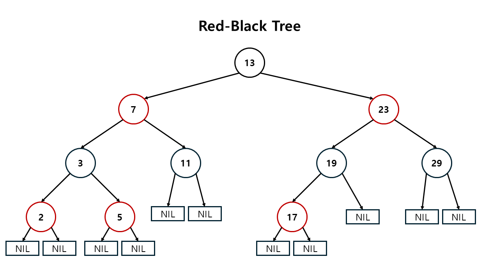
> 레드-블랙 트리의 기본적인 형태
- **정의**: 각 노드에 색상을 부여하여 특정 규칙을 만족하게 유지하는 자가 균형 이진 탐색 트리

- **특징**:  
  - 각 노드는 레드 또는 블랙 색상을 가지며, 루트 노드와 모든 리프 노드는 항상 블랙
  - 레드 노드는 자식 노드가 모두 블랙이어야 함
  - 모든 경로에서 루트 노드부터 리프 노드까지의 블랙 노드 수가 동일해야함
  - 삽입과 삭제 시 색상 변경과 회전 연산 수행

- **장점**:  
    - 탐색, 삽입, 삭제 연산이 모두 O($log\,n$) 시간 복잡도로 수행
    - AVL트리에 비해 삽입과 삭제 시 회전 횟수가 적어 메모라 사용과 연산이 효율적
- **단점**:  
    - 색상 규칙과 균형 유지를 위한 회전 연산을 구현하는것이 복잡
    - 각 노드가 색상 정보를 저장해야 해, 메모리 사용량이 비교적 높음
    - AVL 트리에 비해 트리 균형이 덜 엄격함  

- **활용**:  
  - 표준 라이브러리의 정렬 자료구조 (예: C++ STL의 std::map, std::set)  
  - 다양한 컴퓨터 과학 알고리즘
<details><summary>Red-Black 트리 삽입 색상변경 예시</summary>

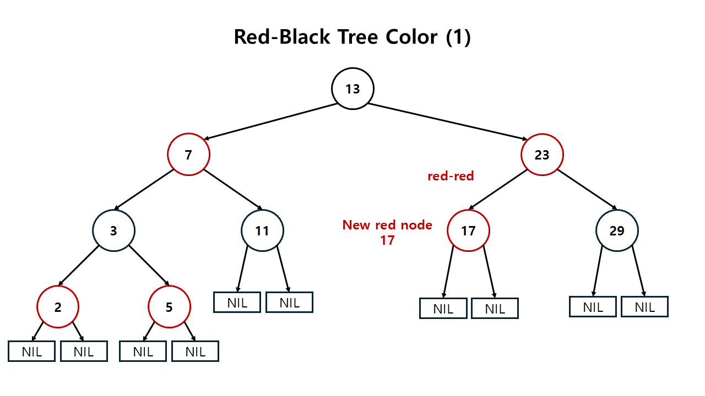
> red node 17을 삽입하면, 23과 17이 연속으로 빨간색이 되어 Red-Black 트리의 조건을 충족하지 못함

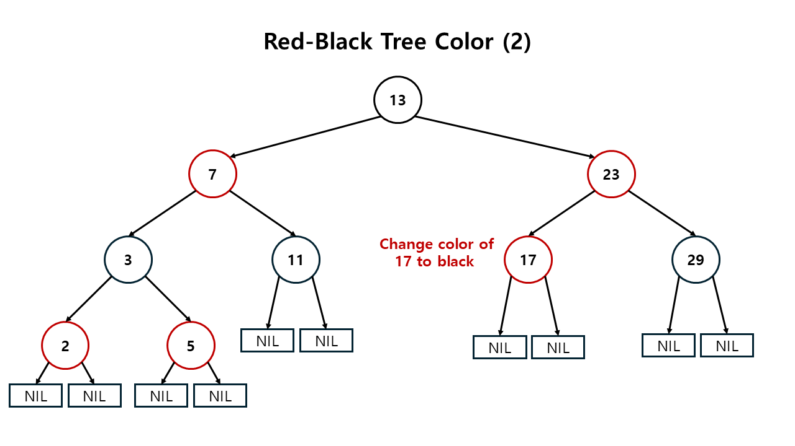
> 17노드의 색상을 검은색으로 변경

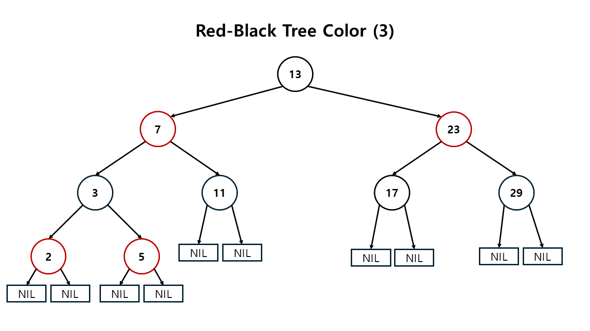
> 완성된 형태

</details>
<details><summary>C 레드-블랙 트리 구현</summary>

```c
#include <stdio.h>
#include <stdlib.h>

// 레드-블랙 트리의 색깔 정의
#define RED 0
#define BLACK 1

// 레드-블랙 트리 노드 구조체 정의
struct Node {
    int data;
    int color;
    struct Node* left;
    struct Node* right;
    struct Node* parent;
};

// 새로운 노드를 생성하는 함수
struct Node* newNode(int data) {
    struct Node* node = (struct Node*)malloc(sizeof(struct Node));
    node->data = data;
    node->color = RED;  // 새로운 노드는 항상 RED
    node->left = node->right = node->parent = NULL;
    return node;
}

// 트리의 회전 (왼쪽 회전)
void leftRotate(struct Node** root, struct Node* x) {
    struct Node* y = x->right;
    x->right = y->left;
    if (y->left != NULL) y->left->parent = x;
    y->parent = x->parent;
    if (x->parent == NULL) *root = y;
    else if (x == x->parent->left) x->parent->left = y;
    else x->parent->right = y;
    y->left = x;
    x->parent = y;
}

// 트리의 회전 (오른쪽 회전)
void rightRotate(struct Node** root, struct Node* x) {
    struct Node* y = x->left;
    x->left = y->right;
    if (y->right != NULL) y->right->parent = x;
    y->parent = x->parent;
    if (x->parent == NULL) *root = y;
    else if (x == x->parent->right) x->parent->right = y;
    else x->parent->left = y;
    y->right = x;
    x->parent = y;
}

// 삽입 후 트리 재정렬 함수 (레드-블랙 트리 특성에 맞게)
void fixViolation(struct Node** root, struct Node* node) {
    struct Node* parent = NULL;
    struct Node* grandParent = NULL;
    
    while (node != *root && node->color == RED && node->parent->color == RED) {
        parent = node->parent;
        grandParent = parent->parent;
        
        // 부모가 왼쪽 자식인 경우
        if (parent == grandParent->left) {
            struct Node* uncle = grandParent->right;
            if (uncle != NULL && uncle->color == RED) {
                // Case 1: 부모와 삼촌이 빨간색인 경우
                grandParent->color = RED;
                parent->color = BLACK;
                uncle->color = BLACK;
                node = grandParent;
            } else {
                // Case 2: 부모가 빨간색이고 삼촌이 검은색인 경우
                if (node == parent->right) {
                    leftRotate(root, parent);
                    node = parent;
                    parent = node->parent;
                }
                // Case 3: 부모가 빨간색이고 삼촌이 검은색인 경우
                rightRotate(root, grandParent);
                parent->color = BLACK;
                grandParent->color = RED;
                node = parent;
            }
        }
        // 부모가 오른쪽 자식인 경우는 위와 반대로 처리
        else {
            struct Node* uncle = grandParent->left;
            if (uncle != NULL && uncle->color == RED) {
                grandParent->color = RED;
                parent->color = BLACK;
                uncle->color = BLACK;
                node = grandParent;
            } else {
                if (node == parent->left) {
                    rightRotate(root, parent);
                    node = parent;
                    parent = node->parent;
                }
                leftRotate(root, grandParent);
                parent->color = BLACK;
                grandParent->color = RED;
                node = parent;
            }
        }
    }
    (*root)->color = BLACK;
}

// 삽입 함수
void insert(struct Node** root, int data) {
    struct Node* node = newNode(data);
    
    if (*root == NULL) {
        *root = node;
        node->color = BLACK;
        return;
    }
    
    struct Node* parent = NULL;
    struct Node* temp = *root;
    
    // 이진 탐색을 통해 삽입할 위치를 찾음
    while (temp != NULL) {
        parent = temp;
        if (data < temp->data) temp = temp->left;
        else temp = temp->right;
    }
    
    node->parent = parent;
    
    if (data < parent->data) parent->left = node;
    else parent->right = node;
    
    // 트리 균형을 맞추기 위해 수정
    fixViolation(root, node);
}
```

</details>
<details><summary>Java 레드-블랙 트리 구현</summary>

```java
private final Comparator<? super K> comparator;

private transient Entry<K,V> root;

private transient int size = 0;

private transient int modCount = 0;

static final class Entry<K,V> implements Map.Entry<K,V> {
    K key;                        // 노드의 키
    V value;                      // 노드의 값
    Entry<K,V> left;              // 왼쪽 자식 노드
    Entry<K,V> right;             // 오른쪽 자식 노드
    Entry<K,V> parent;            // 부모 노드
    boolean color = BLACK;        // 노드의 색상 (RED 또는 BLACK)

    /**
     * 새로운 노드를 생성할 때 키, 값, 부모 노드를 설정하고
     * 자식 노드들은 null로 설정, 색상은 기본적으로 BLACK으로 설정
     */
    Entry(K key, V value, Entry<K,V> parent) {
        this.key = key;            // 키 설정
        this.value = value;        // 값 설정
        this.parent = parent;      // 부모 노드 설정
    }
}

// Red-black mechanics
private static final boolean RED   = false;
private static final boolean BLACK = true;

final Entry<K,V> getEntry(Object key) {
    // Offload comparator-based version for sake of performance
    if (comparator != null)
        return getEntryUsingComparator(key);	// Comparator를 사용하는 경우
    if (key == null)
        throw new NullPointerException();	// null 키는 허용되지 않음
    @SuppressWarnings("unchecked")
        Comparable<? super K> k = (Comparable<? super K>) key;
    Entry<K,V> p = root;
    while (p != null) {
        int cmp = k.compareTo(p.key);	// 현재 노드의 키와 비교
        if (cmp < 0)
            p = p.left;		// 왼쪽으로 이동
        else if (cmp > 0)
            p = p.right;	// 오른쪽으로 이동
        else
            return p;	// 일치하는 키 발견
    }
    return null;	// 해당 키를 찾지 못한 경우 null 반환
}

public V put(K key, V value) {
    Entry<K,V> t = root;
    
    if (t == null) {	// 트리가 비어있다면 루트 노드를 삽입
        compare(key, key); // type (and possibly null) check

        root = new Entry<>(key, value, null);
        size = 1;
        modCount++;
        return null;
    }
    
    int cmp;
    Entry<K,V> parent;
    // split comparator and comparable paths
    Comparator<? super K> cpr = comparator;
    
    if (cpr != null) {	// Comparator를 사용하는 경우
        do {
            parent = t;
            cmp = cpr.compare(key, t.key);	// 키 비교
            if (cmp < 0)
                t = t.left;
            else if (cmp > 0)
                t = t.right;
            else	// 같은 키가 이미 존재하는 경우 값 대체
                return t.setValue(value);
        } while (t != null);
    }
    else {	// Comparator가 없는 경우
        if (key == null)
            throw new NullPointerException();
        @SuppressWarnings("unchecked")
            Comparable<? super K> k = (Comparable<? super K>) key;
        do {
            parent = t;
            cmp = k.compareTo(t.key);
            if (cmp < 0)
                t = t.left;
            else if (cmp > 0)
                t = t.right;
            else	// 같은 키가 이미 존재하는 경우 값 대체
                return t.setValue(value);
        } while (t != null);
    }
    // 새로운 노드를 부모 노드에 연결
    Entry<K,V> e = new Entry<>(key, value, parent);
    if (cmp < 0)
        parent.left = e;
    else
        parent.right = e;
    fixAfterInsertion(e);	// 삽입 후 트리 균형 유지 (색상 변경 및 회전)
    size++;
    modCount++;
    return null;
}

private static final boolean RED   = false;
private static final boolean BLACK = true;

// Balancing operations.
private static <K,V> boolean colorOf(Entry<K,V> p) {
    return (p == null ? BLACK : p.color);	// null 노드는 항상 BLACK으로 처리
}

private static <K,V> Entry<K,V> parentOf(Entry<K,V> p) {
    return (p == null ? null: p.parent);	// 부모 노드를 반환
}

private static <K,V> void setColor(Entry<K,V> p, boolean c) {
    if (p != null)
        p.color = c;	// 노드의 색상을 설정
}

private static <K,V> Entry<K,V> leftOf(Entry<K,V> p) {
    return (p == null) ? null: p.left;	// 왼쪽 자식 노드를 반환
}

private static <K,V> Entry<K,V> rightOf(Entry<K,V> p) {
    return (p == null) ? null: p.right;	// 오른쪽 자식 노드를 반환
}

private void rotateLeft(Entry<K,V> p) {
    if (p != null) {
        Entry<K,V> r = p.right;	// r : p의 오른쪽 자식
        p.right = r.left;		// r의 왼쪽 자식을 p의 오른쪽 자식으로
        if (r.left != null)
            r.left.parent = p;
        r.parent = p.parent;
        if (p.parent == null)	// p가 루트인 경우
            root = r;			// r을 새로운 루트로 설정
        else if (p.parent.left == p)
            p.parent.left = r;	// p가 부모의 왼쪽 자식인 경우
        else
            p.parent.right = r;	// p가 부모의 오른쪽 자식인 경우
        r.left = p;				// r의 왼쪽 자식으로 p 설정
        p.parent = r;
    }
}

/** From CLR */
private void rotateRight(Entry<K,V> p) {	//rotateLeft의 방향만 반대로
    if (p != null) {
        Entry<K,V> l = p.left;
        p.left = l.right;
        if (l.right != null) l.right.parent = p;
        l.parent = p.parent;
        if (p.parent == null)
            root = l;
        else if (p.parent.right == p)
            p.parent.right = l;
        else p.parent.left = l;
        l.right = p;
        p.parent = l;
    }
}

private void fixAfterInsertion(Entry<K,V> x) {
    x.color = RED;	// 새로 삽입된 노드는 항상 RED

    // 부모가 RED인 경우 불균형 발생
    while (x != null && x != root && x.parent.color == RED) {
        // 부모가 조부모의 왼쪽 자식인 경우
        if (parentOf(x) == leftOf(parentOf(parentOf(x)))) {
            
            // 삼촌 노드
            Entry<K,V> y = rightOf(parentOf(parentOf(x)));
            
            // Case 1: 삼촌 노드가 RED인 경우
            if (colorOf(y) == RED) {
                // 부모와 삼촌을 BLACK으로
                setColor(parentOf(x), BLACK);
                setColor(y, BLACK);
                // 조부모를 RED로 변경
                setColor(parentOf(parentOf(x)), RED);
                // 조부모로 이동해 반복 (전파)
                x = parentOf(parentOf(x));
            } else { // Case 2: 삼촌이 BLACK인 경우
                // 삽입된 노드가 오른쪽 자식일 경우
                if (x == rightOf(parentOf(x))) {
                    x = parentOf(x);	// x를 부모로 이동 (회전 후 자식이 됨)
                    rotateLeft(x);	// 왼쪽 회전
                }
                // 부모를 BLACK, 조부모를 RED로 색상 변경
                setColor(parentOf(x), BLACK);
                setColor(parentOf(parentOf(x)), RED);
                // 조부모 기준 오른쪽 회전
                rotateRight(parentOf(parentOf(x)));
            }
        } else {	// 부모가 오른쪽 자식인 경우 (대칭 처리)
            Entry<K,V> y = leftOf(parentOf(parentOf(x)));
            if (colorOf(y) == RED) {
                setColor(parentOf(x), BLACK);
                setColor(y, BLACK);
                setColor(parentOf(parentOf(x)), RED);
                x = parentOf(parentOf(x));
            } else {
                if (x == leftOf(parentOf(x))) {
                    x = parentOf(x);
                    rotateRight(x);
                }
                setColor(parentOf(x), BLACK);
                setColor(parentOf(parentOf(x)), RED);
                rotateLeft(parentOf(parentOf(x)));
            }
        }
    }
    root.color = BLACK;	// 루트는 항상 BLACK으로 유지
}

public V remove(Object key) {
    Entry<K,V> p = getEntry(key);	// 주어진 키에 해당하는 노드를 탐색
    if (p == null)
        return null;	// 노드를 찾지 못하면 null 반환

    V oldValue = p.value;	// 기존 값 저장
    deleteEntry(p);		// 노드를 삭제
    return oldValue;	// 삭제된 노드의 값을 반환
}

static <K,V> TreeMap.Entry<K,V> successor(Entry<K,V> t) {
    if (t == null)
        return null;
    else if (t.right != null) {	// 오른쪽 자식이 있으면 오른쪽 서브트리에서 후계자 찾기
        Entry<K,V> p = t.right;
        while (p.left != null)
            p = p.left;	// 오른쪽 서브트리에서 가장 작은 노드 탐색
        return p;
    } else {		// 오른쪽 자식이 없을 경우, 부모 노드로 올라가서 후계자 찾기
        Entry<K,V> p = t.parent;
        Entry<K,V> ch = t;
        // 부모 노드가 오른쪽 자식인 동안 상위 노드로 올라감
        while (p != null && ch == p.right) {
            ch = p;
            p = p.parent;
        }
        return p;	// 후계자를 반환
    }
}

private void deleteEntry(Entry<K,V> p) {
    modCount++;	// 트리 구조 변경 횟수 증가
    size--;		// 트리 크기 감소

    // 노드가 두 자식을 가지고 있는 경우 후계자의 값을 복사하고 후계자를 삭제
    // If strictly internal, copy successor's element to p and then make p
    // point to successor.
    if (p.left != null && p.right != null) {
        Entry<K,V> s = successor(p);	// 후계자를 찾음
        p.key = s.key;		// 후계자의 키 복사
        p.value = s.value;	// 후계자의 값 복사
        p = s;	// 후계자를 실제로 삭제할 노드로 설정
    } // p has 2 children

    // 자식이 하나만 있는 경우 해당 자식을 대체할 노드로 설정
    // Start fixup at replacement node, if it exists.
    Entry<K,V> replacement = (p.left != null ? p.left : p.right);

    if (replacement != null) {
        
        // Link replacement to parent
        // 대체 노드를 부모 노드와 연결
        replacement.parent = p.parent;
        // 삭제한 노드가 루트일 경우 대체 노드를 루트로 설정
        if (p.parent == null)
            root = replacement;
        else if (p == p.parent.left)
            p.parent.left  = replacement;
        else
            p.parent.right = replacement;

        // Null out links so they are OK to use by fixAfterDeletion.
        // 연결이 해제된 노드의 참조를 null로 설정
        p.left = p.right = p.parent = null;

        // Fix replacement
        // 삭제한 노드가 블랙일 경우, 트리의 균형을 복구
        if (p.color == BLACK)
            fixAfterDeletion(replacement);
    
    // 삭제한 노드가 루트이면서 자식이 없는 경우        
    } else if (p.parent == null) { // return if we are the only node.
        root = null;	// 트리를 비움
    
    // 자식이 없는 리프 노드인 경우
    } else { //  No children. Use self as phantom replacement and unlink.
        // 삭제한 노드가 블랙일 경우 균형 복구
        if (p.color == BLACK)
            fixAfterDeletion(p);
            
        // 부모 노드에서 삭제된 노드를 제거
        if (p.parent != null) {
            if (p == p.parent.left)
                p.parent.left = null;
            else if (p == p.parent.right)
                p.parent.right = null;
            p.parent = null;
        }
    }
}

private void fixAfterDeletion(Entry<K,V> x) {
    
    // 해결 대상 노드가 루트가 아니면서 BLACK인 경우 반복
    while (x != root && colorOf(x) == BLACK) {
    
        // 해결 대상 노드가 부모의 왼쪽 노드인 경우 
        if (x == leftOf(parentOf(x))) {
            
            // 형제 노드 찾기 (없으면 NIL 노드)
            Entry<K,V> sib = rightOf(parentOf(x));

            // Case 1 : 형제가 RED인 경우
            if (colorOf(sib) == RED) {
                setColor(sib, BLACK);		// 형제를 BLACK으로 변경
                setColor(parentOf(x), RED);	// 부모를 RED로 변경
                rotateLeft(parentOf(x));	// 부모 기준 좌회전
                sib = rightOf(parentOf(x));	// 회전후 새로운 형제 노드 설정
            }

            // Case 2 : 형제가 BLACK이고, 조카노드들이 모두 BLACK인 경우
            if (colorOf(leftOf(sib))  == BLACK &&
                colorOf(rightOf(sib)) == BLACK) {
                setColor(sib, RED);		// 형제를 레드로 변경
                x = parentOf(x);		// 이중 블랙 문제를 상위 노드로 전파
            } 
            
            // Case 3 : 형제가 BLACK이고, 조카노드 중 하나 이상이 RED인 경우
            else {
                // Case 3-1 : 형제(Right)과 반대 방향(Left)에 RED조카가 있는 경우
                if (colorOf(rightOf(sib)) == BLACK) {
                    // 왼쪽 RED 조카를 BLACK으로, 형제 노드를 RED로 변경
                    setColor(leftOf(sib), BLACK);
                    setColor(sib, RED);
                    // 형제 기준 우회전
                    rotateRight(sib);
                    sib = rightOf(parentOf(x));	// 새로운 형제 노드 설정
                }
                
                // Case 3-2 : 형제(Right)과 같은 방향(Right)에 RED조카가 있는 경우
                setColor(sib, colorOf(parentOf(x))); 	// 형제의 색상을 부모의 색상으로 설정
                setColor(parentOf(x), BLACK);	// 부모를 블랙으로 변경
                setColor(rightOf(sib), BLACK);	// 형제의 오른쪽 자식을 블랙으로 변경
                rotateLeft(parentOf(x));	// 부모 기준 좌회전
                x = root;	// 문제 해결 후 루트로 설정하여 반복 종료
            }
            
        } else { // symmetric (좌우 대칭)
            Entry<K,V> sib = leftOf(parentOf(x));

            if (colorOf(sib) == RED) {
                setColor(sib, BLACK);
                setColor(parentOf(x), RED);
                rotateRight(parentOf(x));
                sib = leftOf(parentOf(x));
            }

            if (colorOf(rightOf(sib)) == BLACK &&
                colorOf(leftOf(sib)) == BLACK) {
                setColor(sib, RED);
                x = parentOf(x);
            } else {
                if (colorOf(leftOf(sib)) == BLACK) {
                    setColor(rightOf(sib), BLACK);
                    setColor(sib, RED);
                    rotateLeft(sib);
                    sib = leftOf(parentOf(x));
                }
                setColor(sib, colorOf(parentOf(x)));
                setColor(parentOf(x), BLACK);
                setColor(leftOf(sib), BLACK);
                rotateRight(parentOf(x));
                x = root;
            }
        }
    }

    // 최종적으로 이중 블랙 문제 해결 후, 해당 노드를 블랙으로 설정
    setColor(x, BLACK);
}
```

</details>

---

#### Splay Tree
- **정의**: 최근에 접근한 노드를 트리의 루트 노드로 이동시키는 Splay 연산을 통해 트리의 구조를 조정하는 이진 탐색 트리 

- **특징**:  
    -  Splay 연산을 통해 최근에 접근한 노드들이 루트 노드 근처에 위치해 있어 더 빠르게 탐색할 수 있음
    -  특정 회전 패턴을 사용하여 Splay 연산을 수행
       -  zig step - 대상 노드가 부모 노드만 가지고 있는 경우(조부모 노드가 없을 때)
       -  zig-zig step - 대상 노드와 부모 노드가 둘다 왼쪽 혹은 오른쪽 자식 노드인 경우
       -  zig-zag step - 대상 노드와 부모 노드가 서로 다른 방향의 자식 노드인 경우
    -  별도의 균형 인수를 유지하지 않고도, Splay연산을 통해 트리의 균형을 간접적으로 유지

- **장점**:  
    -  별도의 균형 정보나 노드의 추가적인 속성을 저장할 필요가 없어 비교적 단순한 구조를 지님
    -  최근에 접근한 노드가 루트에 위치하게 되어, 접근 패턴이 국소적일 경우 높은 효율성을 띔
- **단점**:  
    -  항상 가장 깊은 노드를 반복적으로 접근하면 트리가 편향되고 효율이 떨어짐
    -  회전 연산과 Splay 연산을 효율적으로 수행하기 위한 구현에 난이도가 있음

- **활용**:  
  - 캐시 시스템  
  - 일부 텍스트 편집기

<details><summary>zig step 예시</summary>

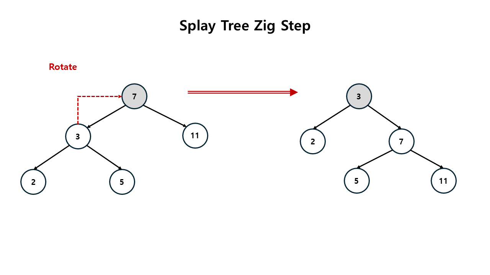
> 3을 7과 rotate하면서 이진 탐색 트리의 형식에 맞춰 다른 노드도 수정
</details>
<details><summary>zig-zig step 예시</summary>

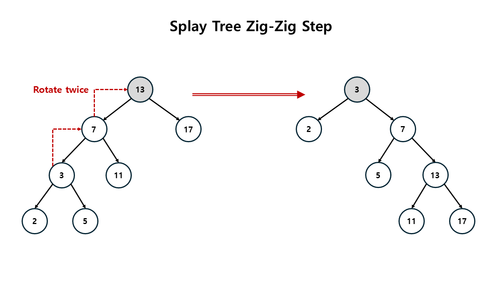
> 3을 7과 한번 rotate 한 뒤, 13과 rotate하고, 다른 노드의 위치도 함께 수정
</details>
<details><summary>zig-zag step 예시</summary>

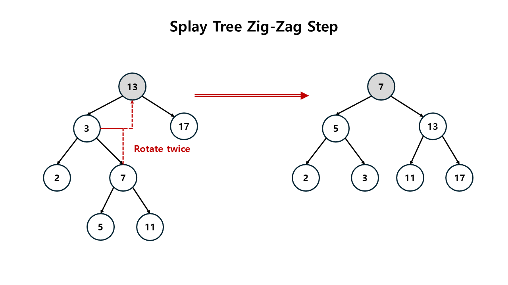
> 7을 3과, 13과 roate 한 뒤, 다른 노드의 위치도 함께 수정
</details>

<details><summary>C Splay 트리 구현</summary>

```c
#include <stdio.h>
#include <stdlib.h>

// 노드 구조체 정의
struct Node {
    int data;
    struct Node* left;
    struct Node* right;
};

// 새 노드를 생성하는 함수
struct Node* newNode(int data) {
    struct Node* node = (struct Node*)malloc(sizeof(struct Node));
    node->data = data;
    node->left = node->right = NULL;
    return node;
}

// 왼쪽 회전 함수
struct Node* leftRotate(struct Node* root) {
    struct Node* newRoot = root->right;
    root->right = newRoot->left;
    newRoot->left = root;
    return newRoot;
}

// 오른쪽 회전 함수
struct Node* rightRotate(struct Node* root) {
    struct Node* newRoot = root->left;
    root->left = newRoot->right;
    newRoot->right = root;
    return newRoot;
}

// Splay 함수 (특정 노드를 루트로 이동)
struct Node* splay(struct Node* root, int key) {
    // 만약 루트가 NULL이거나 루트의 값이 key라면, 아무 것도 하지 않음
    if (root == NULL || root->data == key) return root;

    // 키가 루트보다 작은 경우
    if (key < root->data) {
        if (root->left == NULL) return root;
        
        // Zig-Zig (좌측-좌측 회전)
        if (key < root->left->data) {
            root = rightRotate(root);
            root = rightRotate(root);
        }
        // Zig-Zag (좌측-우측 회전)
        else if (key > root->left->data) {
            root->left = leftRotate(root->left);
            root = rightRotate(root);
        }
    }
    // 키가 루트보다 큰 경우
    else {
        if (root->right == NULL) return root;
        
        // Zig-Zig (우측-우측 회전)
        if (key > root->right->data) {
            root = leftRotate(root);
            root = leftRotate(root);
        }
        // Zig-Zag (우측-좌측 회전)
        else if (key < root->right->data) {
            root->right = rightRotate(root->right);
            root = leftRotate(root);
        }
    }
    
    return root;
}

// 삽입 함수
struct Node* insert(struct Node* root, int key) {
    if (root == NULL) return newNode(key);

    root = splay(root, key);

    if (root->data == key) return root;

    struct Node* newNode = (struct Node*)malloc(sizeof(struct Node));
    newNode->data = key;

    if (root->data > key) {
        newNode->right = root;
        newNode->left = root->left;
        root->left = NULL;
    } else {
        newNode->left = root;
        newNode->right = root->right;
        root->right = NULL;
    }

    return newNode;
}
```

</details>
<details><summary>Java Splay 트리 구현</summary>

```java
class Node {
    public int key;
    public Node left, right;
}

class SplayTree {
    static Node newNode(int key) {
        Node node = new Node();
        node.key = key;
        node.left = node.right = null;
        return node;
    }

    static Node rightRotate(Node x) {
        Node y = x.left;
        x.left = y.right;
        y.right = x;
        return y;
    }

    static Node leftRotate(Node x) {
        Node y = x.right;
        x.right = y.left;
        y.left = x;
        return y;
    }

    static Node splay(Node root, int key) {
        if (root == null || root.key == key)
            return root;

        if (root.key > key) {
            if (root.left == null)
                return root;
            if (root.left.key > key) {
                root.left.left = splay(root.left.left, key);
                root = rightRotate(root);
            }
            else if (root.left.key < key) {
                root.left.right = splay(root.left.right, key);
                if (root.left.right != null)
                    root.left = leftRotate(root.left);
            }
            return (root.left == null) ? root : rightRotate(root);
        }
        else {
            if (root.right == null)
                return root;
            if (root.right.key > key) {
                root.right.left = splay(root.right.left, key);
                if (root.right.left != null)
                    root.right = rightRotate(root.right);
            }
            else if (root.right.key < key) {
                root.right.right = splay(root.right.right, key);
                root = leftRotate(root);
            }
            return (root.right == null) ? root : leftRotate(root);
        }
    }

    static Node insert(Node root, int key) {
        if (root == null)
            return newNode(key);

        root = splay(root, key);

        if (root.key == key)
            return root;

        Node node = newNode(key);
        if (root.key > key) {
            node.right = root;
            node.left = root.left;
            root.left = null;
        }
        else {
            node.left = root;
            node.right = root.right;
            root.right = null;
        }
        return node;
    }
}
```

</details>

---

### B 트리 계열 (B-tree Family)

#### B 트리 (B-Tree)
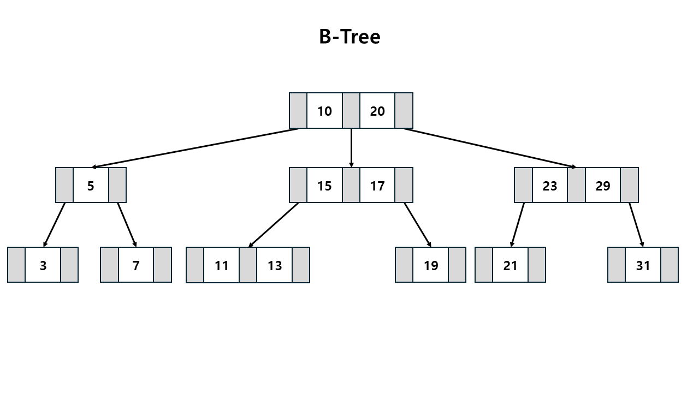
> B-Tree의 기본적인 형태
- **정의**:  이진 트리를 확장해 하나의 노드가 가질 수 있는 자식 노드의 최대 숫자가 2보다 큰 트리

- **특징**:  
  - 다중 경로 트리의 일종으로, 각 노드가 여러 개의 키와 자식 포인터를 가질 수 있음
  - 각 노드는 최소 t-1개, 최대 2t-1개의 키를 가질 수 있고, 이에 따라 최소 t개, 최대 2t개의 자식 노드를 가질 수 있음(t는 트리의 차수)
  - 모든 리프 노드가 같은 깊이에 위치하여 트리의 균형을 유지
  - 각 노드 내의 키는 오름차순으로 정렬되어 있음

- **장점**:  
  - 트리의 높이가 낮아 모든 기본 연산이 O($log\,n$) 시간 복잡도로 수행
  - 각 노드가 여러 키와 포인터를 포함하여 디스크 블록 하나에 많은 정보를 저장할 수 있어 디스크 I/O 횟수를 줄일 수 있음
  - 키가 정렬되어 있어 특정 범위 내의 키들을 효율적으로 검색 가능
- **단점**:  
  - 각 노드가 여러 개의 키와 포인터를 저장해야 해, 메모리 사용량이 증가할 수 있음
  - 트리의 차수 t의 적절한 값 설정이 어렵고, 잘못된 차수 설정은 트리의 성능에 부정적인 영향을 미침

- **활용**:  
  - 데이터베이스 인덱스  
  - 파일 시스템

<details><summary>B 트리의 키 공간이 다 차지 않았을 때, 삽입</summary>

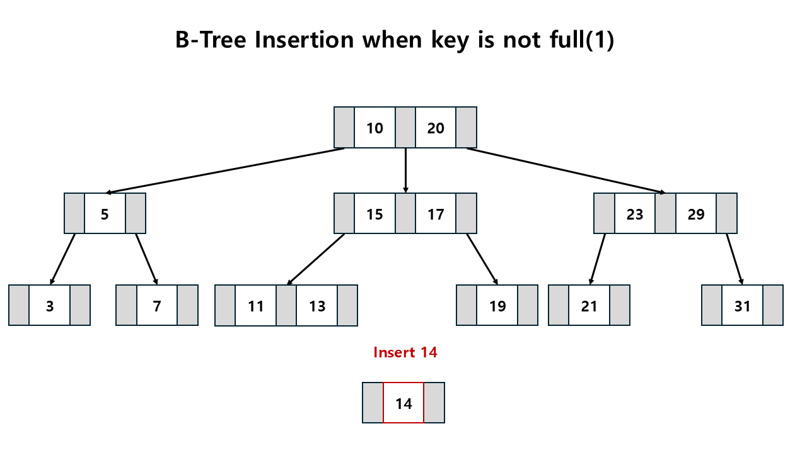
> 14를 삽입

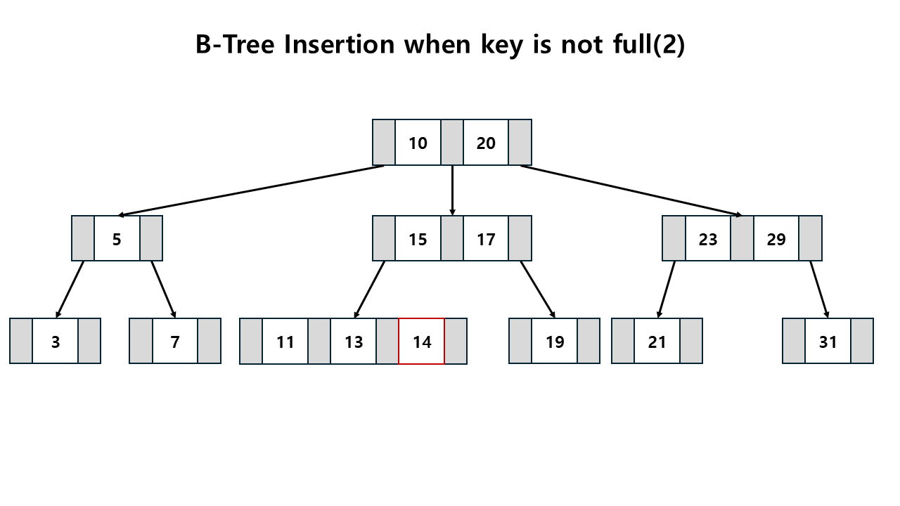
> 10과 20사이, 15보다 작고, 13보다 크므로 그림의 위치에 삽입
</details>

<details><summary>B 트리의 키 공간이 다 찼을 때, 삽입</summary>

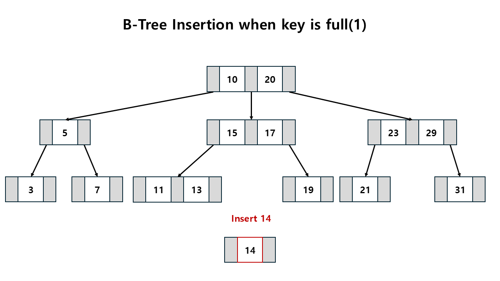
> 14를 삽입

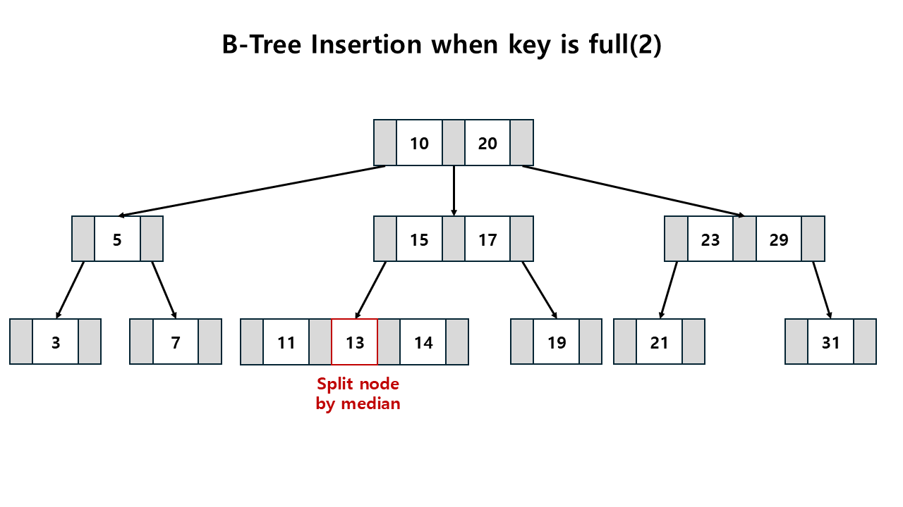
> 키 공간이 최대 2개라고 가정하면, 다 찼으므로 15의 자식 노드들을 중간값을 기준으로 분할

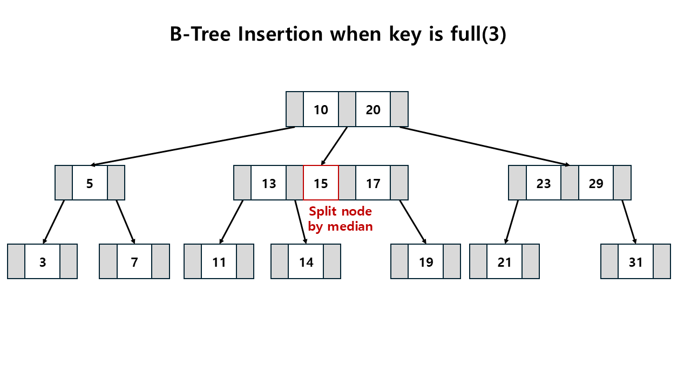
> 중간값 15를 기준으로 분할

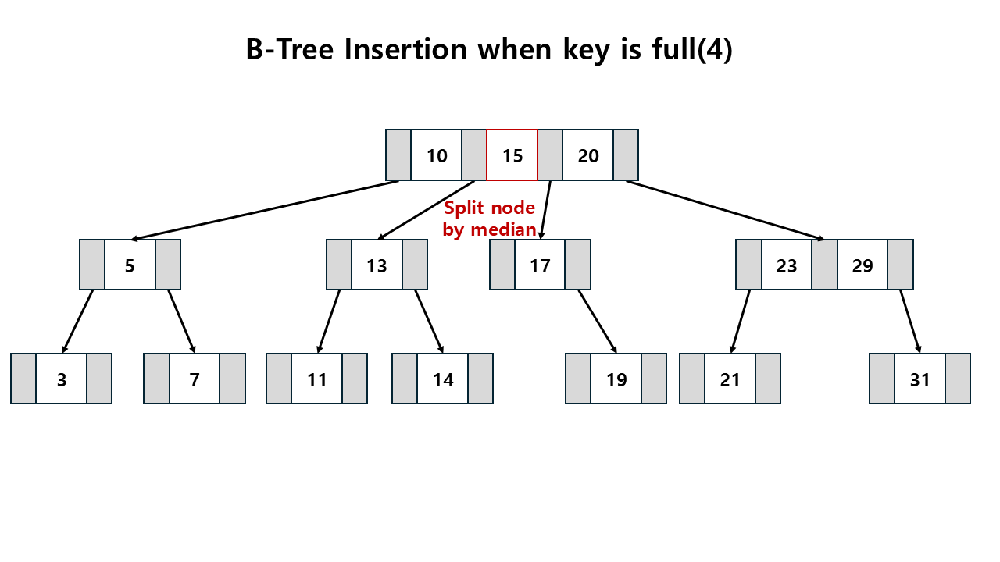
> 중간값 15를 기준으로 분할

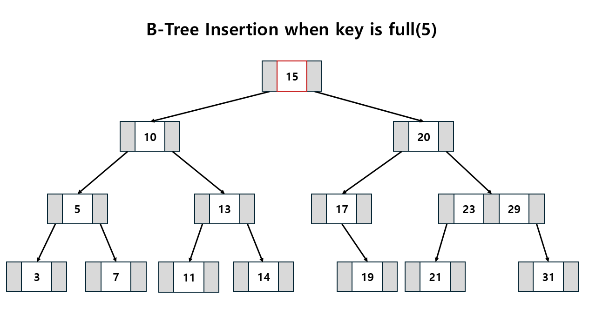
> 완료된 형태

</details>

<details><summary>C B 트리 구현</summary>

```c
#include <stdio.h>
#include <stdlib.h>

#define MAX 3  // 최대 자식 노드 수

// B트리 노드 정의
typedef struct Node {
    int keys[MAX];  // 키 배열
    struct Node* children[MAX + 1];  // 자식 노드 포인터 배열
    int n;  // 현재 키 수
    int leaf;  // 리프 노드 여부
} Node;

// 노드 생성 함수
Node* createNode(int leaf) {
    Node* newNode = (Node*)malloc(sizeof(Node));
    newNode->leaf = leaf;
    newNode->n = 0;
    for (int i = 0; i < MAX + 1; i++) {
        newNode->children[i] = NULL;
    }
    return newNode;
}

// B-Tree 삽입 함수
void insert(Node** root, int key) {
    Node* r = *root;
    if (r->n == MAX) {  // 루트가 가득 차면 분할
        Node* newNode = createNode(0);
        newNode->children[0] = r;
        split(newNode, 0, r);
        *root = newNode;
    }
    insertNonFull(*root, key);
}

// B-Tree 노드 분할 함수
void split(Node* x, int i, Node* y) {
    Node* z = createNode(y->leaf);
    z->n = MAX / 2;
    for (int j = 0; j < MAX / 2; j++) {
        z->keys[j] = y->keys[j + MAX / 2 + 1];
    }
    if (!y->leaf) {
        for (int j = 0; j <= MAX / 2; j++) {
            z->children[j] = y->children[j + MAX / 2 + 1];
        }
    }
    y->n = MAX / 2;

    for (int j = x->n; j > i; j--) {
        x->children[j + 1] = x->children[j];
    }
    x->children[i + 1] = z;

    for (int j = x->n - 1; j >= i; j--) {
        x->keys[j + 1] = x->keys[j];
    }
    x->keys[i] = y->keys[MAX / 2];
    x->n++;
}

// B-Tree 노드에 키 삽입 (가득 차지 않았을 경우)
void insertNonFull(Node* x, int key) {
    int i = x->n - 1;
    if (x->leaf) {
        while (i >= 0 && key < x->keys[i]) {
            x->keys[i + 1] = x->keys[i];
            i--;
        }
        x->keys[i + 1] = key;
        x->n++;
    } else {
        while (i >= 0 && key < x->keys[i]) {
            i--;
        }
        i++;
        if (x->children[i]->n == MAX) {
            split(x, i, x->children[i]);
            if (key > x->keys[i]) {
                i++;
            }
        }
        insertNonFull(x->children[i], key);
    }
}

// B-Tree 출력 함수
void printTree(Node* root, int level) {
    if (root) {
        for (int i = 0; i < root->n; i++) {
            printf("%d ", root->keys[i]);
        }
        printf("\n");

        if (!root->leaf) {
            for (int i = 0; i <= root->n; i++) {
                printTree(root->children[i], level + 1);
            }
        }
            ```c
#include <stdio.h>
#include <stdlib.h>

#define MAX 3  // 최대 자식 노드 수

// B트리 노드 정의
typedef struct Node {
    int keys[MAX];  // 키 배열
    struct Node* children[MAX + 1];  // 자식 노드 포인터 배열
    int n;  // 현재 키 수
    int leaf;  // 리프 노드 여부
} Node;

// 노드 생성 함수
Node* createNode(int leaf) {
    Node* newNode = (Node*)malloc(sizeof(Node));
    newNode->leaf = leaf;
    newNode->n = 0;
    for (int i = 0; i < MAX + 1; i++) {
        newNode->children[i] = NULL;
    }
    return newNode;
}

// B-Tree 삽입 함수
void insert(Node** root, int key) {
    Node* r = *root;
    if (r->n == MAX) {  // 루트가 가득 차면 분할
        Node* newNode = createNode(0);
        newNode->children[0] = r;
        split(newNode, 0, r);
        *root = newNode;
    }
    insertNonFull(*root, key);
}

// B-Tree 노드 분할 함수
void split(Node* x, int i, Node* y) {
    Node* z = createNode(y->leaf);
    z->n = MAX / 2;
    for (int j = 0; j < MAX / 2; j++) {
        z->keys[j] = y->keys[j + MAX / 2 + 1];
    }
    if (!y->leaf) {
        for (int j = 0; j <= MAX / 2; j++) {
            z->children[j] = y->children[j + MAX / 2 + 1];
        }
    }
    y->n = MAX / 2;

    for (int j = x->n; j > i; j--) {
        x->children[j + 1] = x->children[j];
    }
    x->children[i + 1] = z;

    for (int j = x->n - 1; j >= i; j--) {
        x->keys[j + 1] = x->keys[j];
    }
    x->keys[i] = y->keys[MAX / 2];
    x->n++;
}

// B-Tree 노드에 키 삽입 (가득 차지 않았을 경우)
void insertNonFull(Node* x, int key) {
    int i = x->n - 1;
    if (x->leaf) {
        while (i >= 0 && key < x->keys[i]) {
            x->keys[i + 1] = x->keys[i];
            i--;
        }
        x->keys[i + 1] = key;
        x->n++;
    } else {
        while (i >= 0 && key < x->keys[i]) {
            i--;
        }
        i++;
        if (x->children[i]->n == MAX) {
            split(x, i, x->children[i]);
            if (key > x->keys[i]) {
                i++;
            }
        }
        insertNonFull(x->children[i], key);
    }
}

    printTree(root, 0);
    return 0;
}
```

</details>

<details><summary>Java B 트리 구현</summary>

```java
class Btree {
    public BTreeNode root; 
    public int t; // Minimum degree

    Btree(int t)
    {
        this.root = null;
        this.t = t;
    }

    public void traverse()
    {
        if (this.root != null)
            this.root.traverse();
        System.out.println();
    }

    public BTreeNode search(int k)
    {
        if (this.root == null)
            return null;
        else
            return this.root.search(k);
    }
}

class BTreeNode {
    int[] keys; 
    int t; 
    BTreeNode[] C; 
    int n; 
    boolean
        leaf; 

    BTreeNode(int t, boolean leaf)
    {
        this.t = t;
        this.leaf = leaf;
        this.keys = new int[2 * t - 1];
        this.C = new BTreeNode[2 * t];
        this.n = 0;
    }

    public void traverse()
    {
        int i = 0;
        for (i = 0; i < this.n; i++) {

            if (this.leaf == false) {
                C[i].traverse();
            }
            System.out.print(keys[i] + " ");
        }

        if (leaf == false)
            C[i].traverse();
    }

    BTreeNode search(int k)
    { 
        int i = 0;
        while (i < n && k > keys[i])
            i++;

        if (keys[i] == k)
            return this;

        if (leaf == true)
            return null;
        return C[i].search(k);
    }
}

```

</details>

---

#### B+ 트리 (B+ Tree)
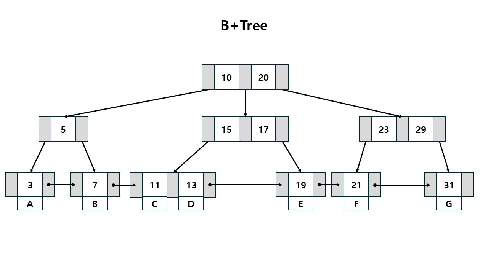
- **정의**:   
    - 모든 실제 데이터가 리프 노드에만 저장되고, 내부 노드는 인덱스 역할을 하는 키만을 저장하는 B 트리의 변형
- **특징**  
  - 내부 노드는 키와 자식 포인터만을 저장하고, 실제 데이터는 리프 노드에만 저장됨
  - 리프 노드들이 연결 리스트 형태로 연결되어 있음

- **장점**:  
    - 리프 노드들이 연결 리스트 형태로 연결되어 있어 연속적인 데이터 접근이 빠름
    - 실제 데이터가 리프 노드에만 저장되어 키 중복이 발생하지 않고, 캐시 효율성이 좋음
- **단점**:  
    - 리프 노드의 연결과 내부 노드의 키 관리 등을 구현해야 해서 구현이 복잡
    - 삽입과 삭제 시 노드의 분할과 병합이 발생할 수 있으며, 병합 과정에서 부모 노드의 키 재배치가 필요해 B 트리보다 복잡하고 시간이 오래 걸림

- **활용**  
  - 데이터베이스 인덱스  
  - 파일 시스템
<details><summary>C B+ 트리 구현</summary>

```c
#include <stdio.h>
#include <stdlib.h>

#define MAX 3  // 최대 자식 노드 수

// B+ 트리 노드 정의
typedef struct Node {
    int keys[MAX];  // 키 배열
    struct Node* children[MAX + 1];  // 자식 노드 포인터 배열
    struct Node* next;  // 링크드 리스트로 연결된 다음 노드
    int n;  // 현재 키 수
    int leaf;  // 리프 노드 여부
} Node;

// 노드 생성 함수
Node* createNode(int leaf) {
    Node* newNode = (Node*)malloc(sizeof(Node));
    newNode->leaf = leaf;
    newNode->n = 0;
    newNode->next = NULL;
    for (int i = 0; i < MAX + 1; i++) {
        newNode->children[i] = NULL;
    }
    return newNode;
}

// B+ 트리 삽입 함수
void insert(Node** root, int key) {
    Node* r = *root;
    if (r->n == MAX) {  // 루트가 가득 차면 분할
        Node* newNode = createNode(0);
        newNode->children[0] = r;
        split(newNode, 0, r);
        *root = newNode;
    }
    insertNonFull(*root, key);
}

// B+ 트리 노드 분할 함수
void split(Node* x, int i, Node* y) {
    Node* z = createNode(y->leaf);
    z->n = MAX / 2;
    for (int j = 0; j < MAX / 2; j++) {
        z->keys[j] = y->keys[j + MAX / 2 + 1];
    }
    if (!y->leaf) {
        for (int j = 0; j <= MAX / 2; j++) {
            z->children[j] = y->children[j + MAX / 2 + 1];
        }
    }
    y->n = MAX / 2;

    for (int j = x->n; j > i; j--) {
        x->children[j + 1] = x->children[j];
    }
    x->children[i + 1] = z;

    for (int j = x->n - 1; j >= i; j--) {
        x->keys[j + 1] = x->keys[j];
    }
    x->keys[i] = y->keys[MAX / 2];
    x->n++;
}

// B+ 트리 노드에 키 삽입 (가득 차지 않았을 경우)
void insertNonFull(Node* x, int key) {
    int i = x->n - 1;
    if (x->leaf) {
        while (i >= 0 && key < x->keys[i]) {
            x->keys[i + 1] = x->keys[i];
            i--;
        }
        x->keys[i + 1] = key;
        x->n++;
    } else {
        while (i >= 0 && key < x->keys[i]) {
            i--;
        }
        i++;
        if (x->children[i]->n == MAX) {
            split(x, i, x->children[i]);
            if (key > x->keys[i]) {
                i++;
            }
        }
        insertNonFull(x->children[i], key);
    }
}

// B+ 트리 출력 함수
void printTree(Node* root) {
    Node* current = root;
    while (current != NULL) {
        for (int i = 0; i < current->n; i++) {
            printf("%d ", current->keys[i]);
        }
        printf("\n");
        current = current->next;
    }
}
```

</details>

<details><summary>Java B+ 트리 구현 </summary>

```java
import java.util.ArrayList;
import java.util.Collections;
import java.util.List;

class BPlusTreeNode {

    boolean isLeaf; 

    List<Integer> keys; 

    List<BPlusTreeNode> children; 

    BPlusTreeNode next; 

    public BPlusTreeNode(boolean isLeaf) {
        this.isLeaf = isLeaf;
        this.keys = new ArrayList<>();
        this.children = new ArrayList<>();
        this.next = null;
    }
}

class BPlusTree {
    private BPlusTreeNode root;
  
    private final int order; 

    public BPlusTree(int order) {
        if (order < 3) {
            throw new IllegalArgumentException("Order must be at least 3");
        }
        this.root = new BPlusTreeNode(true);
        this.order = order;
    }

    private BPlusTreeNode findLeaf(int key) {
        BPlusTreeNode node = root;
        while (!node.isLeaf) {
            int i = 0;
            while (i < node.keys.size() && key >= node.keys.get(i)) {
                i++;
            }
            node = node.children.get(i);
        }
        return node;
    }

    public void insert(int key) {
        BPlusTreeNode leaf = findLeaf(key);
        insertIntoLeaf(leaf, key);

        if (leaf.keys.size() > order - 1) {
            splitLeaf(leaf);
        }
    }

    private void insertIntoLeaf(BPlusTreeNode leaf, int key) {
        int pos = Collections.binarySearch(leaf.keys, key);
        if (pos < 0) {
            pos = -(pos + 1);
        }
        leaf.keys.add(pos, key);
    }

    private void splitLeaf(BPlusTreeNode leaf) {
        int mid = (order + 1) / 2;
        BPlusTreeNode newLeaf = new BPlusTreeNode(true);

        newLeaf.keys.addAll(leaf.keys.subList(mid, leaf.keys.size()));
        leaf.keys.subList(mid, leaf.keys.size()).clear();

        newLeaf.next = leaf.next;
        leaf.next = newLeaf;

        if (leaf == root) {
            BPlusTreeNode newRoot = new BPlusTreeNode(false);
            newRoot.keys.add(newLeaf.keys.get(0));
            newRoot.children.add(leaf);
            newRoot.children.add(newLeaf);
            root = newRoot;
        } else {
            insertIntoParent(leaf, newLeaf, newLeaf.keys.get(0));
        }
    }

    private void insertIntoParent(BPlusTreeNode left, BPlusTreeNode right, int key) {
        BPlusTreeNode parent = findParent(root, left);

        if (parent == null) {
            throw new RuntimeException("Parent node not found for insertion");
        }

        int pos = Collections.binarySearch(parent.keys, key);
        if (pos < 0) {
            pos = -(pos + 1);
        }

        parent.keys.add(pos, key);
        parent.children.add(pos + 1, right);
        if (parent.keys.size() > order - 1) {
            splitInternal(parent);
        }
    }

    private void splitInternal(BPlusTreeNode internal) {
        int mid = (order + 1) / 2;
        BPlusTreeNode newInternal = new BPlusTreeNode(false);

        newInternal.keys.addAll(internal.keys.subList(mid + 1, internal.keys.size()));
        internal.keys.subList(mid, internal.keys.size()).clear();

        newInternal.children.addAll(internal.children.subList(mid + 1, internal.children.size()));
        internal.children.subList(mid + 1, internal.children.size()).clear();

        if (internal == root) {
            BPlusTreeNode newRoot = new BPlusTreeNode(false);
            newRoot.keys.add(internal.keys.get(mid));
            newRoot.children.add(internal);
            newRoot.children.add(newInternal);
            root = newRoot;
        } else {
            insertIntoParent(internal, newInternal, internal.keys.remove(mid));
        }
    }

    private BPlusTreeNode findParent(BPlusTreeNode current, BPlusTreeNode target) {
        if (current.isLeaf || current.children.isEmpty()) {
            return null;
        }

        for (int i = 0; i < current.children.size(); i++) {
            BPlusTreeNode child = current.children.get(i);

            if (child == target) {
                return current; 
            }

            BPlusTreeNode possibleParent = findParent(child, target);
            if (possibleParent != null) {
                return possibleParent;
            }
        }

        return null; 
    }


    public boolean search(int key) {
        BPlusTreeNode node = findLeaf(key);
        int pos = Collections.binarySearch(node.keys, key);
        return pos >= 0;
    }

    public void printTree() {
        printNode(root, 0);
    }

    private void printNode(BPlusTreeNode node, int level) {
        System.out.println("Level " + level + ": " + node.keys);
        if (!node.isLeaf) {
            for (BPlusTreeNode child : node.children) {
                printNode(child, level + 1);
            }
        }
    }
}
```

</details>

---

#### B* 트리 (B* Tree)
- **정의**: * 트리는 B 트리의 변형으로, 노드 분할이 일어날 때 두 개 이상의 자식 노드를 부모로 병합하는 방식

- **특징**  
  - 노드 분할 시, 하나의 자식 노드가 아닌 두 개 이상의 자식 노드를 부모로 병합하여 효과적으로 균형을 유지
  - 리프 노드는 B+ 트리처럼 데이터만 저장
  - 내부 노드는 부모 노드와 자식 노드 사이에 값을 분배하여 균형을 유지
  - 트리의 노드가 꽉 찼을 때, 분할 대신 자식 노드들끼리 합병하여 트리 구조를 조정
 
- **장점**:  
    - B 트리보다 트리가 더 넓고 낮아서 디스크 I/O가 더 효율적    
    - 노드가 꽉 차면 단순히 분할하지 않고 병합하므로, 트리가 더욱 균형 있게 유지
- **단점**:  
    - 노드 분할 방식과 병합 과정이 복잡하여 구현이 어려울 수 있음
    - 병합이 자주 일어나기 때문에 더 많은 메모리 자원을 소비

- **활용**:
  - 고성능 데이터베이스 인덱스  
  - 대용량 파일 시스템

---

## 힙 (Heap)
- **정의**: 완전 이진 트리의 일종으로, 특정한 우선순위에 따라 데이터를 저장하는 자료구조.
- **특징**:
    -  주로 우선순위 큐를 구현하는데 사용
    -  부모 노드는 자식 노드보다 우선순위가 높다는 특성을 가짐

---

### 최대 힙 (Max-Heap)
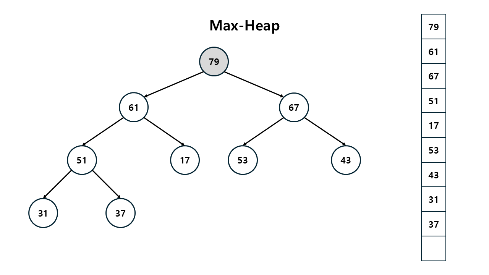
> 최대 힙의 기본 형태
- **정의**: 부모 노드의 값이 자식 노드의 값보다 크거나 같은 힙 구조

- **특징**:  
  - 부모 노드의 값이 자식 노드의 값보다 크거나 같은 성질
  - 루트 노드가 가장 큰 값을 가지고, 모든 부모 노드는 자식보다 크거나 같음
 
- **장점**:  
    - 루트 노드에 최대값이 항상 위치하여 최대값을 $O(1)$ 시간 복잡도에 접근 가능
    - 힙 업과 힙 다운 연산이 O(log n) 시간  
- **단점**:  
    - 최대값 접근에는 최적화되어 있지만, 임의의 요소 검색에는 $O(n)$ 시간 복잡도를 가져 비효율적
    - 힙 정렬 외의 용도가 제한적  

- **활용**  
  - 우선순위 큐  
  - 힙 정렬  
  - 실시간 데이터 처리

<details><summary>최대 힙 삽입</summary>

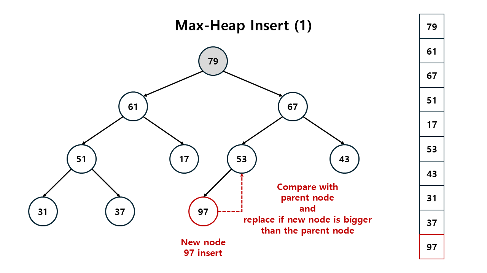
> 새 노드를 삽입하면 부모 노드와 비교하여 새 노드가 크다면 자리를 교체


> 비교/교체 반복

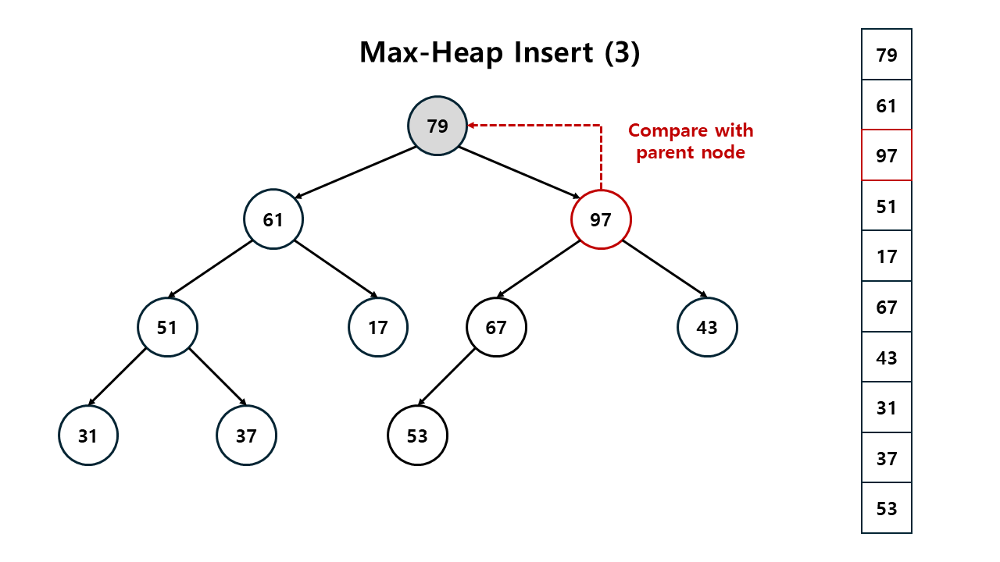
> 비교/교체 반복

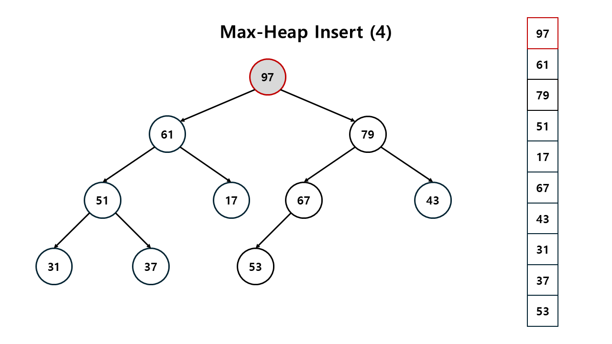
> 새 노드가 제일 큰 수이므로, root 자리에 위치

</details>
<details><summary>최대 힙 삭제</summary>

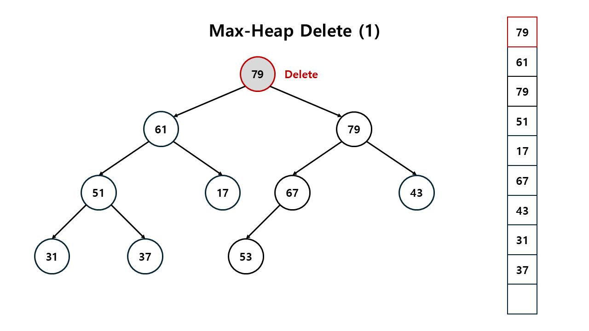
> 79 노드 삭제

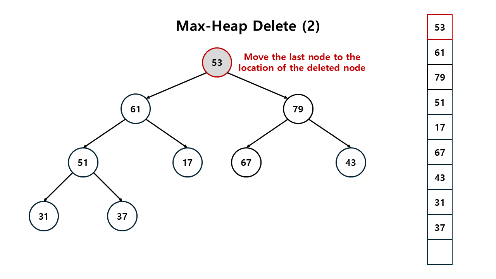
> 제일 마지막 노드인 53을 삭제된 노드의 위치로 옮김

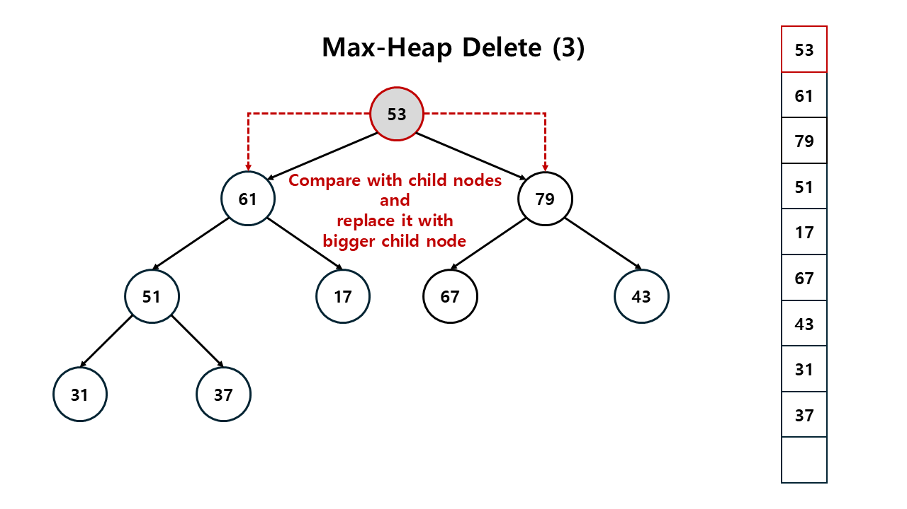
> 왼쪽 자식, 오른쪽 자식과 비교하여 더 큰 노드와 교체

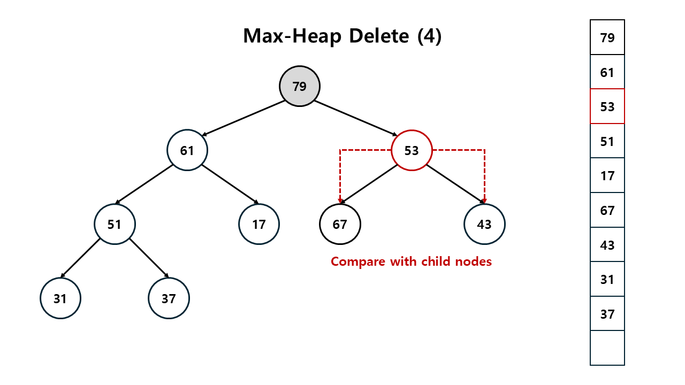
> 더 큰 노드가 없을때까지 반복

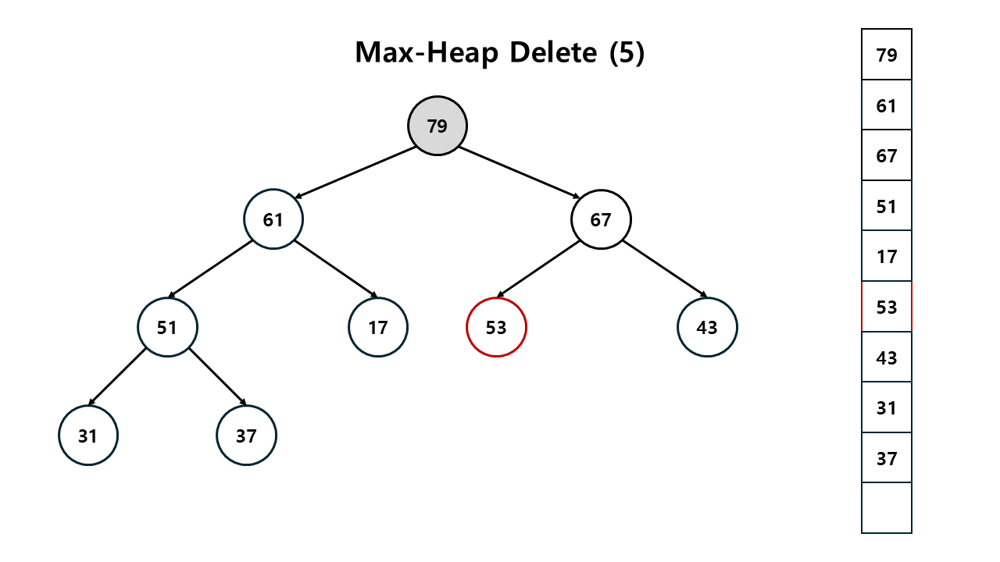
> 완료된 형태

</details>


<details><summary>C 최대 힙 구현</summary>

```c
#include <stdio.h>
#include <stdlib.h>

#define MAX_SIZE 100

typedef struct {
    int data[MAX_SIZE];
    int size;
} MaxHeap;

// 부모, 왼쪽 자식, 오른쪽 자식 인덱스 계산
int parent(int index) {
    return (index - 1) / 2;
}

int left_child(int index) {
    return 2 * index + 1;
}

int right_child(int index) {
    return 2 * index + 2;
}

// 힙 구조 초기화
void init_heap(MaxHeap* heap) {
    heap->size = 0;
}

// 힙 삽입 연산 (Heapify-up)
void insert(MaxHeap* heap, int value) {
    if (heap->size >= MAX_SIZE) {
        printf("Heap is full\n");
        return;
    }

    heap->data[heap->size] = value;
    int index = heap->size;
    heap->size++;

    // 부모 노드와 비교하여 올바른 위치로 삽입
    while (index > 0 && heap->data[parent(index)] < heap->data[index]) {
        // 부모와 자식 노드 교환
        int temp = heap->data[parent(index)];
        heap->data[parent(index)] = heap->data[index];
        heap->data[index] = temp;

        index = parent(index);
    }
}

// 힙 삭제 연산 (최대값 추출 및 Heapify-down)
int extract_max(MaxHeap* heap) {
    if (heap->size == 0) {
        printf("Heap is empty\n");
        return -1;
    }

    int max = heap->data[0];
    heap->data[0] = heap->data[heap->size - 1];
    heap->size--;

    // Heapify-down
    int index = 0;
    while (left_child(index) < heap->size) {
        int left = left_child(index);
        int right = right_child(index);
        int largest = index;

        if (heap->data[left] > heap->data[largest]) {
            largest = left;
        }

        if (right < heap->size && heap->data[right] > heap->data[largest]) {
            largest = right;
        }

        if (largest != index) {
            // 부모와 자식 노드 교환
            int temp = heap->data[index];
            heap->data[index] = heap->data[largest];
            heap->data[largest] = temp;
            index = largest;
        } else {
            break;
        }
    }

    return max;
}
```

</details>

<details><summary>Java 최대 힙 구현</summary>

```java
public class MaxHeap {
	private int[] Heap;
	private int size;
	private int maxsize;

	public MaxHeap(int maxsize)
	{
		this.maxsize = maxsize;
		this.size = 0;
		Heap = new int[this.maxsize];
	}

	private int parent(int pos) { return (pos - 1) / 2; }

	private int leftChild(int pos) { return (2 * pos) + 1; }

	private int rightChild(int pos)
	{
		return (2 * pos) + 2;
	}

	private boolean isLeaf(int pos)
	{
		if (pos > (size / 2) && pos <= size) {
			return true;
		}
		return false;
	}

	private void swap(int fpos, int spos)
	{
		int tmp;
		tmp = Heap[fpos];
		Heap[fpos] = Heap[spos];
		Heap[spos] = tmp;
	}

	private void maxHeapify(int pos)
	{
		if (isLeaf(pos))
			return;

		if (Heap[pos] < Heap[leftChild(pos)]
			|| Heap[pos] < Heap[rightChild(pos)]) {

			if (Heap[leftChild(pos)]
				> Heap[rightChild(pos)]) {
				swap(pos, leftChild(pos));
				maxHeapify(leftChild(pos));
			}
			else {
				swap(pos, rightChild(pos));
				maxHeapify(rightChild(pos));
			}
		}
	}

	public void insert(int element)
	{
		Heap[size] = element;

		int current = size;
		while (Heap[current] > Heap[parent(current)]) {
			swap(current, parent(current));
			current = parent(current);
		}
		size++;
	}

	public void print()
	{

		for (int i = 0; i < size / 2; i++) {

			System.out.print("Parent Node : " + Heap[i]);

			if (leftChild(i)
				< size) 
				System.out.print(" Left Child Node: "
								+ Heap[leftChild(i)]);

			if (rightChild(i)
				< size) 
				System.out.print(" Right Child Node: "
								+ Heap[rightChild(i)]);

			System.out.println(); 
		}
	}

	public int extractMax()
	{
		int popped = Heap[0];
		Heap[0] = Heap[--size];
		maxHeapify(0);
		return popped;
	}
}
```

</details>

---

### 최소 힙 (Min-Heap)
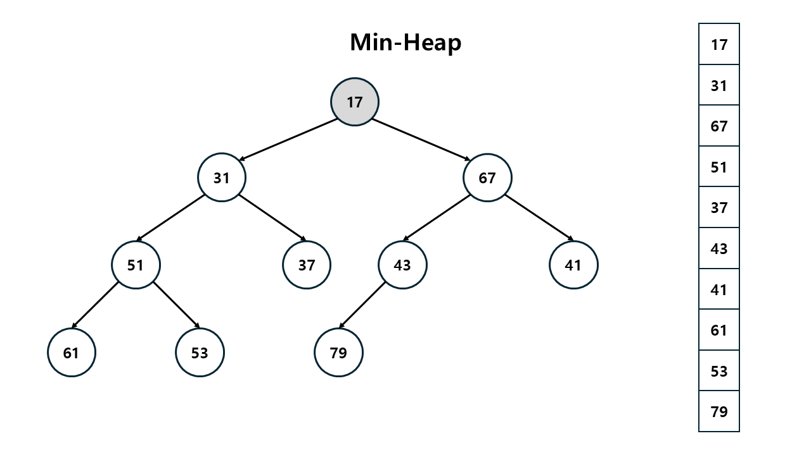
> 최소 힙의 기본 형태
- **정의**: 부모 노드의 값이 자식 노드의 값보다 크거나 같은 힙 구조  

- **특징**  
  - 부모 노드의 값이 자식 노드의 값보다 작거나 같은 성질
  - 루트 노드가 가장 작은 값을 가지고, 모든 부모 노드는 자식보다 작거나 같음

- **장점**:  
    - 루트 노드에 최소값이 항상 위치하여 최대값을 $O(1)$ 시간 복잡도에 접근 가능
    - 힙 업과 힙 다운 연산이 O(log n) 시간  
- **단점**:  
    - 최소값 접근에는 최적화되어 있지만, 임의의 요소 검색에는 $O(n)$ 시간 복잡도를 가져 비효율적
    - 배열의 크기를 변경할 수 없기 때문에 유동적인 크기 조정이 불가능

- **활용**:  
  - 우선순위 큐  
  - 힙 정렬  
  - 실시간 데이터 처리

<details><summary>C 최소 힙 구현</summary>

```c

#include <stdio.h>
#include <stdlib.h>

#define MAX_SIZE 100

typedef struct {
    int data[MAX_SIZE];
    int size;
} MinHeap;

// 부모, 왼쪽 자식, 오른쪽 자식 인덱스 계산
int parent(int index) {
    return (index - 1) / 2;
}

int left_child(int index) {
    return 2 * index + 1;
}

int right_child(int index) {
    return 2 * index + 2;
}

// 힙 구조 초기화
void init_heap(MinHeap* heap) {
    heap->size = 0;
}

// 힙 삽입 연산 (Heapify-up)
void insert(MinHeap* heap, int value) {
    if (heap->size >= MAX_SIZE) {
        printf("Heap is full\n");
        return;
    }

    heap->data[heap->size] = value;
    int index = heap->size;
    heap->size++;

    // 부모 노드와 비교하여 올바른 위치로 삽입
    while (index > 0 && heap->data[parent(index)] > heap->data[index]) {
        // 부모와 자식 노드 교환
        int temp = heap->data[parent(index)];
        heap->data[parent(index)] = heap->data[index];
        heap->data[index] = temp;

        index = parent(index);
    }
}

// 힙 삭제 연산 (최소값 추출 및 Heapify-down)
int extract_min(MinHeap* heap) {
    if (heap->size == 0) {
        printf("Heap is empty\n");
        return -1;
    }

    int min = heap->data[0];
    heap->data[0] = heap->data[heap->size - 1];
    heap->size--;

    // Heapify-down
    int index = 0;
    while (left_child(index) < heap->size) {
        int left = left_child(index);
        int right = right_child(index);
        int smallest = index;

        if (heap->data[left] < heap->data[smallest]) {
            smallest = left;
        }

        if (right < heap->size && heap->data[right] < heap->data[smallest]) {
            smallest = right;
        }

        if (smallest != index) {
            // 부모와 자식 노드 교환
            int temp = heap->data[index];
            heap->data[index] = heap->data[smallest];
            heap->data[smallest] = temp;
            index = smallest;
        } else {
            break;
        }
    }

    return min;
}
```

</details>

<details><summary>Java 최소 힙 구현</summary>

```java
class MinHeap {
 
    private int[] Heap;
    private int size;
    private int maxsize;
 
    private static final int FRONT = 1;
 
    public MinHeap(int maxsize)
    {
 
        this.maxsize = maxsize;
        this.size = 0;
 
        Heap = new int[this.maxsize + 1];
        Heap[0] = Integer.MIN_VALUE;
    }

    private int parent(int pos) { return pos / 2; }
 
    private int leftChild(int pos) { return (2 * pos); }
 
    private int rightChild(int pos)
    {
        return (2 * pos) + 1;
    }

    private boolean isLeaf(int pos)
    {
 
        if (pos > (size / 2)) {
            return true;
        }
 
        return false;
    }

    private void swap(int fpos, int spos)
    {
 
        int tmp;
        tmp = Heap[fpos];
 
        Heap[fpos] = Heap[spos];
        Heap[spos] = tmp;
    }

   private void minHeapify(int pos)
   {      
     if(!isLeaf(pos)){
       int swapPos= pos;
       if(rightChild(pos)<=size)
          swapPos = Heap[leftChild(pos)]<Heap[rightChild(pos)]?leftChild(pos):rightChild(pos);
       else
         swapPos= leftChild(pos);
        
       if(Heap[pos]>Heap[leftChild(pos)] || Heap[pos]> Heap[rightChild(pos)]){
         swap(pos,swapPos);
         minHeapify(swapPos);
       }
        
     }       
   }
 
    public void insert(int element)
    {
 
        if (size >= maxsize) {
            return;
        }
 
        Heap[++size] = element;
        int current = size;
 
        while (Heap[current] < Heap[parent(current)]) {
            swap(current, parent(current));
            current = parent(current);
        }
    }

    public void print()
    {
        for (int i = 1; i <= size / 2; i++) {
 
            System.out.print(
                " PARENT : " + Heap[i]
                + " LEFT CHILD : " + Heap[2 * i]
                + " RIGHT CHILD :" + Heap[2 * i + 1]);
 
            System.out.println();
        }
    }
 
    public int remove()
    {
 
        int popped = Heap[FRONT];
        Heap[FRONT] = Heap[size--];
        minHeapify(FRONT);
 
        return popped;
    }
}
```

</details>

---

### 피보나치 힙 (Fibonacci Heap)
- **정의**: 여러 개의 리스트 형태의 트리를 이용하여 데이터를 저장하는 힙 구조 

- **특징**  
  - 각 트리가 피보나치 수열의 크기를 기반으로 결합되며, 이로 인해 트리의 크기를 일정하게 유지할 수 있음
  - 최소 힙(Min Heap)의 특성을 가짐
  - 여러 개의 트리로 구성되어 루트 노드들이 이중 연결 리스트 형태로 연결되어있고, 트리 간에는 순서 관계가 없음
  - lazy 구조를 채택하여 트리의 재구성이 연산시 바로 일어나는 것이 아니라, 실제 필요할때 재구성

- **장점**:  
    - 대부분의 연산시 상수 시간에 수행되고, 삭제 연산만이 $O(log\,n)$ 시간 복잡도를 가져 매우 효율적
    - 다중 루트 트리 구조 덕분에 병합 연산을 $O(1)$에 수행
- **단점**:  
    - 노드 분할, 병합, 마크 비트 관리 등 연산 구현이 매우 복잡
    - 실제 응용에서는 상수 계수가 높아 다른 힙 자료 구조들에 비해 느릴 수 있음

- **활용**  
  - 최단 경로 알고리즘 (예: 다익스트라)  
  - 우선순위 큐 구현  
  - 그래프 알고리즘

---

## 분리 집합 (Disjoint Set)
- **정의**: 서로 중복되지 않은 부분 집합들로 나누어진 원소들에 대한 정보를 저장하고 조작하는 자료 구조
- **특징**:
  - 모든 원소는 정확히 하나의 집합에만 속하고, 집합 간에는 겹침이 없음
  - 각 집합은 트리 구조로 표현되고, 루트 노드는 해당 집합의 대표 원소를 의미
- **주요 연산**
    -  **합병(Union)**: 집합을 합침
    -  **찾기(Find)**: 특정 원소가 집합 찾기

---

### Union-Find 알고리즘 (Union-Find Algorithm)
- **정의**: 분리 집합을 관리하고 합병과 찾기 연산을 수행하는 알고리즘

- **특징**  
  - 각 집합은 트리 구조로 표현되고, 루트 노드는 해당 집합의 대표 원소 역할
  - Find 연산 시 트리의 경로 압축 최적화를 진행함
  - Union 연산 시 두 트리의 높이와 크기를 비교하여 작은 트리를 큰 트리의 자식으로 연결

- **장점**:  
    - Find와 Union 연산이 거의 상수 시간에 수행되어 대규모 데이터에서도 빠르게 데이터를 관리 가능
    - 랭크 기반 합병과 경로 압축을 통해 트리의 높이를 낮게 유지하여 연산의 효율성을 극대화함
    - 집합 간 연결 여부를 추척하기에 빠름
- **단점**:  
    - 초기 원소 집합이 고정되어 있어 원소를 추가하거나 제거하는 데 한계가 있음
    - 동적 연결성과 같은 특정 문제에서만 유용

- **활용**:  
  - 그래프의 최소 신장 트리 알고리즘 (예: Kruskal)  
  - 네트워크 연결 관리  

---

### 경로 압축 및 크기 조정 (Path Compression and Union by Rank)
- **정의**: Union-Find 알고리즘에서 연산을 최적화하기 위한 기법
- **경로 압축**: 
    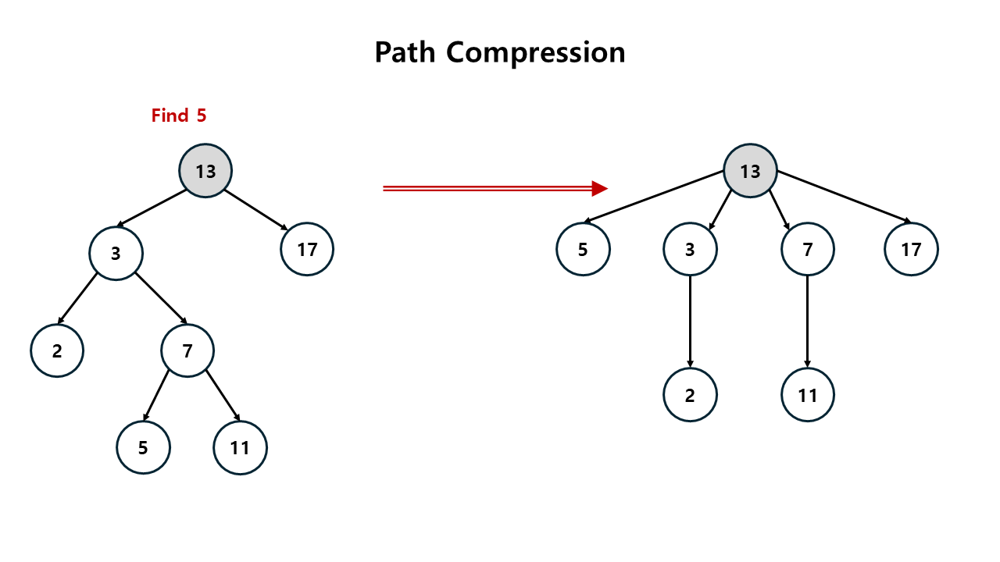
    -  **정의**: Find 연산을 수행할 때, 트리의 각 노드들을 루트 노드에 직접 연결함으로써 트리의 높이를 줄이는 기법
    -  **특징**:
       -  주어진 원소가 속한 집합의 대표자를 찾는 과정으로, 트리의 높이를 최소화하고 Find 연산을 수행할 때 트리의 경로에 있는 모든 노드를 대표자와 바로 연결하여 이후 Find 연산이 더 빠르게 수행됨
- **크기 조정**: 
    -  **정의**: Union 연산을 수행할 때, 작은 트리를 큰 트리의 자식으로 연결하여 트리의 높이를 최소화하는 기법
    -  **특징**:
       -  작은 집합을 큰 집합에 합침으로써 트리의 높이가 지나치게 증가하는것을 방지


<details><summary>C Union-Find 알고리즘 구현</summary>

```c
int find(int parent[], int x) {
    if (parent[x] != x)
        parent[x] = find(parent, parent[x]);  // 경로 압축
    return parent[x];
}

void unionSets(int parent[], int size[], int x, int y) {
    int rootX = find(parent, x);
    int rootY = find(parent, y);
    
    if (rootX != rootY) {
        // 크기 조정
        if (size[rootX] < size[rootY]) {
            parent[rootX] = rootY;
            size[rootY] += size[rootX];
        } else {
            parent[rootY] = rootX;
            size[rootX] += size[rootY];
        }
    }
}
```

</details>

<details><summary>Java Union-Find 알고리즘 구현</summary>

```java
public int find(Subset[] subsets, int i)
{
    if(subsets[i].parent!=i)
    {
        subsets[i].parent = find(subsets, subsets[i].parent);
    }
    return subsets[i].parent;
}

public void union(Subset[] subsets, int x, int y)
{
    int xroot = find(subsets, x);
    int yroot = find(subsets, y);
    
    if(subsets[xroot].rank < subsets[yroot].rank)
    {
        subsets[xroot].parent = yroot;
    }
    else if(subsets[xroot].rank > subsets[yroot].rank)
    {
        subsets[yroot].parent = xroot;
    }
    else
    {
        subsets[xroot].parent = yroot;
        subsets[yroot].rank++;
    }	
}
```

</details>

---

## 그래프 (Graph)
- 정의: 노드(정점)와 간선으로 구성된 수학적 구조
- 정점: 각 노드를 나타내는 요소
- 간선: 두 정점을 연결하는 선
#### 방향 그래프 (Directed Graph)
- 정의: 간선이 방향을 가지는 그래프
- 특징:
  - 간선은 출발점에서 도착점으로 연결됨
  - 간선은 (A → B)와 같이 방향을 가진다

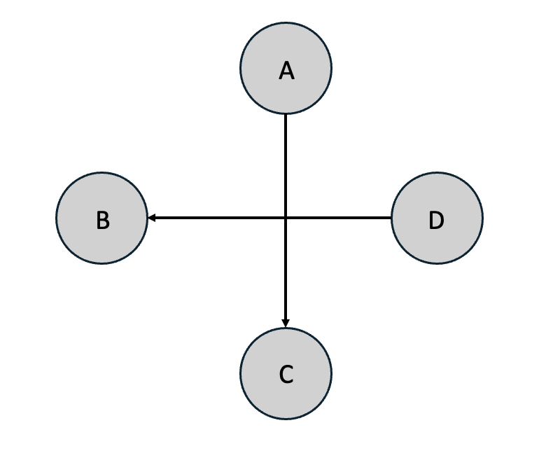
> 위 그림은 노드(A,B,C,D) 간의 관계를 방향성 있는 간선으로 표현한 구조 
#### 무방향 그래프 (Undirected Graph)
- 정의: 간선에 방향이 없는 그래프
- 특징:
  - 두 정점은 서로 양방향으로 연결됨
  -  간선은 (A, B)와 같이 두 정점 간의 관계로 나타낸다


> 위 그림은 노드(A,B,C,D) 간의 관계를 방향성 없는 간선으로 표현한 구조 
#### 가중 그래프 (Weighted Graph)
- 정의: 간선에 가중치가 부여된 그래프
- 특징:
  - 가중치는 두 정점 간의 거리나 비용 등을 나타냄

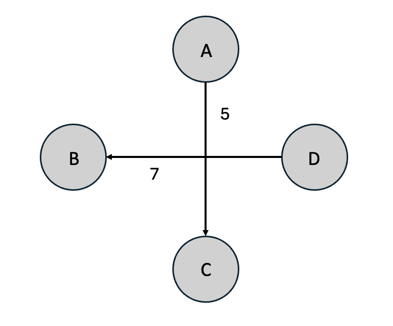
> 위 그림은  A에서 C로 가는 경로는 5, D에서 B로 가는 경로는 7의 가중치를 갖는 것을 보여줌 
#### 비가중 그래프
- 정의: 간선에 가중치가 없는 그래프
- 형태:
  - 무방향 비가중 그래프: 간선에 방향이 없고, 두 노드는 상호 연결되어 있음
  - 방향 비가중 그래프: 간선에 방향이 있어 한쪽 방향으로만 연결됨

### 그래프 표현 방식
#### (1) 인접 행렬 (Adjacency Matrix)
- 정의: 정점의 수가 n일 때, n*n 크기의 이차원 배열로 그래프를 표현
- 특징:
  - 각 배열의 값은 두 정점 간의 간선의 존재 여부를 나타냄
  - 방향 그래프에서는 (i, j) 위치에 간선이 있으면 1, 없으면 0을 저장
  - 무방향 그래프에서는 (i, j)와 (j, i)가 모두 1로 표시
- 장점: 구조가 직관적이고 구현하기 쉬움
- 단점:
  - 메모리 비효율적 사용
  - 노드 추가/삭제 어려움 

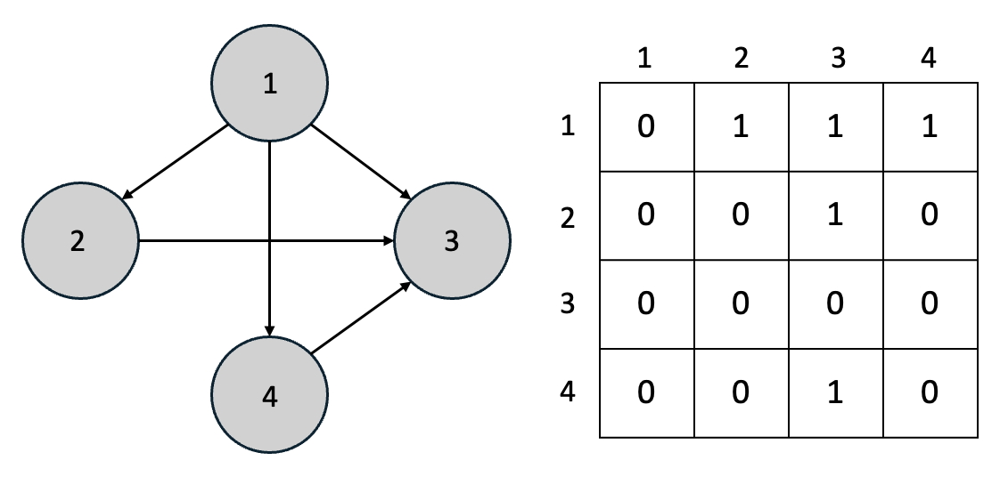
> 위 그림은 방향 그래프와 그래프의 각 정점 간의 연결 관계를 0(연결 없음)과 1(연결 있음)로 나타낸 2차원 배열인 인접 행렬을 보여줌


#### (2) 인접 리스트 (Adjacency List)
- 정의: 각 정점에 대해 해당 정점과 연결된 모든 정점들의 리스트를 저장
- 장점: 동적 데이터 구조 사용 가능
- 단점: 간선이 많을수록 저장해야 할 리스트가 커져서 메모리 효율성이 떨어짐


> 왼쪽의 그래프는 정점과 가중치 있는 간선으로 구성되어 있으며, 오른쪽의 인접 리스트는 각 정점에 연결된 이웃 정점과 간선의 가중치를 나타냄 


### 그래프 순회
#### (1) 너비 우선 탐색 (BFS)
- 정의: 큐 자료구조를 사용하여 그래프를 탐색
- 동작: 시작 정점에서부터 인접한 정점들을 차례로 방문하며, 가까운 곳부터 탐색
- 장점: 최단 경로 탐색에 적합
- 단점: 큐를 사용하므로 DFS보다 메모리 사용량이 많음   
<details>
<summary>c언어 그래프 순회 BFS 구현</summary>
<div markdown="1">

```c
#include <stdio.h>
#include <stdlib.h>

#define MAX_VERTICES 100

typedef struct Node {
    int vertex;
    struct Node* next;
} Node;

Node* adjList[MAX_VERTICES]; // 인접 리스트
int visited[MAX_VERTICES];   // 방문 여부 배열

// 큐 정의
typedef struct Queue {
    int items[MAX_VERTICES];
    int front, rear;
} Queue;

Queue* createQueue() {
    Queue* q = (Queue*)malloc(sizeof(Queue));
    q->front = -1;
    q->rear = -1;
    return q;
}

int isEmpty(Queue* q) {
    return q->front == -1;
}

void enqueue(Queue* q, int value) {
    if (q->rear == MAX_VERTICES - 1) {
        printf("Queue is full\n");
        return;
    }
    if (q->front == -1) q->front = 0;
    q->rear++;
    q->items[q->rear] = value;
}

int dequeue(Queue* q) {
    if (isEmpty(q)) {
        printf("Queue is empty\n");
        return -1;
    }
    int item = q->items[q->front];
    q->front++;
    if (q->front > q->rear) q->front = q->rear = -1;
    return item;
}

// 그래프에 간선 추가
void addEdge(int src, int dest) {
    Node* newNode = (Node*)malloc(sizeof(Node));
    newNode->vertex = dest;
    newNode->next = adjList[src];
    adjList[src] = newNode;
}

// BFS 순회
void BFS(int start) {
    Queue* q = createQueue();

    visited[start] = 1;
    enqueue(q, start);

    while (!isEmpty(q)) {
        int current = dequeue(q);
        printf("%d ", current);

        Node* temp = adjList[current];
        while (temp) {
            int adjVertex = temp->vertex;
            if (!visited[adjVertex]) {
                visited[adjVertex] = 1;
                enqueue(q, adjVertex);
            }
            temp = temp->next;
        }
    }
}

int main() {
    int vertices = 6;

    // 초기화
    for (int i = 0; i < vertices; i++) {
        adjList[i] = NULL;
        visited[i] = 0;
    }

    // 그래프 정의 (0 -> 1, 0 -> 2, ...)
    addEdge(0, 1);
    addEdge(0, 2);
    addEdge(1, 3);
    addEdge(1, 4);
    addEdge(2, 5);

    printf("BFS traversal starting from vertex 0:\n");
    BFS(0);

    return 0;
}
```
</div>
</details>

<details>
<summary>java 그래프 순회 BFS 구현</summary>
<div markdown="1">

```java
import java.util.*;

class Graph {
    private int vertices; // 정점의 개수
    private LinkedList<Integer>[] adjList; // 인접 리스트

    // 생성자
    public Graph(int vertices) {
        this.vertices = vertices;
        adjList = new LinkedList[vertices];
        for (int i = 0; i < vertices; i++) {
            adjList[i] = new LinkedList<>();
        }
    }

    // 간선 추가
    public void addEdge(int src, int dest) {
        adjList[src].add(dest);
    }

    // BFS 구현
    public void BFS(int start) {
        boolean[] visited = new boolean[vertices];
        Queue<Integer> queue = new LinkedList<>();

        visited[start] = true;
        queue.add(start);

        while (!queue.isEmpty()) {
            int current = queue.poll();
            System.out.print(current + " ");

            for (int neighbor : adjList[current]) {
                if (!visited[neighbor]) {
                    visited[neighbor] = true;
                    queue.add(neighbor);
                }
            }
        }
    }

    public static void main(String[] args) {
        Graph graph = new Graph(6);

        graph.addEdge(0, 1);
        graph.addEdge(0, 2);
        graph.addEdge(1, 3);
        graph.addEdge(1, 4);
        graph.addEdge(2, 5);

        System.out.println("BFS traversal starting from vertex 0:");
        graph.BFS(0);
    }
}
```
</div>
</details>
 
#### (2) 깊이 우선 탐색 (DFS)
- 정의: 시작 정점에서부터 가능한 한 깊게 탐색하고, 더 이상 갈 곳이 없으면 돌아가서 다른 경로 탐색
- 스택 또는 재귀를 사용
- 장점: 메모리 사용량이 적음
- 단점: 사이클이 있는 그래프에서 무한루프가 발생할 수 있으므로 방문 체크 여부가 필요 
<details>
<summary>c언어 그래프 순회 DFS 구현</summary>

```c
#include <stdio.h>
#include <stdlib.h>

#define MAX_VERTICES 100

typedef struct Node {
    int vertex;
    struct Node* next;
} Node;

Node* adjList[MAX_VERTICES]; // 인접 리스트
int visited[MAX_VERTICES];   // 방문 여부 배열

// 그래프에 간선 추가
void addEdge(int src, int dest) {
    Node* newNode = (Node*)malloc(sizeof(Node));
    newNode->vertex = dest;
    newNode->next = adjList[src];
    adjList[src] = newNode;
}

// DFS 함수
void DFS(int start) {
    visited[start] = 1;
    printf("%d ", start);

    Node* temp = adjList[start];
    while (temp) {
        int adjVertex = temp->vertex;
        if (!visited[adjVertex]) {
            DFS(adjVertex);
        }
        temp = temp->next;
    }
}

int main() {
    int vertices = 6;

    // 초기화
    for (int i = 0; i < vertices; i++) {
        adjList[i] = NULL;
        visited[i] = 0;
    }

    // 그래프 정의
    addEdge(0, 1);
    addEdge(0, 2);
    addEdge(1, 3);
    addEdge(1, 4);
    addEdge(2, 5);

    printf("DFS traversal starting from vertex 0:\n");
    DFS(0);

    return 0;
}
```
<div markdown="1">
</div>
</details>
<details>
<summary>java 그래프 순회 DFS 구현</summary>
<div markdown="1">

```java
import java.util.*;

class Graph {
    private int vertices; // 정점의 개수
    private LinkedList<Integer>[] adjList; // 인접 리스트
    private boolean[] visited; // 방문 여부 배열

    // 생성자
    public Graph(int vertices) {
        this.vertices = vertices;
        adjList = new LinkedList[vertices];
        visited = new boolean[vertices];
        for (int i = 0; i < vertices; i++) {
            adjList[i] = new LinkedList<>();
        }
    }

    // 간선 추가
    public void addEdge(int src, int dest) {
        adjList[src].add(dest);
    }

    // DFS 함수
    public void DFS(int start) {
        visited[start] = true;
        System.out.print(start + " ");

        for (int neighbor : adjList[start]) {
            if (!visited[neighbor]) {
                DFS(neighbor);
            }
        }
    }

    public static void main(String[] args) {
        Graph graph = new Graph(6);

        graph.addEdge(0, 1);
        graph.addEdge(0, 2);
        graph.addEdge(1, 3);
        graph.addEdge(1, 4);
        graph.addEdge(2, 5);

        System.out.println("DFS traversal starting from vertex 0:");
        graph.DFS(0);
    }
}
```
</div>
</details>

### 최단 경로 알고리즘
#### 다익스트라 알고리즘 (Dijkstra Algorithm)
- 정의: 그래프에서 단일 시작점에서 다른 모든 정점까지의 최단 경로를 찾는 알고리즘 
- 작동 원리:
  1. 시작 정점의 최단 거리를 0으로 설정
  2. 현재까지 방문하지 않은 정점 중, 최단 거리가 가장 짧은 정점을 선택
  3. 선택된 정점의 모든 인접 정점에 대해, 새롭게 계산된 거리가 기존 거리보다 짧으면 업데이트
  4. 위의 과정을 반복
- 장점: 우선순위 큐를 사용하면 시간 복잡도를 줄일 수 있음
- 단점: 음의 가중치 간선을 처리할 수 없음 
<details>
<summary>c언어 다익스트라 알고리즘 구현</summary>
<div markdown="1">

```c
#include <stdio.h>
#include <limits.h>

#define MAX_VERTICES 100
#define INF INT_MAX

int graph[MAX_VERTICES][MAX_VERTICES];
int dist[MAX_VERTICES];
int visited[MAX_VERTICES];

int minDistance(int vertices) {
    int min = INF, minIndex;
    for (int i = 0; i < vertices; i++) {
        if (!visited[i] && dist[i] < min) {
            min = dist[i];
            minIndex = i;
        }
    }
    return minIndex;
}

void dijkstra(int vertices, int start) {
    for (int i = 0; i < vertices; i++) {
        dist[i] = INF;
        visited[i] = 0;
    }
    dist[start] = 0;

    for (int i = 0; i < vertices - 1; i++) {
        int u = minDistance(vertices);
        visited[u] = 1;

        for (int v = 0; v < vertices; v++) {
            if (!visited[v] && graph[u][v] && dist[u] != INF && dist[u] + graph[u][v] < dist[v]) {
                dist[v] = dist[u] + graph[u][v];
            }
        }
    }
}
```
</div>
</details>
<details>
<summary>java 다익스트라 알고리즘 구현</summary>
<div markdown="1">

```java
import java.util.*;

class Dijkstra {
    private static final int INF = Integer.MAX_VALUE;

    public static void dijkstra(int vertices, int[][] graph, int start) {
        int[] dist = new int[vertices];
        boolean[] visited = new boolean[vertices];

        Arrays.fill(dist, INF);
        dist[start] = 0;

        for (int i = 0; i < vertices - 1; i++) {
            int u = minDistance(vertices, dist, visited);
            visited[u] = true;

            for (int v = 0; v < vertices; v++) {
                if (!visited[v] && graph[u][v] != 0 && dist[u] != INF && dist[u] + graph[u][v] < dist[v]) {
                    dist[v] = dist[u] + graph[u][v];
                }
            }
        }
    }

    private static int minDistance(int vertices, int[] dist, boolean[] visited) {
        int min = INF, minIndex = -1;
        for (int i = 0; i < vertices; i++) {
            if (!visited[i] && dist[i] < min) {
                min = dist[i];
                minIndex = i;
            }
        }
        return minIndex;
    }
}
```
</div>
</details>

#### 벨만-포드 알고리즘 (Bellman-Ford Algorithm)
- 정의: 그래프에서 단일 시작점에서 모든 정점으로의 최단 경로를 찾는 알고리즘 
- 특징:
  - 음의 가중치 간선을 허용
  - 시간 복잡도: O(V⋅E), V는 정점의 개수, E는 간선의 개수
- 작동 원리:
  1. 모든 정점의 최단거리를 초기화
  2. 간선을 V-1 번 반복적으로 완화
  3. 추가로 한 번 더 반복하여 음의 가중치 사이클 확인
- 장점: 음의 가중치 간선 처리 가능
- 단점: 시간 복잡도가 높아 상대적 속도 느릴 수 있음 
<details>
<summary>c언어 벨만-포드 알고리즘 구현</summary>
<div markdown="1">

```c
#include <stdio.h>
#include <limits.h>

#define MAX_VERTICES 100
#define INF INT_MAX

typedef struct {
    int src, dest, weight;
} Edge;

Edge edges[MAX_VERTICES];
int dist[MAX_VERTICES];

void bellmanFord(int vertices, int edgesCount, int start) {
    for (int i = 0; i < vertices; i++) dist[i] = INF;
    dist[start] = 0;

    for (int i = 1; i < vertices; i++) {
        for (int j = 0; j < edgesCount; j++) {
            int u = edges[j].src, v = edges[j].dest, w = edges[j].weight;
            if (dist[u] != INF && dist[u] + w < dist[v]) {
                dist[v] = dist[u] + w;
            }
        }
    }

    // 음의 사이클 검사
    for (int i = 0; i < edgesCount; i++) {
        int u = edges[i].src, v = edges[i].dest, w = edges[i].weight;
        if (dist[u] != INF && dist[u] + w < dist[v]) {
            printf("Graph contains a negative weight cycle\n");
            return;
        }
    }
}
```
</div>
</details>
<details>
<summary>java 벨만-포드 알고리즘 구현</summary>
<div markdown="1">

```java
class BellmanFord {
    static final int INF = Integer.MAX_VALUE;

    static class Edge {
        int src, dest, weight;

        Edge(int src, int dest, int weight) {
            this.src = src;
            this.dest = dest;
            this.weight = weight;
        }
    }

    public static void bellmanFord(int vertices, Edge[] edges, int start) {
        int[] dist = new int[vertices];
        for (int i = 0; i < vertices; i++) dist[i] = INF;
        dist[start] = 0;

        for (int i = 1; i < vertices; i++) {
            for (Edge edge : edges) {
                if (dist[edge.src] != INF && dist[edge.src] + edge.weight < dist[edge.dest]) {
                    dist[edge.dest] = dist[edge.src] + edge.weight;
                }
            }
        }

        // 음의 사이클 검사
        for (Edge edge : edges) {
            if (dist[edge.src] != INF && dist[edge.src] + edge.weight < dist[edge.dest]) {
                System.out.println("Graph contains a negative weight cycle");
                return;
            }
        }
    }
}
```
</div>
</details>

#### 플로이드-워셜 알고리즘 (Floyd-Warshall Algorithm)
- 정의: 그래프에서 모든 쌍 최단 경로를 구하는 알고리즘 
- 특징:
  - 음수 가중치 간선이 존재해도 동작
  - 각 정점 쌍 간의 최단 거리 행렬이 출력
- 작동 원리:
  1. 초기화:
     - dist[i][j]: 직접 연결된 가중치로 초기화
     - i=j일 때 dist[i][j]=0
     - 연결되지 않은 경우 dist[i][j]= ∞
  2. 최단 거리 갱신:
     - 모든 쌍 (i,j)에 대해, 정점 k를 경유하는 경로를 고려: dist[i][j]=min(dist[i][j],dist[i][k]+dist[k][j])
  3. 위의 과정을 반복 
- 장점: 음수 가중치가 있는 그래프도 처리 가능
- 단점: 시간 복잡도가 높아 정점 수가 많을수록 비효율적 

<details>
<summary>c언어 플로이드-워셜 알고리즘 구현</summary>
<div markdown="1">

```c
#include <stdio.h>
#include <limits.h>

#define INF INT_MAX
#define V 4  // 정점의 개수

void floydWarshall(int graph[V][V]) {
    int dist[V][V];

    // 초기화: dist 배열에 그래프의 값을 복사
    for (int i = 0; i < V; i++) 
        for (int j = 0; j < V; j++)
            dist[i][j] = graph[i][j];

    // 플로이드-워셜 알고리즘 수행
    for (int k = 0; k < V; k++) {
        for (int i = 0; i < V; i++) {
            for (int j = 0; j < V; j++) {
                if (dist[i][k] != INF && dist[k][j] != INF && dist[i][j] > dist[i][k] + dist[k][j]) {
                    dist[i][j] = dist[i][k] + dist[k][j];
                }
            }
        }
    }

    // 결과 출력
    printf("최단 경로 행렬:\n");
    for (int i = 0; i < V; i++) {
        for (int j = 0; j < V; j++) {
            if (dist[i][j] == INF) 
                printf("INF ");
            else
                printf("%d ", dist[i][j]);
        }
        printf("\n");
    }
}

int main() {
    int graph[V][V] = {
        {0, 3, INF, 7},
        {3, 0, 1, INF},
        {INF, 1, 0, 2},
        {7, INF, 2, 0}
    };

    floydWarshall(graph);

    return 0;
}
```
</div>
</details>
<details>
<summary>java 플로이드-워셜 알고리즘 구현</summary>
<div markdown="1">

```java
class FloydWarshall {
    static final int INF = Integer.MAX_VALUE;
    static final int V = 4;

    public static void floydWarshall(int[][] graph) {
        int[][] dist = new int[V][V];

        // 초기화: dist 배열에 그래프의 값을 복사
        for (int i = 0; i < V; i++) 
            for (int j = 0; j < V; j++)
                dist[i][j] = graph[i][j];

        // 플로이드-워셜 알고리즘 수행
        for (int k = 0; k < V; k++) {
            for (int i = 0; i < V; i++) {
                for (int j = 0; j < V; j++) {
                    if (dist[i][k] != INF && dist[k][j] != INF && dist[i][j] > dist[i][k] + dist[k][j]) {
                        dist[i][j] = dist[i][k] + dist[k][j];
                    }
                }
            }
        }

        // 결과 출력
        System.out.println("최단 경로 행렬:");
        for (int i = 0; i < V; i++) {
            for (int j = 0; j < V; j++) {
                if (dist[i][j] == INF)
                    System.out.print("INF ");
                else
                    System.out.print(dist[i][j] + " ");
            }
            System.out.println();
        }
    }

    public static void main(String[] args) {
        int[][] graph = {
            {0, 3, INF, 7},
            {3, 0, 1, INF},
            {INF, 1, 0, 2},
            {7, INF, 2, 0}
        };

        floydWarshall(graph);
    }
}
```
</div>
</details>

### 최소 신장 트리
- 가중치가 있는 연결 그래프에서 모든 정점을 최소 비용으로 연결하는 트리
#### 크루스칼 알고리즘 (Kruskal's Algorithm)
- 간선 중심의 알고리즘
- 간선들을 가중치 순으로 정렬한 후, 가중치가 작은 간선부터 하나씩 선택하여 트리를 확장
- 사이클이 생기지 않도록 검사
- 장점: 구현이 간단하고 직관적
- 단점: 간선이 많은 경우 성능이 떨어질 수 있음
<details>
<summary>c언어 크루스칼 알고리즘 구현</summary>
<div markdown="1">

```c
#include <stdio.h>
#include <stdlib.h>

#define MAX_EDGES 100
#define MAX_VERTICES 100

typedef struct {
    int u, v, weight;
} Edge;

Edge edges[MAX_EDGES];
int parent[MAX_VERTICES], rank[MAX_VERTICES];

int find(int i) {
    if (parent[i] == i) return i;
    return parent[i] = find(parent[i]);
}

void unionSets(int u, int v) {
    int rootU = find(u), rootV = find(v);
    if (rootU != rootV) {
        if (rank[rootU] > rank[rootV])
            parent[rootV] = rootU;
        else if (rank[rootU] < rank[rootV])
            parent[rootU] = rootV;
        else {
            parent[rootV] = rootU;
            rank[rootU]++;
        }
    }
}

int compareEdges(const void *a, const void *b) {
    return ((Edge*)a)->weight - ((Edge*)b)->weight;
}

void kruskal(int vertices, int edgesCount) {
    for (int i = 0; i < vertices; i++) {
        parent[i] = i;
        rank[i] = 0;
    }

    qsort(edges, edgesCount, sizeof(Edge), compareEdges);

    int mstWeight = 0;
    for (int i = 0; i < edgesCount; i++) {
        int u = edges[i].u, v = edges[i].v;
        if (find(u) != find(v)) {
            printf("Edge: %d - %d, Weight: %d\n", u, v, edges[i].weight);
            mstWeight += edges[i].weight;
            unionSets(u, v);
        }
    }
    printf("Total weight of MST: %d\n", mstWeight);
}

int main() {
    int vertices = 4, edgesCount = 5;
    
    edges[0] = (Edge){0, 1, 10};
    edges[1] = (Edge){0, 2, 6};
    edges[2] = (Edge){0, 3, 5};
    edges[3] = (Edge){1, 3, 15};
    edges[4] = (Edge){2, 3, 4};
    
    kruskal(vertices, edgesCount);

    return 0;
}
```
</div>
</details>
<details>
<summary>java 크루스칼 알고리즘 구현</summary>
<div markdown="1">

```java
import java.util.*;

class Kruskal {
    static class Edge {
        int u, v, weight;
        Edge(int u, int v, int weight) {
            this.u = u; this.v = v; this.weight = weight;
        }
    }

    static class UnionFind {
        int[] parent, rank;
        UnionFind(int size) {
            parent = new int[size];
            rank = new int[size];
            for (int i = 0; i < size; i++) parent[i] = i;
        }

        int find(int i) {
            if (parent[i] == i) return i;
            return parent[i] = find(parent[i]);
        }

        void union(int u, int v) {
            int rootU = find(u), rootV = find(v);
            if (rootU != rootV) {
                if (rank[rootU] > rank[rootV]) parent[rootV] = rootU;
                else if (rank[rootU] < rank[rootV]) parent[rootU] = rootV;
                else { parent[rootV] = rootU; rank[rootU]++; }
            }
        }
    }

    public static void kruskal(int vertices, List<Edge> edges) {
        UnionFind uf = new UnionFind(vertices);
        Collections.sort(edges, Comparator.comparingInt(e -> e.weight));

        int mstWeight = 0;
        for (Edge edge : edges) {
            if (uf.find(edge.u) != uf.find(edge.v)) {
                System.out.println("Edge: " + edge.u + " - " + edge.v + ", Weight: " + edge.weight);
                mstWeight += edge.weight;
                uf.union(edge.u, edge.v);
            }
        }
        System.out.println("Total weight of MST: " + mstWeight);
    }

    public static void main(String[] args) {
        List<Edge> edges = new ArrayList<>();
        edges.add(new Edge(0, 1, 10));
        edges.add(new Edge(0, 2, 6));
        edges.add(new Edge(0, 3, 5));
        edges.add(new Edge(1, 3, 15));
        edges.add(new Edge(2, 3, 4));

        kruskal(4, edges);
    }
}
```
</div>
</details>


#### 프림 알고리즘 (Prim's Algorithm)
- 정점 중심의 알고리즘
- 하나의 정점에서 시작해, 연결된 간선 중 가장 작은 가중치의 간선을 계속 선택하며 트리를 확장
- 장점: 구현이 직관적이며 간선 수에 크게 의존하지 않음
- 단점: 간선 수가 적은 경우 크루스칼보다 느릴 수 있음

<details>
<summary>c언어 프림 알고리즘 구현</summary>
<div markdown="1">

```c
#include <stdio.h>
#include <limits.h>

#define MAX_VERTICES 100
#define INF INT_MAX

int graph[MAX_VERTICES][MAX_VERTICES], key[MAX_VERTICES], parent[MAX_VERTICES], visited[MAX_VERTICES];

void prim(int vertices) {
    for (int i = 0; i < vertices; i++) {
        key[i] = INF;
        visited[i] = 0;
    }

    key[0] = 0;
    parent[0] = -1;

    for (int count = 0; count < vertices - 1; count++) {
        int minKey = INF, u = -1;
        for (int v = 0; v < vertices; v++) {
            if (!visited[v] && key[v] < minKey) {
                minKey = key[v];
                u = v;
            }
        }

        visited[u] = 1;

        for (int v = 0; v < vertices; v++) {
            if (graph[u][v] && !visited[v] && graph[u][v] < key[v]) {
                key[v] = graph[u][v];
                parent[v] = u;
            }
        }
    }

    for (int i = 1; i < vertices; i++) {
        printf("%d-%d %d\n", parent[i], i, graph[i][parent[i]]);
    }
}

int main() {
    int vertices = 5;
    int g[5][5] = { {0, 2, 0, 6, 0}, {2, 0, 3, 8, 5}, {0, 3, 0, 0, 7}, {6, 8, 0, 0, 9}, {0, 5, 7, 9, 0} };
    for (int i = 0; i < vertices; i++) for (int j = 0; j < vertices; j++) graph[i][j] = g[i][j];

    prim(vertices);
    return 0;
}
```
</div>
</details>
<details>
<summary>java 프림 알고리즘 구현</summary>
<div markdown="1">

```java
import java.util.*;

class Prim {
    static final int INF = Integer.MAX_VALUE;

    public static void prim(int vertices, int[][] graph) {
        int[] key = new int[vertices];
        int[] parent = new int[vertices];
        boolean[] visited = new boolean[vertices];

        Arrays.fill(key, INF);
        Arrays.fill(parent, -1);
        key[0] = 0;

        for (int count = 0; count < vertices - 1; count++) {
            int minKey = INF, u = -1;
            for (int v = 0; v < vertices; v++) {
                if (!visited[v] && key[v] < minKey) {
                    minKey = key[v];
                    u = v;
                }
            }

            visited[u] = true;

            for (int v = 0; v < vertices; v++) {
                if (graph[u][v] != 0 && !visited[v] && graph[u][v] < key[v]) {
                    key[v] = graph[u][v];
                    parent[v] = u;
                }
            }
        }

        for (int i = 1; i < vertices; i++) {
            System.out.println(parent[i] + "-" + i + " " + graph[i][parent[i]]);
        }
    }

    public static void main(String[] args) {
        int vertices = 5;
        int[][] graph = {
            {0, 2, 0, 6, 0},
            {2, 0, 3, 8, 5},
            {0, 3, 0, 0, 7},
            {6, 8, 0, 0, 9},
            {0, 5, 7, 9, 0}
        };

        prim(vertices, graph);
    }
}
```
</div>
</details>

### 위상 정렬
- 방향 그래프에서 정점들을 선형 순서로 배열하는 방법
- 각 정점은 그와 연결된 간선의 방향에 따라 순서가 결정됨
- 특징: 
   - 방향성 그래프에서만 가능: 순환이 있으면 위상 정렬 불가능 
   - 선형 순서: 모든 정점을 하나의 선형 순서로 배치
### 강결합 요소 탐색
- 강결합 요소: 
   - 모든 정점들이 서로 도달 가능한 부분 그래프
   - 최소한 하나의 사이클이 존재하는 부분 그래프
  
(1) Kosaraju의 알고리즘
- DFS를 수행하여 후속 정점에 대한 처리 순서를 구함
- 그래프의 간선을 반전시킨 뒤, 스택에서 정점을 하나씩 꺼내며 DFS를 수행
 
(2) Tarjan의 알고리즘
- DFS를 한 번만 수행
- 각 정점의 low-link 값을 계산하여 강결합 요소를 구함

## 해시 
데이터를 고정된 크기의 값으로 변환하는 일방향 함수
### 해시 테이블 (Hash Table)
- 키를 입력받아, 해시 값을 인덱스로 사용하여 데이터를 찾을 수 있도록 하는 자료 구조
- 버킷
  - 해시값이 매핑되는 저장소
  - 일반적으로 배열 형태로 구현되며, 같은 해시값을 가진 데이터는 이 배열의 특정 위치에 저장
- 장점: 빠르게 데이터를 검색하고 저장할 수 있음
- 단점: 메모리 효율성 낮음


> 위 그림은 a,b,c,d의 키가 해시 함수에 의해 특정 버킷(0,1,2,3)으로 매핑되고 해당 버킷에 데이터가 저장되는 과정을 보여줌 

### 해시 함수
  임의의 크기를 가진 입력 데이터를 받아들여, 이를 고정된 크기의 출력 값(해시 값) 으로 변환하는 함수
  - 일방향성: 입력값으로 출력값을 계산할 수 있지만, 출력값만 가지고 원본 데이터 추측 불가능
  - 고정 크기: 출력값의 크기는 고정.
  - 충돌 회피: 서로 다른 두 입력값에 대해 동일한 해시값을 출력하는 충돌이 적어야 함
### 충돌 처리 
두 개 이상의 다른 입력값이 동일한 해시 값을 생성할 경우 이를 처리
#### (1) 개방 주소법 (Open Addressing)
- 충돌이 발생하면 다른 빈 슬롯을 찾아 데이터를 저장
- 리스트를 사용하지 않고 모든 데이터를 해시 테이블 자체에 저장
- 동작 방식:
  - 선형 탐색: 해시 테이블의 다음 슬롯을 차례대로 검색하여 빈자리 찾음
  - 이차 탐색: 일정한 간격을 두고 탐색하여 빈 슬롯을 찾음
  - 이중 해싱: 두 번째 해시 함수에 의해 새로운 슬롯을 찾음
- 장점: 메모리 사용량이 일정 
- 단점: 테이블 크기를 동적으로 늘리는 것이 어려워, 해시 테이블 크기 관리가 필요 

#### (2) 체이닝 (Chaining)
- 각 해시 테이블 슬롯에 링크드 리스트 또는 다른 자료 구조를 사용하여 충돌 처리
- 해시 테이블의 크기와 관계없이 충돌 처리 가능
- 동작방식:
  1. 각 해시 테이블의 슬롯은 링크드 리스트를 가리키는 포인터를 가짐
  2. 해시 함수는 입력값을 해시 테이블의 인덱스로 변환
  3. 충돌이 발생하면, 해당 키는 동일한 슬롯에 저장되지 않고, 해당 슬롯의 리스트에 차례대로 연결
- 장점: 해시 테이블의 크기를 미리 예측할 필요가 없음
- 단점: 각 슬롯에 대한 추가적인 메모리가 필요

### 동적 크기 조정
- 데이터를 추가하거나 삭제하는 동안 자료 구조의 크기를 자동으로 조정
1. 테이블 크기 확장(업사이징, Up-sizing):
   - 테이블의 부하율이 높아지면, 기존 해시 테이블을 더 큰 크기로 확장
   - 모든 기존 항목을 새로운 테이블로 재배치 
2. 테이블 크기 축소(다운사이징, Down-sizing):
   - 테이블의 부하율이 낮으면, 테이블의 크기를 축소할 수 있음
   - 새 크기는 기존 크기의 절반 정도로 설정
   - 재배치 필요 
- 장점: 크기 조정을 통해 해시 충돌 최소화
- 단점: 크기 변경 시 성능 저하 
### 블룸 필터 (Bloom Filter)
- 정의: 특정 원속 집합에 속하는지 검사하는데 사용할 수 있는 확룰형 자료구조
- 특징:
  - 공간 효율성: 원소를 직접 저장하지 않고 비트 배열을 사용해 원소의 존재 여부를 추적함으로써 메모리를 효율적으로 사용
  - 빠른 검색 가능
- 작동 원리:
  1. 모든 비트를 0으로 초기 설정
  2. 삽입하려는 원소를 해시 함수에 입력하여, 각 해시 함수가 반환한 인덱스 위치의 비트를 1로 설정
  3. 검사하려는 원소를 해시 함수에 입력하여, 반환된 모든 인덱스 위치의 비트 확인
- 장점: 메모리 사용량 적음
- 단점: 기본적으로 삭제 불가 